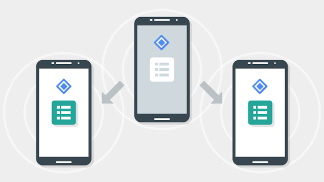

# 宣布近场连接2.0：完全离线，高带宽配对设备通信

原标题：Announcing Nearby Connections 2.0: fully offline, high bandwidth peer to peer device communication  
链接：[https://android-developers.googleblog.com/2017/07/announcing-nearby-connections-20-fully.html](https://android-developers.googleblog.com/2017/07/announcing-nearby-connections-20-fully.html)  
作者：Ritesh Nayak M （产品经理）  
翻译：[arjinmc](https://github.com/arjnmc)  

  

想象一下，进入酒店房间，温度设置恰到好处，你最喜爱的数学摇滚的子类型在后台演出，电视会敦促你继续对你保存的喜爱观看列表。如果你的手机通讯录可以在你在一起时与你的配偶合并，因此你不再需要向你的婆婆电话号码（你应该拥有的电话号码）在快速拨号上，在你最喜欢的，并列为紧急联系）？现在想象一个世界，你可以在纽约或旧金山这样的城市驾驶空车道或私人停车位，并与该空间协商 出租，直到其所有者回来。

所有这些情景中的共同点是能够检测到与你接近的人，地点和事物的距离 - 并能够进行通信。

在今年的I / O中，我们谈到了[近场连接 API 的刷新](https://youtu.be/1a0wII96cpE?t=23m2s)，可以以完全离线的P2P方式在附近的设备之间提供高带宽，低延迟，加密的数据传输。今天，我们宣布在运行[Google Play服务11.0](https://developers.google.com/android/guides/releases#june_2017_-_version_110)及更高版本的所有Android设备上都可以[使用此API](https://developers.google.com/nearby/connections/overview)。 

附近的连接使用WiFi，蓝牙LE和经典蓝牙在发动机下发现并建立与附近设备的连接。它通过利用每个无线电的优势来消除这些无线电的固有复杂性，同时规避各自的弱点。除了在不同的操作系统版本和设备之外避免处理这些无线电的变幻莫测的痛苦之外，这种抽象可以通过无线电之间的切换以及有意义的方式无缝地升级连接的带宽，同时获得无形的空中更新使用新的无线电技术，因为它变得可用 - 在应用程序代码中没有任何变化。 

这个API的核心是一个可以用来传输字节，文件或数据流的连接（与Unix-socket类似的语义）。有两种支持的连接拓扑：

* Star：有用于创建1：N拓扑，其中有一个集中的设备，其他人特别感兴趣。例如，一个离线游戏的主机，或教师的设备在课堂测验应用程序。
* Cluster：用于创建M：N拓扑，允许创建更松散的网状网络。例如，一个教室应用程序，支持组建即时协作的临时项目组，或离线超邻近式聊天应用程序。

作为构建此API的过程的一部分，我们与几个合作伙伴合作，每个合作伙伴都具有独特的脱机数据传输需求和环境。看到他们在这个API的早期版本之上建立起来是非常好的，他们的反馈在引导我们今天推出时是非常宝贵的。看看他们正在建造的一些很酷的东西：

* [天气频道](https://play.google.com/store/apps/details?id=com.weather.Weather)会在数据不足的地区建立按需网状网络，以传播紧急天气警报。
* [Hotstar](https://play.google.com/store/apps/details?id=in.startv.hotstar)可以在有点/无互联网连接的地方进行离线媒体分享（如公共交通工具，飞机等）
* [GameInsight](https://play.google.com/store/apps/details?id=com.gameinsight.gobandroid&hl=en)使用近场连接不仅可以找到附近的玩家，还可以离线运行整个游戏。
* Android TV正在构建一个远程控制应用程序（由近场连接提供支持），以简化初始设置，并启用后续的第二屏幕体验。

现在，该API是公开的，我们不能等待，看看你会在你的应用程序使用的近场连接。要开始使用，请访问我们的[开发者网站](https://developers.google.com/nearby/connections/overview)，查看我们的[代码示例](https://github.com/googlesamples/android-nearby/tree/master/connections)，并发布你在Stackoverflow（附带[google-nearby](https://stackoverflow.com/tags/google-nearby/info)）的任何问题。要了解最新的Android附近产品（以及我们其他与上下文相关的API）的最新信息，请订阅我们的[邮件列表](https://groups.google.com/forum/#!members/google-context-apis/join)。