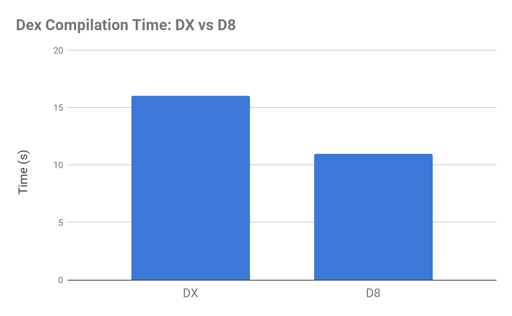
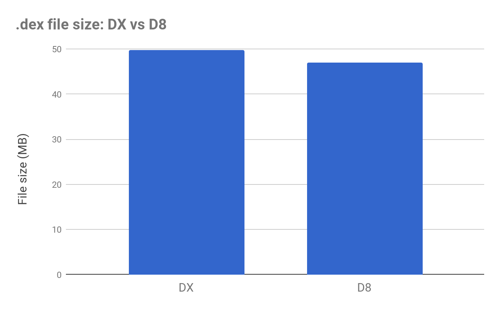

# 现在预览下一代Dex编译器

原标题：Next-generation Dex Compiler Now in Preview  
链接：[https://android-developers.googleblog.com/2017/08/next-generation-dex-compiler-now-in.html](https://android-developers.googleblog.com/2017/08/next-generation-dex-compiler-now-in.html)  
作者：James Lau (产品经理)  
翻译：[arjinmc](https://github.com/arjinmc)  

Android开发者知道，dex编译是构建APK的关键步骤。这是将.class字节码转换为Android Runtime的.dex字节码（或用于旧版Android的Dalvik）的过程。dex编译器主要在日常应用程序开发中起作用，但它直接影响到应用程序的构建时间，.dex文件大小和运行时性能。

这就是为什么我们正在投入在dex编译器上进行重要改进。我们很高兴地宣布，下一代dex编译器D8现在可以作为[Android Studio 3.0测试版](https://developer.android.com/studio/preview/index.html)的一部分进行预览。

与当前的DX编译器进行比较时，D8编译速度更快，并输出较小的.dex文件，同时具有相同或更好的应用程序运行时性能。

  
<small>* 在[这里](https://github.com/jmslau/perf-android-large/tree/android-30)测试基准项目。</small>

  
<small>* 在[这里](https://github.com/jmslau/perf-android-large/tree/android-30)测试基准项目。</small>

##如何尝试？

D8可以从[Android Studio 3.0 Beta预览](https://developer.android.com/studio/preview/index.html)开始。要尝试，请在项目的gradle.properties文件中设置以下内容：
```code
android.enableD8 = true
```

我们测试了D8在许多应用程序上的正确性和性能，结果令人鼓舞。我们有足够的信心，结果是我们正在切换使用D8作为构建[AOSP](https://source.android.com/source/)的默认dex编译器。目前没有已知的问题，但我们很乐意听到你的反馈。你可以使用此[链接](https://issuetracker.google.com/issues/new?component=317603&template=1018721)提交bug报告 。

## 下一步是什么？

我们计划在接下来的几个月内使用Android Studio 3.0版本来预览D8。在此期间，我们将专注于解决我们从社区收到的任何关键bug报告。我们计划将D8放在预览之外，并将其作为Android Studio 3.1中的默认dex编译器。那时，DX编译器将正式投入维护模式。只有DX的关键问题才能确定。

除了D8之外，我们还在研发R8，这是一个Proguard替代整个程序的缩小和优化。虽然R8项目已经[开源](https://r8.googlesource.com/r8)，但尚未与Android Gradle插件集成。当我们准备好与社区进行预览时，我们将在不久的将来提供有关R8的更多详细信息。

## 工具开发人员：让你的字节码工具Java 8准备就绪

4月份，我们[宣布推出Java 8语言功能](https://android-developers.googleblog.com/2017/04/java-8-language-features-support-update.html)。在Java编译（javac）之后，并且运行任何字节码读取或重写工具之前，紧随其后的步骤就会发生。作为D8的一部分，在接下来的几个月中，绝对的一步将进入后期阶段。这将使我们能够进一步缩短整体构建时间并生成更优化的代码。这种改变意味着任何字节码读取或重写工具都将在最后一步之前运行。如果你为Android开发了.class字节码读取或重写工具，则需要确保它们可以处理Java 8字节码格式，以便在D8进行Dug时将其继续正常工作。

快乐dex'ing！