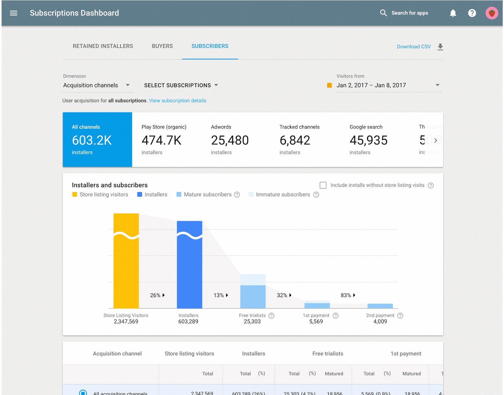

# 使用这些新功能和最佳实践在Google Play上构建订阅业务

原标题：Build a subscriptions business on Google Play with these new features and best practices  
链接：[https://android-developers.googleblog.com/2017/08/build-subscriptions-business-on-google.html](https://android-developers.googleblog.com/2017/08/build-subscriptions-business-on-google.html)  
作者：Tom Grinsted (产品经理)  
翻译：[arjinmc](https://github.com/arjinmc)  

订阅可以是可持续的收入来源，让你有信心投资于你的长期业务增长。订阅应用在Google Play上迅速增长; 过去三年，用户数量翻了一番，用户数量增加了10倍。为了帮助我们看到越来越多的订阅业务，我们在I / O 2017上在Google Play Console中引入了[订阅仪表板](https://www.youtube.com/watch?v=hRZPXgRhOH0)。今天，我们增加了三个新的订阅报告，涵盖收获，保留和取消，以帮助你了解你的数据并做出明智的业务决策。查找以下新功能的信息，我们更新的最佳实践，以帮助你拓展订阅业务，以及其他开发者在Google Play上取得成功的故事。

##　Google Play Console现在提供了新的订阅报告

  
<small>Google Play Console中有三份新的订阅报告</small>

该<strong>收获报告</strong>可以评估不同的采集渠道，包括Adwords和UTM-标记的广告。这可以帮助你确定哪些渠道和广告系列在获得新订阅者方面最成功。

该<strong>持有报告</strong>显示你的用户的定制队列的寿命保留。它允许你轻松比较不同的订阅产品，绘制关键事件，如免费试用的结束，并提供预测，使你能够更快地做出决策。

最后<strong>取消报告</strong>。这个详细的取消数据显示用户自愿（例如当他们选择取消）或非自愿（例如，当付款失败时）自动取消。你还可以看到取消是否由人员卸载。

我们不断努力改进Google Play控制台。如果你有关于如何改进订阅功能的想法或反馈，[请告诉我们](https://docs.google.com/forms/d/e/1FAIpQLSdyg0eVD2oBGXDAt637IT6W4eumyCWUV1apht-KhxtEQ8TOhQ/viewform)。

## 利用新的Google Play帐单资料库

要从这些功能中受益，你需要使用Google Play帐单作为您应用中订阅的付款方式。[新的Google Play帐单库](https://docs.google.com/forms/d/e/1FAIpQLSdyg0eVD2oBGXDAt637IT6W4eumyCWUV1apht-KhxtEQ8TOhQ/viewform)可轻松实现「Play帐单」功能。我们还更新了Play Billing，因此当买方尝试启动购买而不是发布应用程序时，会执行结算许可。这意味着你可以在Play Billing支持的和不支持的国家/地区中发布单一APK（而不是保留不使用不支持的国家/地区的帐单权限的单独的APK）。请记住，在尝试提供任何应用内购买之前，请[先查看](https://support.google.com/googleplay/android-developer/answer/1153481?hl=en&ref_topic=3452890)是否支付结算。

## 成为“订阅第一”公司，并在Google Play上取得成功

随着开发者在Google Play上的订阅产品变得更加复杂，我们最成功的合作伙伴已经学到了很多但并不奏效。具有订阅应用专家知识的合作伙伴经理NikoSchröer在Medium发表了一篇文章，可帮助你[成为成功的订阅公司](https://medium.com/googleplaydev/building-a-subscriptions-business-for-all-seasons-7ffd95b3f929)。在这篇文章中，你将找到一个链接，详细介绍了我们对2017年6月发布的[Android订阅者的详细用户研究报告](http://services.google.com/fh/files/misc/subscription_apps_on_google_play.pdf)，这有助于你深入了解用户在订阅产品中的寻找。我们还发布了一些关于[订阅的新的最佳实践](https://developer.android.com/distribute/best-practices/earn/subscriptions.html)，你可以在[Playbook应用](https://g.co/playbookapp)中阅读其他技巧，以在Google Play上取得成功。

## 其他开发人员如何在Play上获得订阅

[Viki](https://play.google.com/store/apps/details?id=com.viki.android&hl=en)是新加坡的视频应用程序，使用订阅构建可持续和可预测的收入来源，允许他们投资原创内容，并为其用户提供更好的优质体验。全年收入总额同比增长超过200％，像中东和拉丁美洲这样的新兴市场增长了700％。观看Viki的产品和工程高级副总裁Alex Chan讲述的故事。

[视频链接](https://youtu.be/VS3G61KzrkI?list=PLWz5rJ2EKKc9ofd2f-_-xmUi07wIGZa1c)  

中东和北非流行音乐服务[Anghami](https://play.google.com/store/apps/details?id=com.anghami&hl=en_GB&e=-EnableAppDetailsPageRedesign)的开发商通过用户界面实验和[入门](https://support.google.com/googleplay/android-developer/answer/140504#intro)定价增加了其应用程序中的用户数量。在一个促销期间，与其平均每日注册相比，Anghami使用入门定价将新注册增加了400％。了解更多关于[Anghami如何成功实现订阅](https://developer.android.com/stories/apps/anghami.html)。