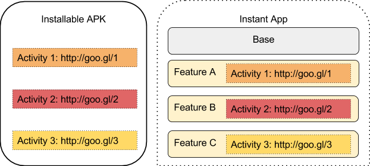
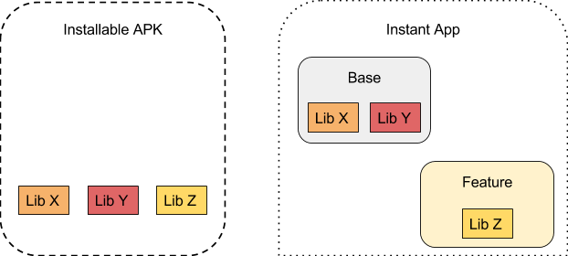
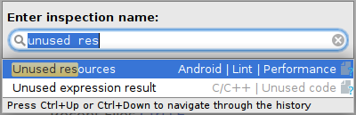
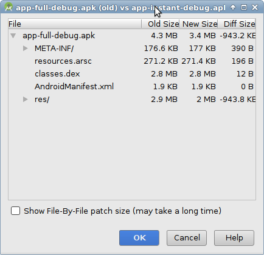
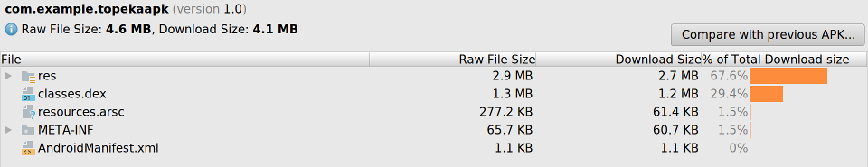
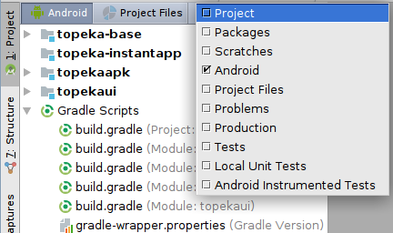
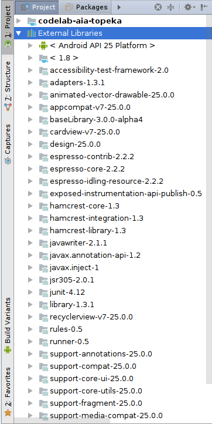
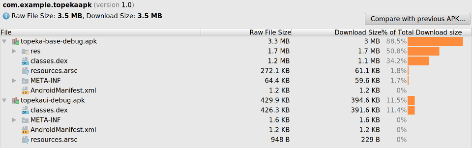
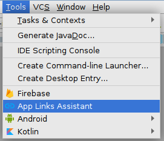
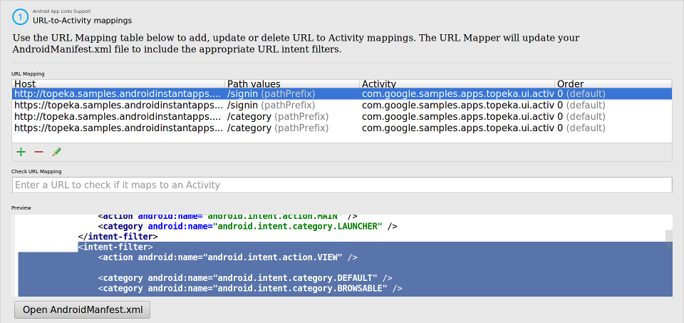

# Android免安装app：管理下载大小的最佳实践

原标题：Android Instant Apps: Best practices for managing download size  
链接：[https://android-developers.googleblog.com/2017/08/android-instant-apps-best-practices-for.html](https://android-developers.googleblog.com/2017/08/android-instant-apps-best-practices-for.html)  
作者：Maru Ahues Bouza (Google Play开发者关系合作伙伴)  
翻译：[arjinmc](https://github.com/arjinmc)  

Android免安装app提供丰富的本地体验，可轻松访问网络链接。人们可以在没有预先安装的情况下体验你的应用程序，从而实现更高级别和更高的参与度。

然而，为了提供加载移动网页的相当的延迟，免安装应用需要精简和结构良好，因此可以根据网址点击快速下载并运行。有鉴于此，我们鼓励二进制加载的任何入口点URL尽可能小，最大为4MB。二进制文件越小，免安装应用程序加载的速度越快，用户体验越平滑。
本文档将提出管理应用程序结构和二进制大小的最佳实践，以实现流畅的免安装应用体验。这些做法也将有益于你的可安装应用程序。

## 重构你的代码库

最大的二进制大小优势来自于将你的应用程序重构为[多个功能模块](https://developer.android.com/topic/instant-apps/getting-started/structure.html#structure_of_an_instant_app_with_multiple_features)。即使你当前的大小和功能集不需要多个功能，我们建议你进行设计，因此你可以在将来快速添加更多功能，而不会影响现有功能的二进制大小。我们还强烈建议拥有统一的模块化代码库来生成可安装和即时应用二进制文件，因为这将减少维护单独的项目和代码的负担，并在两者之间提供更清洁的项目结构。根据我们早期访问合作伙伴的经验，我们相信这将对下载的二进制大小产生最大的影响。但是，它也需要最多的投资。

为了达到目的，你可以从单个（基本）模块开始，然后通过将相关部分移动到特征模块来重构代码。请注意，在开发免安装应用程序时，你不需要担心二进制大小，因为大小限制不适用于本地构建的二进制文件。你也可以通过Play开发者控制台将你的二进制文件发布到[开发轨道](https://support.google.com/googleplay/android-developer/answer/7381861)（在开发期间快速部署即时应用程序的特殊轨道），其大小限制为10MB。[[1](https://tech.buzzfeed.com/from-westinghouse-to-android-instant-apps-60fbfaca4ebe)，[2](http://rea.tech/building-the-realestate-com-au-android-instant-app/)]的4MB限制使用一次的二进制完成出来的发展轨道。

每个特征模块可以具有与给定URL对应的一个（或多个）入口点 - activities。将单个代码库分为多个模块时，你将具有不同功能的不同入口点，平台将根据需要加载相关功能。请记住，为任何给定入口点下载的总二进制文件应低于4MB，因此任何功能模块和基本模块的组合大小必须低于4MB。

  

建议首先定义功能activity入口点映射，然后构造重构的努力，以减少每个入口点的二进制大小。

还要考虑如何包含库。如果特定功能模块需要某些库，那么它们应该只包含在功能模块中，而不是添加到基础APK中。这将减小基本模块的尺寸。例如，假设你有一个依赖于库X，Y和Z的应用程序。最初，你可以通过将基础gradle.build文件中的所有依赖项打包到基本模块中的所有库。但是，如果只有功能模块中的代码需要库Z，则将依赖关系从基本模块移动到功能模块是有意义的。只要没有其他功能模块依赖于同一个库，这是有用的。如果多个功能模块使用相同的库，将其保留在基本模块中是绝对有意义的。

  

## Link检查

许多应用程序倾向于获取大量资源，并且在一段时间内，其中一些应用程序已不再使用。Android Studio对于未使用的资源有用的内置lint检查。按Alt + Ctrl + Shift + I（Mac OS上的Cmd + Alt + Shift + I），键入“未使用资源”，然后启动“未使用资源Android | Lint | Performance”检查。它也有助于减少可安装的APK的大小。

  

## 字符串资源

与资源类似，请注意字符串，并不是所有这些都可能被使用，通常可以通过删除未使用的字符串资源来显着减少应用程序大小。如果应用程序支持多种语言，则可能需要减少本地化资源的数量，因为它通常会删除大量的资源资源。如果应用程序仅支持几种语言但使用AppCompat库（包括多种语言的消息），这一点尤为重要。使用[resConfig](https://developer.android.com/studio/build/shrink-code.html#unused-alt-resources)仅选择特定的资源配置。提示：通常你可以使用“[自动](https://google.github.io/android-gradle-dsl/current/com.android.build.gradle.internal.dsl.ProductFlavor.html#com.android.build.gradle.internal.dsl.ProductFlavor:resConfigs(java.lang.String[]))”来限制从第三方库拉出的配置，以匹配项目中定义的一组配置。

## 切换到WebP

可以通过切换到[WebP图像](https://developer.android.com/studio/write/convert-webp.html)而不是PNG来实现[绘制资源大小](https://developer.android.com/topic/performance/reduce-apk-size.html#use-webp)的显着减少。Android免安装app支持WebP格式的所有功能（透明度，无损等），因此功能不会有任何损失。请记住，应用程序启动器图标必须使用PNG格式，但它不应该是一个问题，因为项目通常会保留在mipmap目录中。如果需要向后兼容的解决方案，则需要将原始PNG图像包含在APK模块中，并[自动覆盖WebP资源](https://developer.android.com/studio/write/add-resources.html#resource_merging)（主源集覆盖AAR /功能模块中的所有资源）。[ [4](https://medium.com/jet-stories/make-your-app-instant-33855ab5d02b) ]

  
  
当然，使用矢量绘图可以让你节省更多的宝贵空间，但使用矢量绘图将需要代码更改，而上述提到的技巧与WebP图像的即时应用程序和PNG图像可安装的APK不需要代码修改。

## 在运行时下载资源

最后，请记住，在技术上，免安装应用APK中的所有资源都不需要打包，因为应用程序可以在运行时下载其他资源。该方法还使应用程序仅下载所需的资源。这些修改可能需要对代码库进行重大更改，但也可以帮助你减少可安装的APK的大小。

如果缩小的资源不会使你的应用功能模块的大小受到限制，那么现在是寻找减少代码大小的方法了。

## 查看本地库

一些第三方库可能包括本机代码，这些代码可能根本不会在即时应用程序中使用。所以第一步是检查在APK中打包的本地库，并确保免安装应用只有那些实际使用的。记得使用[APK Analyzer](https://developer.android.com/studio/build/apk-analyzer.html)（Build - > APK Analyzer ...）查看编译的APK [ [5](https://medium.com/vimeo-engineering-blog/vimeo-android-instant-apps-2f8b1e94760c) ]

  

##　查看外部库

接下来查看与应用程序代码链接的所有外部库的列表。你可能会发现一些意想不到的惊喜，提供传递依赖。当你的项目依赖的库取决于另一个库，而依赖于另一个库时，就会发生传递依赖。有时，这些传递依赖可能会包含意外的惊喜，例如你根本不需要的库（即，你在代码中不使用的JSON处理库）。有关详细信息，请参阅“Gradle用户指南”中的“ [排除依赖关系](https://docs.gradle.org/current/userguide/dependency_management.html#sub:exclude_transitive_dependencies)”。

Android Studio有几个有用的工具来分析项目的外部依赖关系。它始终有助于从项目视图开始：

  

“Project”视图显示了一个名为“外部库”的部分，你可以在其中看到项目使用的所有库，包括任何传递依赖关系：

  

为了进一步减少基本特​​征大小，你可能需要注意代码依赖关系和外部库。检查“Project”视图，并查找可能是项目不需要的传递依赖项的未使用的库。还要查找提供相同功能的库（例如用于图像加载/缓存的多个库）。[ [4](https://medium.com/jet-stories/make-your-app-instant-33855ab5d02b) ]

你还可以将不同的版本与[APK Analyzer](https://developer.android.com/studio/build/apk-analyzer.html)工具进行比较，并且与即时APK一起使用。

  

最后，查看传递性依赖关系列表，并排除你不需要的依赖关系。使用以下命令查看依赖关系图：<small> gradle -q :MODULE:dependencies --configuration compile</small>。更多细节可以在[Gradle文档](https://docs.gradle.org/current/userguide/dependency_management.html#sub:exclude_transitive_dependencies)中找到。

## 其他技巧

Android Studio 3.0包括App Links Assistant工具，可帮助你生成必要的intent过滤器，并帮助将项目拆分成多个模块。[ [3](https://willowtreeapps.com/ideas/an-introduction-to-android-instant-apps) ]

  
  

一旦你获得了大小限制下的免安装应用程序包，那么现在就是确保构建过程是最新的。检查应用程序包和即时应用APK是否使用“[APK签名方案v2](https://developer.android.com/about/versions/nougat/android-7.0.html#apk_signature_v2)”进行签名。如果你使用最新版本的SDK工具签署APK，则应自动完成所有操作。但是，如果手动签名构建工件，则需要避免使用jarsigner并切换到[apksigner](https://developer.android.com/studio/command-line/apksigner.html)。

还有一些有用的提示可以将应用程序的代码调整到免安装运行时环境。请记住，基于[InstantApps.isInstantApp（...）](https://developer.android.com/topic/instant-apps/reference.html#isinstantapp)的免安装/可安装应用程序的小代码分支应该是正常的，通常不会使源代码不可读（除非你滥用它）。另外，当使用共享intent时，请确保代码没有明确枚举设备上安装的应用程序，免安装应用安全模型不允许。只需使用常规Intent.createChooser（）向用户显示所有可能的操作的列表。

为现有Android应用开发免安装应用程序的工作水平在开发者各不相同，并且在很大程度上取决于你今天应用程序的组织方式。对于某些项目来说，很简单，因为你的项目已经被组织为多个模块。然而，对于某些人而言，重点将在于减少代码和资源资产的大小，我们已经介绍了上述工具和Android平台的功能来帮助你。

## 看看其他开发者使用Android免安装app

最后，看看这些由于由已经建立了一个免安装的应用程序的开发者发布的非常好的帖子：

* <strong>Buzzfeed</strong>：[从西屋到Android免安装应用程序，BuzzFeed之旅](https://tech.buzzfeed.com/from-westinghouse-to-android-instant-apps-60fbfaca4ebe)
* <strong>Realestate.com.au</strong>：[构建realestate.com.au Android免安装App](http://rea.tech/building-the-realestate-com-au-android-instant-app/)
* <strong>WillowTree</strong>：[Android免安装Apps简介](https://willowtreeapps.com/ideas/an-introduction-to-android-instant-apps)
* <strong>Jet.com</strong>：[做你的免安装应用程序](https://medium.com/jet-stories/make-your-app-instant-33855ab5d02b)
* <strong>Vimeo</strong>：[Android免安装Apps，一步一步：Vimeo如何去做](https://medium.com/vimeo-engineering-blog/vimeo-android-instant-apps-2f8b1e94760c)
* <strong>Ticketmaster</strong>：[Ticketmaster在Google I / O上展示尖端Android免安装app Technology技术](https://tech.ticketmaster.com/2017/05/18/ticketmaster-demonstrates-cutting-edge-android-instant-apps-technology-at-google-io/)
* <strong>Domain</strong>： [制做域名Android免安装应用程序](http://tech.domain.com.au/2017/06/making-the-domain-android-app-instant-%E2%9A%A1/)

访问Android开发者网站，[开始使用Android免安装Apps](https://g.co/instantapps)，并查看其他开发者的[免安装应用程序成功案例](https://developer.android.com/stories/instant-apps.html)。