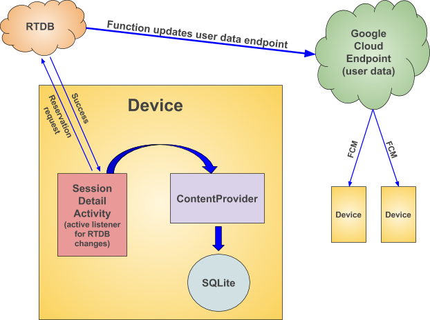

# Google发布Google I / O 2017的源代码

原标题：Google releases source for Google I/O 2017 for Android  
链接：[https://android-developers.googleblog.com/2017/08/google-releases-source-for-google-io.html](https://android-developers.googleblog.com/2017/08/google-releases-source-for-google-io.html)  
作者：Shailen Tuli  
翻译：[arjinmc](https://github.com/arjinmc)  

今天，我们发布了Android应用的官方[Google I / O 2017](https://play.google.com/store/apps/details?id=com.google.samples.apps.iosched&hl=en)的[源代码](https://github.com/google/iosched)。

今年的应用程序大大修改了现有的功能，并添加了几个新功能。它还扩展了使用[Firebase](https://firebase.google.com/?utm_source=google&utm_medium=cpc&utm_campaign=1001467%20%7C%20Firebase*%20Brand%20GENERIC%20%7C%20US%20%7C%20en%20%7C%20Desk%2BTab%2BMobile%20%7C%20Text%20%7C%20BKWS%20%5B2017%5D&utm_term=%7Bkeyword%7D&gclid=Cj0KCQjwq7XMBRCDARIsAKVI5Qais3r2YPsnohDN1mzomMUFysiwEJJ5W2V-LfRO_0btHf5SAfMmp5caAofLEALw_wcB)的技术堆栈。在这篇文章中，我们将突出显示应用程序的几个显着变化及其设计注意事项。

2017年最突出的新功能是活动<strong>预约</strong>系统，旨在帮助现场参会者省下时间，并提供精简的会议体验。登记参会者可以在会议之前和会议期间保留会话并加入接待名单。预约提供了快速进入会议，而无需长时间等待。预约数据与参加者的会议徽章系统同步，允许活动人员使用支持NFC的手机验证预约。不仅预订功能非常受欢迎，而且预订数据帮助活动人员在I / O之前和之后更改会议室的大小，以适应实际的座位需求。

使用[Firebase实时数据库](https://firebase.google.com/products/database/)（RTDB）和[Firebase的Cloud Functions](https://firebase.google.com/products/functions/)实现了预约功能。RTDB在用户设备之间提供了轻松的同步 - 我们只需在代码中实现一个监听器来接收数据库更新。RTDB还提供开箱即用的离线支持，即使在旅行期间间歇性网络连接时也允许会议数据可用。云功能在后台处理用户的预约请求，使用事务来确保状态的正确性（防止恶作剧用户抢占太多的座位！）并与活动徽章系统进行通信。

像往年一样，我们使用ContentProvider作为所有应用程序数据的抽象层，这意味着我们必须弄清楚如何将RTDB数据与ContentProvider集成。我们需要在有两个本地数据缓存之间进行协商：1）通过ContentProvider访问的本地SQLite数据库，以及2）由RTDB创建的本地缓存以便于脱机访问。我们决定将ContentProvider中的所有应用数据整合在一起：每当用户在RTDB中更改预约数据时，我们更新了ContentProvider，使其成为应用数据的唯一真实来源。这意味着我们需要仅在单个屏幕上保留与RTDB的开放连接，即会话详细信息活动，用户可能正在主动管理其预留。应用程序其他部分显示的预约数据由ContentProvider支持。在离线模式下，或者在与RTDB连接的片断或延迟的情况下，我们可以从ContentProvider获取用户保留的最后一个已知状态。

我们还必须找出将RTDB整合到IOSched的整体同步逻辑中的良好规则，特别是因为RTDB具有与我们在应用程序中使用的ping-and-fetch方法非常不同的同步模型。我们决定继续使用[云端点](https://cloud.google.com/endpoints/)来跨设备和网络和iOS客户端同步用户数据（数据本身存储在[数据存储区](https://cloud.google.com/appengine/docs/standard/java/datastore/)中）。虽然RTDB提供即时数据同步，但我们希望确保用户的预留数据是所有设备上的最新数据，即使应用程序不在前台。我们使用云功能将RTDB预约数据集成到同步流中：一旦在RTDB中更改了用户的预约数据，该功能更新了端点，从而触发了[Firebase Cloud Messaging](https://firebase.google.com/products/cloud-messaging/)下游消息给所有用户的设备，然后调度数据同步。

  

今年的应用程序还提供了一个<strong>Feed</strong>功能来逐个小时向用户介绍I / O的开发（大多数应用程序的用户偏远，Feed是他们的会议窗口）。Feed也由RTDB提供支持，数据使用简单的CMS推送到服务器。我们使用云功能来监视RTDB Feed数据; 当在服务器上更新Feed数据时，功能会向客户端发送一个Cloud Messaging下游消息，从而将用户的新Feed项存在视觉上。

在2015年和2016年，我们采用了IOSched的MVP架构，今年我们继续使用。这种架构为我们提供了很好的分离关注点，便于测试，并且一般使我们的代码更清洁，更易于维护。对于Feed功能，我们决定尝试使用[Android Architecture Blueprints](https://github.com/googlesamples/android-architecture)启发的更轻量级的MVP实现，它提供必要的模块化，同时非常容易理解。这里的目标是教学和实践：我们想为开发者展示一个替代的MVP模式; 我们还想展示一种适合我们对此功能的需求的架构。

第一次，IOSched大量使用[Firebase远程配置](https://firebase.google.com/docs/remote-config/)。在过去，我们发现自己无法通知用户非会议数据 - 无线上网信息，班车时间表，优惠代码等等 - 在会议之前或会议期间改变。迫使应用更新是不可行的; 我们只想让应用内默认值可更新。使用远程配置为我们很容易解决这个问题。

最后，我们结束了一个三层系统，通知用户有关变更：

1. 会议数据和用户数据更改通过云消息传递和数据同步（ping和fetch模型）进行通信。
2. Feed数据变化通过RTDB进行控制。
3. 通过远程配置控制对应用程序内常量的更改。

## 未来的计划

即使我们发布了2017年的代码，我们仍然在未来几个月内提前完成工作。我们将更新代码以遵循现代模式进行后台处理（并使我们的应用程序“O”兼容），并且将来我们将采用Android的架构组件来简化应用程序的整体设计。开发者可以按照[GitHub](https://github.com/google/iosched)上的代码进行更改。