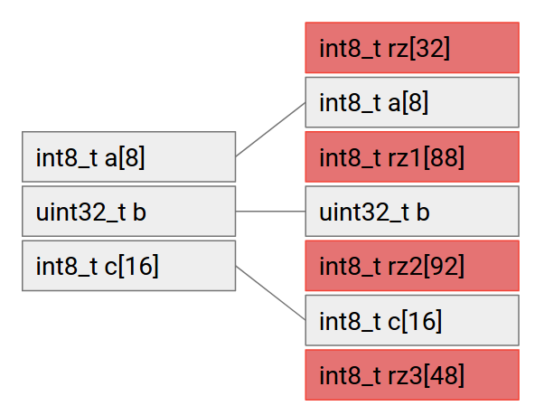

# Android Bug与Sanitizers混合

原标题：Android Bug Swatting with Sanitizers  
链接：[https://android-developers.googleblog.com/2017/08/android-bug-swatting-with-sanitizers.html](https://android-developers.googleblog.com/2017/08/android-bug-swatting-with-sanitizers.html)  
作者：Dan Austin (Android安全团队)  
翻译：[arjinmc](https://github.com/arjinmc)  

用于构建Android的编译器基础架构LLVM包含执行多个组件像静态和动态分析器。在分析Android时广泛使用的一组这些组件是Sanitizers(检测器)，特别是AddressSanitizer，UndefinedBehaviorSanitizer和SanitizerCoverage。这些Sanitizers是编译器rt中包含的基于编译器的仪器组件，可用于开发和测试过程，以推出错误并使Android更好。目前在Android中可用的Sanitizers可以发现和诊断许多内存滥用错误和未定义的行为，并可以提供代码覆盖率指标，以确保你的测试套件尽可能完整。

这篇博客文章详细介绍了目前的Android Sanitizers - AddressSanitizer，UndefinedBehaviorSanitizer和SanitizerCoverage的内部结构，并展示了如何在Android构建系统中使用它们。

## AddressSanitizer

[AddressSanitizer](https://github.com/google/sanitizers/wiki/AddressSanitizer)（ASan）是一种基于编译器的仪器功能，允许运行时检测C / C ++代码中的许多类型的内存错误。在Android中，检查以下类别的内存错误已经过测试：

* 超出范围访问堆，堆栈和全局变量
* 释放后使用，
* Use-after-return（运行时标记ASAN_OPTIONS = detect_stack_use_after_return = 1）
* 使用范围后（clang flag -fsanitize-address-use-after-scope）
* 双倍免费，无效

Android允许ASan全面建立仪器，并且还可以通过asanwrapper在应用程序级别进行ASan测试。有关仪器技术的说明可以在[source.android.com](https://source.android.com/devices/tech/debug/asan.html)上找到。

AddressSanitizer基于两个高级概念。第一个是所有内存相关函数调用的调试，包括alloca，malloc和free，以及跟踪内存分配，免费和使用统计信息的信息。该仪器允许ASan检测到无效的内存使用错误，包括双重免费，使用范围，返回和免费。ASan还可以检测发生在定义的内存区域范围之外的读取和写入。它通过填充所有分配的内存缓冲区和变量来实现。如果对此填充区域进行读取或写入，ASan会捕获并输出有用的诊断内存违例的信息。这种填充被称为ASan术语中毒记忆。这是一个例子，它是一个使用堆栈分配变量的内存填充中毒的例子：

  
<strong>图1</strong><small>具有8个元素的int8_t数组的ASANified堆栈变量示例，一个uint32_t和一个16个元素的int8_t数组。使用ASAN编译后的内存布局在右侧，每个变量之间填充。对于每个堆栈变量，在变量前后都有32个字节的填充。如果变量的对象大小不是32字节，则插入一个额外的32 - n个字节的填充，其中n是对象大小。</small>

ASan使用影子内存来跟踪哪些字节是正常内存，哪些字节是中毒的内存。字节可以被标记为完全正常（在阴影存储器中标记为0），完全中毒（相应的阴影字节的高位被置位），或者第一个k个字节未被取消（影子字节值为k）。如果影子内存指示一个字节中毒，则ASan会崩溃程序并输出有用的调试信息，包括调用堆栈，阴影内存映射，内存违规的类型，读取或写入的内容，导致违规的PC和内存内容.

```code
AddressSanitizer: heap-buffer-overflow on address 0xe6146cf3 at pc 0xe86eeb3c bp 0xffe67348 sp 0xffe66f14
WRITE of size 39 at 0xe6146cf3 thread T0
    #0 0xe86eeb3b  (/system/lib/libclang_rt.asan-arm-android.so+0x64b3b)
    #1 0xaddc5d27  (/data/simple_test_fuzzer+0x4d27)
    #2 0xaddd08b9  (/data/simple_test_fuzzer+0xf8b9)
    #3 0xaddd0a97  (/data/simple_test_fuzzer+0xfa97)
    #4 0xaddd0fbb  (/data/simple_test_fuzzer+0xffbb)
    #5 0xaddd109f  (/data/simple_test_fuzzer+0x1009f)
    #6 0xaddcbfb9  (/data/simple_test_fuzzer+0xafb9)
    #7 0xaddc9ceb  (/data/simple_test_fuzzer+0x8ceb)
    #8 0xe8655635  (/system/lib/libc.so+0x7a635)
0xe6146cf3 is located 0 bytes to the right of 35-byte region [0xe6146cd0,0xe6146cf3)
allocated by thread T0 here:
    #0 0xe87159df  (/system/lib/libclang_rt.asan-arm-android.so+0x8b9df)
    #1 0xaddc5ca7  (/data/simple_test_fuzzer+0x4ca7)
    #2 0xaddd08b9  (/data/simple_test_fuzzer+0xf8b9)
SUMMARY: AddressSanitizer: heap-buffer-overflow (/system/lib/libclang_rt.asan-arm-android.so+0x64b3b) 
Shadow bytes around the buggy address:
  0x1cc28d40: fa fa 00 00 00 00 07 fa fa fa fd fd fd fd fd fd
  0x1cc28d50: fa fa 00 00 00 00 07 fa fa fa fd fd fd fd fd fd
  0x1cc28d60: fa fa 00 00 00 00 00 02 fa fa fd fd fd fd fd fd
  0x1cc28d70: fa fa fa fa fa fa fa fa fa fa fa fa fa fa fa fa
  0x1cc28d80: fa fa fa fa fa fa fa fa fa fa fa fa fa fa fa fa
=>0x1cc28d90: fa fa fa fa fa fa fa fa fa fa 00 00 00 00[03]fa
  0x1cc28da0: fa fa 00 00 00 00 07 fa fa fa 00 00 00 00 03 fa
  0x1cc28db0: fa fa fd fd fd fd fd fa fa fa fd fd fd fd fd fa
  0x1cc28dc0: fa fa 00 00 00 00 00 02 fa fa fd fd fd fd fd fd
  0x1cc28dd0: fa fa 00 00 00 00 00 02 fa fa fd fd fd fd fd fd
  0x1cc28de0: fa fa 00 00 00 00 00 02 fa fa fd fd fd fd fd fd
Shadow byte legend (one shadow byte represents 8 application bytes):
  Addressable:           00
  Partially addressable: 01 02 03 04 05 06 07 
  Heap left redzone:       fa
  Freed heap region:       fd
  Stack left redzone:      f1
  Stack mid redzone:       f2
  Stack right redzone:     f3
  Stack after return:      f5
  Stack use after scope:   f8
  Global redzone:          f9
  Global init order:       f6
  Poisoned by user:        f7
  Container overflow:      fc
  Array cookie:            ac
  Intra object redzone:    bb
  ASan internal:           fe
  Left alloca redzone:     ca
  Right alloca redzone:    cb
```

有关报告的每个部分的更多信息，以及如何使其更加用户友好，可以在[LLVM网站](https://clang.llvm.org/docs/AddressSanitizer.html)和[Github](https://github.com/google/sanitizers/wiki/AddressSanitizer)上找到。

有时候，bug发现过程可能看起来是非确定性的，特别是当bug需要特殊的设置或者更先进的技术，比如堆栈启动或者竞争条件的开发。许多这些bug并不能立即显现出来，并且可能会将数千个指令从内存违规中脱离出来，这是实际的根本原因。由于ASan对所有与内存相关的功能进行了设备，并且在不触发与ASan相关的回调功能的情况下将数据与无法访问的区域进行配对，因此内存违规被捕获，而不是等待导致崩溃的损坏。这在bug发现和根本原因诊断中非常有用。此外，ASAN是一款非常有用的模糊工具，已被用于 Android上的[许多](https://www.blackhat.com/docs/asia-16/materials/asia-16-He-Hey-Your-Parcel-Looks-Bad-Fuzzing-And-Exploiting-Parcelization-Vulnerabilities-In-Android-wp.pdf)[模糊](https://conference.hitb.org/hitbsecconf2016ams/materials/D1T3%20LABS%20-%20Anto%20Joseph%20-%20Droid-FF.pdf)[工作](https://nullcon.net/website/archives/ppt/goa-15/analyzing-chrome-crash-reports-at-scale-by-abhishek-arya.pdf)。

## UBSan

[UndefinedBehaviorSanitizer](https://clang.llvm.org/docs/UndefinedBehaviorSanitizer.html)（UBSan）执行编译时仪器，以检查各种类型的未定义行为。设备制造商可以在其测试版本中包含LOCAL_SANITIZE：= default-ub在其makefile或default-ub：true的蓝图文件的清理程序块中。虽然UBSan可以检测许多未定义的行为，但Android的构建系统直接支持：

* bool
* integer-divide-by-zero
* return
* returns-nonnull-attribute
* shift-exponent
* unreachable
* vla-bound

UBSan的整数溢出检查也用于Android的构建系统。UBSan还支持无符号整数溢出，这不是技术上未定义的行为，而是包含在sanitizer中。通过将LOCAL_SANITIZE设置为有符号整数溢出，无符号整数溢出或组合标志整数，可以在makefile中启用这些命令，它们使能有符号整数溢出，无符号整数溢出，整数除以零， shift-base和shift-exponent。通过将Misc_undefined设置为所需的标志，可以在蓝图文件中启用这些功能。这些UBSan目标，特别是无符号整数溢出在mediaserver组件中广泛使用，以消除任何潜在的整数溢出漏洞。

Android上的默认实现是在遇到未定义的行为时中止程序。然而，从2016年10月开始，UBSan在Android上有一个可选的运行时库，可以提供更详细的错误报告，包括遇到的未定义行为的类型，文件和源代码行信息。

在Android.mk文件中，启用：
```code
LOCAL_SANITIZE：= unsigned-integer-overflow signed-integer-overflow
LOCAL_SANITIZE_DIAG：= unsigned-integer-overflow signed-integer-overflow
```
在Android.bp文件中，它启用：
```code
sanitize: {
        misc_undefined: [
            "unsigned-integer-overflow",
            "signed-integer-overflow",
        ],
        diag: {
            misc_undefined: [
                "unsigned-integer-overflow",
                "signed-integer-overflow",
            ],
        },
    },
```
以下是由UBSan运行时库提供的信息的示例：
```code
external/icu/icu4c/source/common/ucnv.c:1193:23: runtime error: unsigned integer overflow: 4291925010 + 2147483647 cannot be represented in type 'unsigned int'
external/icu/icu4c/source/common/cstring.c:288:16: runtime error: unsigned integer overflow: 0 - 1 cannot be represented in type 'uint32_t' (aka 'unsigned int')
external/harfbuzz_ng/src/hb-private.hh:894:16: runtime error: unsigned integer overflow: 72 - 55296 cannot be represented in type 'unsigned int'
external/harfbuzz_ng/src/hb-set-private.hh:82:24: runtime error: unsigned integer overflow: 32 - 562949953421312 cannot be represented in type 'unsigned long'
system/keymaster/authorization_set.cpp:500:37: runtime error: unsigned integer overflow: 6843601868186924302 * 24 cannot be represented in type 'unsigned long'
```

## SanitizerCoverage

Sanitizer工具具有内置的非常简单的代码覆盖工具.SanitizerCoverage允许在调用级别，基本块级别或边缘级别进行代码覆盖。这些可以用作独立的仪器技术或与任何Sanitizer结合使用，包括AddressSanitizer和UndefinedBehaviorSanitizer。要使用新的基于guard的覆盖，请设置fsanitize-coverage = trace-pc-guard。这会导致编译器在每个边缘插入__sanitizer_cov_trace_pc_guard（＆guard_variable）。每个边都有自己的uint32_t guard_variable。此外，还会生成一个模块构造函数__sanitizer_cov_trace_pc_guard_init（uint32_t * start，uint32_t * stop）。所有的__sanitizer_cov_函数都应该由用户提供。你可以使用[守卫跟踪电脑的示例](https://clang.llvm.org/docs/SanitizerCoverage.html#tracing-pcs-with-guards)。

除了控制流量跟踪，SanitizerCoverage还可以进行数据流跟踪。这通过fsanitize-coverage = trace-cmp激活，并通过使用__sanitizer_cov_trace_ *函数检测所有开关和比较指令来实现。对于整数除法和GEP指令存在类似的功能，分别用fsanitize-coverage = trace-div和fsanitize-coverage = trace-gep激活。这是一个实验界面，不是线程安全的，并且可以随时更改，但是它在Android版本中可用和实用。

在覆盖Sanitizer会话期间，覆盖信息被记录在两个文件，一个.sancov文件和一个sancov.map文件中。第一个包含程序中的所有检测点，另一个包含表示为第一个文件中的索引序列的执行跟踪。默认情况下，这些文件存储在当前工作目录中，其中一个为执行期间运行的每个可执行文件和共享对象创建。

## 结论

ASAN，UBSan和SanitizerCoverage仅仅是在Android中使用LLVM Sanitizer的开始。更多的LLVM sanitizer正在集成到Android构建系统中。这里描述的Sanitizer可以用作代码健康和系统稳定性机制，甚至目前被Android Security用于查找和防止安全漏洞！


