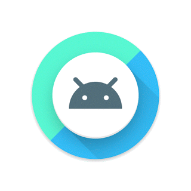
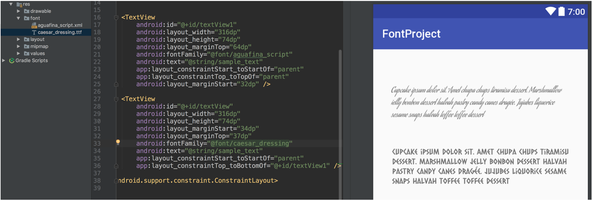

# 介绍Android 8.0 Oreo

原标题：Introducing Android 8.0 Oreo  
链接：[https://android-developers.googleblog.com/2017/08/introducing-android-8-oreo.html](https://android-developers.googleblog.com/2017/08/introducing-android-8-oreo.html)  
作者：Dave Burke (工程副总裁)  
翻译：[arjinmc](https://github.com/arjinmc)  

经过一年多的开发和测试，开发者和早期采用者（谢谢！），我们现在准备正式推出Android 8.0 Oreo到世界各地。Android 8.0带来了许多伟大的功能，如图片，自动填充，集成即时应用程序，Google Play保护，更快的启动时间等等。

我们正在将资源推向Android开放源代码项目（AOSP），今天供大家访问。Pixel和Nexus 5X / 6P版本已经进入了运营商测试，我们预计在接下来的几个星期内，Pixel C和Nexus Player将分阶段推出。Android测试版用户将会收到今天的最终版本的更新，并且[可以](https://developer.android.com/about/versions/o/download.html)手动下载和刷镜像。在过去的几个月里，我们一直与合作伙伴密切合作，到今年年底，硬件厂商如Essential，华为，HTC，京瓷，LG，摩托罗拉，诺基亚手机的HMD全球之家，三星，夏普和索尼计划将新设备推出或升级到Android 8.0 Oreo。

## 什么是Android Oreo？

在Android 8.0 Oreo中，我们专注于创造流畅的体验，使Android更加强大，易于使用，如：

  
* <strong>画中画</strong>可让用户在任意尺寸的屏幕上同时管理两项任务，而且应用程序[可轻松支持](https://developer.android.com/about/versions/o/android-8.0.html#opip)。（如上图）
* <strong>通知点</strong>扩展了通知的覆盖范围，并提供了一种新的方式来展现你的应用程序中的表面的Activity。点[对大部分应用程序零点工作](https://developer.android.com/guide/topics/ui/notifiers/notifications.html#badges) - 我们甚至从图标中提取点的颜色。
* <strong>自动填充框架</strong>简化了用户如何设置新设备并同步其密码。使用表单数据的应用程序可以[优化其自动填充应用程序](https://developer.android.com/guide/topics/text/autofill.html)，密码管理器应用程序可以使用新的API将他们的服务提供给他们最喜欢的应用程序中的用户。作为Google Play服务更新的一部分，Autofill将在未来几周内全面展开。

我们还投入了一项专注于优化电池寿命，启动时间，图形渲染和稳定性的项目，同时为开发人员更好地了解应用程序的健康状况：

* <strong>系统优化</strong>：我们跨系统工作，帮助应用程序运行得更快更流畅 - 例如，在运行时，我们添加了一个新的并发压缩垃圾回收，代码区域等。
* <strong>后台限制</strong>：我们为[后台运行的背景位置和Wi-Fi扫描以及更改方式添加了新的限制](https://developer.android.com/about/versions/o/background-location-limits.html)。这些边界可防止意外过度使用电池和内存，并适用于所有应用程序 - 确保你了解并在应用程序中对这些进行了说明。
* <strong>互补的Android Vitals仪表板和IDE分析器</strong>：在Play应用商店控制台中，你现在可以查看有关应用程序的汇总数据，以帮助你[精确定位常见问题](https://developer.android.com/topic/performance/vitals/index.html) - 过多崩溃率，ANR速率，冻结帧，渲染缓慢，唤醒过多等。你还将在Android Studio 3.0中找到新的性能分析器，并在平台中找到新的仪器。

   

<small>在Android 8.0中，你的应用可以直接在laucher中固定一个特定的应用快捷方式来驱动互动（左）。通知点让用户在你的应用程序中处于活动状态，并让他们直接跳转到应用程序的核心功能（右）。</small>

对于开发人员，Android Oreo包含许多新功能，可帮助你构建更好，更高效的应用程序。这里仅仅是少数：

* <strong>自动调整文本视图</strong>：使用[自动调整TextView](https://developer.android.com/guide/topics/ui/look-and-feel/autosizing-textview.html)可以自动填充TextView文本，而不管数量。你可以创建预设文本大小的数组，或者以逐步的粒度设置最小和最大大小，并且文本将增长和缩小以填充可用的TextView空间。
* <strong>XML中的字体</strong>：[字体](https://developer.android.com/guide/topics/ui/look-and-feel/fonts-in-xml.html)现在是完全支持的资源类型。你现在可以在XML布局中使用字体，并以XML定义字体系列。
* <strong>可下载的字体和表情符号</strong>：使用[可下载的字体](https://developer.android.com/guide/topics/ui/look-and-feel/downloadable-fonts.html)，你可以从共享提供程序加载字体，而不是将其包含在你的APK中。提供商和支持库管理字体的下载并在应用程序之间共享它们。相同的实现也支持可下载的表情符号，所以你可以获得更新的表情符号，而不限于内置于设备中的表情符号。
* <strong>自适应图标</strong>：你现在可以根据设备制造商选择的遮罩创建系统以不同形状显示的[自适应图标](https://developer.android.com/guide/practices/ui_guidelines/icon_design_adaptive.html)。该系统还可以动画化与图标的交互，并在launcher，快捷方式，设置，共享对话框和概述屏幕中使用它们。

  
  
<small>自适应图标以不同的设备型号显示各种形状。</small>

* <strong>桌面快捷式</strong>：应用程序快捷键和主屏幕小部件非常适合吸引用户，现在你可以让用户从你的应用程序中添加并将[快捷式和小部件](https://android-developers.googleblog.com/2017/07/whats-new-for-shortcuts-and-widgets-in.html)插入launcher。还有一个新的选项来添加专门的活动来帮助用户创建快捷方式。该activity完成了自定义选项和确认。
* <strong>应用程序的宽色域颜色</strong>：成像应用程序现在可以充分利用具有广域色彩显示的新设备。为了显示宽色域图像，应用程序在其清单文件（每个activty）中启用一个标志，并使用嵌入的[宽色配置文件](https://developer.android.com/reference/android/graphics/ColorSpace.html)（AdobeRGB，Pro Photo RGB，DCI-P3等）加载位图。
* <strong>WebView增强功能</strong>：在Android Oreo中，我们默认启用了WebView多进程模式，并添加了一个API，让你的应用程序[处理错误和崩溃](https://developer.android.com/guide/webapps/managing-webview.html)。你还可以选择通[过Google安全浏览验证网站](https://developer.android.com/guide/webapps/managing-webview.html#safe-browsing)的WebView对象。
* <strong>Java 8语言API和运行时优化</strong>： Android现在支持多种新的Java语言API，包括新的java.time API。此外，Android Runtime比以往任何时候都更快，在某些应用程序基准上可以提高到两倍。

通过访问[developer.android.com](https://developer.android.com/index.html)上的[Android 8.0 Oreo网站](https://developer.android.com/about/versions/o/index.html)了解有关这些和其他新功能的更多信息。还请查看[Android Oreo的新功能？了解开发者的新功能的视频](https://www.youtube.com/watch?v=7kD0ZYzJbYo)。

## 确保你的应用程序已准备就绪

如果还没有准备好，今天要花一点时间测试你的应用程序，并确保他们提供你要升级到Android Oreo的用户所需的体验。

只需将你当前的应用从Google Play安装运行到Android Oreo的设备或[模拟器](https://developer.android.com/studio/run/managing-avds.html)上，并测试用户流。应用程序应该运行和看起来不错，并且正确处理Android Oreo [行为的变化](https://developer.android.com/about/versions/o/android-8.0-changes.html)。特别要注意[后台位置限制](https://developer.android.com/about/versions/o/android-8.0-changes.html#abll)，[通知通道](https://developer.android.com/guide/topics/ui/notifiers/notifications.html#ManageChannels)以及[网络](https://developer.android.com/about/versions/o/android-8.0-changes.html#networking-all)， [安全性](https://developer.android.com/about/versions/o/android-8.0-changes.html#security-all)和[标识符](https://developer.android.com/about/versions/o/android-8.0-changes.html#privacy-all)的变化。

一旦解决了任何问题你就可以在alpha，beta或者产品渠道上发布应用程式更新到Google Play，以便用户开始接收Android 8.0 Oreo。

## 使用Android Studio加快开发速度

当你准备在Android Oreo中使用新的API构建时，我们建议你更新到最新版本的[Android Studio 3.0](https://android-developers.googleblog.com/2017/05/android-studio-3-0-canary1.html)，可从[beta版渠道](https://developer.android.com/studio/preview/index.html)下载。除了改进的应用程序[性能分析工具](https://developer.android.com/studio/preview/features/android-profiler.html)，支持[Kotlin编程语言](http://android-developers.googleblog.com/2017/05/android-announces-support-for-kotlin.html)和Gradle构建优化之外，Android Studio 3.0还可以使用[免安装应用程序](https://android-developers.googleblog.com/2017/05/android-instant-apps-is-open-to-all.html)，[XML字体](https://developer.android.com/guide/topics/ui/look-and-feel/fonts-in-xml.html)，[可下载字体](https://developer.android.com/guide/topics/ui/look-and-feel/downloadable-fonts.html)和[自适应图标](https://developer.android.com/guide/practices/ui_guidelines/icon_design_adaptive.html)进行开发。

  
<small>Android Studio 3.0包括使用Android Oreo功能开发的工具，例如在你的应用程序中预览XML字体资源。</small>

我们还建议你更新到现在可从[Google的Maven库](https://developer.android.com/studio/build/dependencies.html#google-maven)获得的[Android支持库26.0.2](https://developer.android.com/topic/libraries/support-library/revisions.html?utm_campaign=android_launch_npreview_061516&utm_source=anddev&utm_medium=blog)以及SDK Manager中提供的最新的SDK，工具和模拟器的系统映像。

如果你刚刚开始构建Android Oreo，请先阅读[移植指南](https://developer.android.com/about/versions/o/migration.html#bfa)。它可以概述你需要做的过程和配置更改。

要针对官方的Android 8.0 API进行编译，请将你的项目更新<i>compileSdkVersion</i>为API 26.我们还建议你将应用程序更新<i>targetSdkVersion</i>为API 26，以使用Android Oreo特定的[行为更改](https://developer.android.com/about/versions/o/behavior-changes.html?utm_campaign=android_launch_npreview_061516&utm_source=anddev&utm_medium=blog)来选择并测试你的应用。有关如何使用Android Oreo构建环境的详细信息，请参阅[移植指南](https://developer.android.com/about/versions/o/migration.html#bfa)。

##　发布你的更新到Google Play

Google Play适用于针对或针对API 26编写的应用程序。准备好后，你可以在Alpha，Beta或生产渠道中发布APK更新。

确保你的更新的应用程序在Android Oreo以及旧版本上运行良好。我们建议你使用[Google Play的beta测试功能](https://developer.android.com/distribute/engage/beta.html?utm_campaign=android_launch_npreview_061516&utm_source=anddev&utm_medium=blog)，从一小群用户那里获得早期反馈，然后进行分阶段推出。我们期待看到你的应用更新！

## Android Oreo的下一步是什么？

我们即将关闭“开发者预览”问题追踪，但请保留反馈！你可以在AOSP问题跟踪器中针对Android 8.0 [提出新问题](https://issuetracker.google.com/issues/new?component=190923&template=841312)。

再次感谢参与Android O开发者预览和公开测试版的许多开发人员和早期采用者。你们给了我们很好的反馈，并提交了数百个问题，帮助我们使Android Oreo平台成为消费者和开发人员的最佳实践。