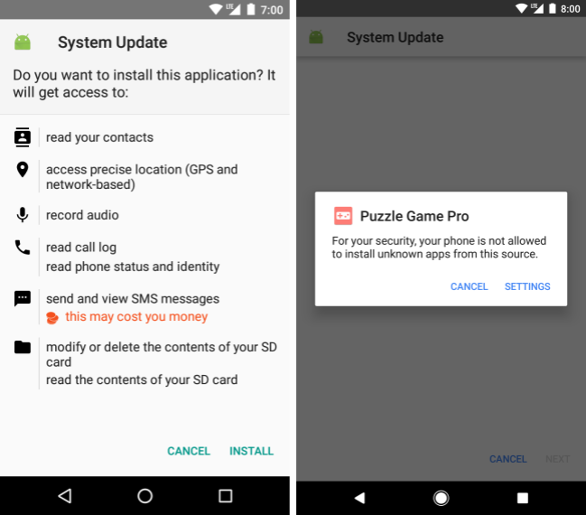
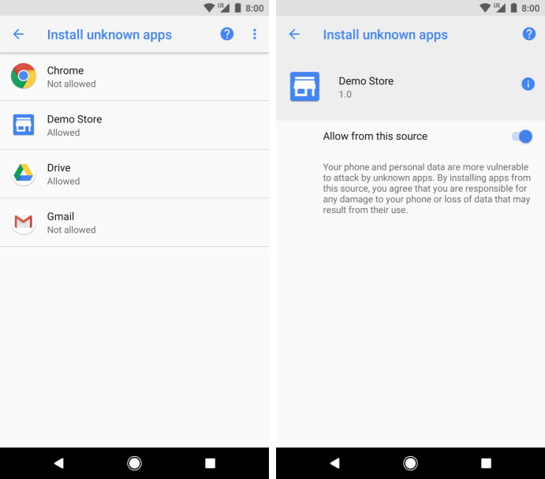

# 使Android O上的应用更安全

原标题：Making it safer to get apps on Android O  
链接：[https://android-developers.googleblog.com/2017/08/making-it-safer-to-get-apps-on-android-o.html](https://android-developers.googleblog.com/2017/08/making-it-safer-to-get-apps-on-android-o.html)  
作者：Edward Cunningham (Android安全产品经理)
翻译：[arjinmc](https://github.com/arjinmc)  

眼睛敏锐的Android O用户将注意到没有“允许未知来源”设置，自Android以来就已经存在，以便于从Google Play和其他预加载的商店外部安装应用程序。在这篇文章中，我们将讨论新的<strong>安装未知应用程序</strong>权限以及为Android用户和开发人员带来的安全优势。

今年早些时候，我们推出了[Google Play保护](https://www.blog.google/products/android/google-play-protect/) - 全面的安全性服务，始终致力于保护你的设备免受伤害。Google Play仍然是Android用户下载其应用程序的最安全的地方之一，大部分来自第三方来源的潜在有害应用程序（PHAs）。

PHA作者采用的常见策略是通过恶意下载器来传递应用程序。例如，游戏应用程序可能不包含恶意代码，而是可能会通知用户安装伪装成重要安全更新的PHA。（你可以在Android Security 2016 Year Review中阅读有关敌意下载的更多信息）。已启用安装来自未知来源的应用程序的用户可能会容易受到这种欺骗行为的影响。

  
左（Android O前）：PHA伪装成系统更新的安装屏幕。
对（Android O）：在安装PHA之前，用户必须首先向触发安装的应用授予权限。
在Android O中，安装未知应用程序权限可以安全地从未知来源安装应用程序。此权限与提示安装的应用程序相关联，就像其他运行时权限一样，并确保用户在提示用户安装应用程序之前，授予使用安装源的权限。当在运行Android O及更高版本的设备上使用时，恶意下载器无法篡改用户安装应用程序，而不必先将其放置。

此新权限为用户提供透明度，控制和简化的流程，以从可信来源启用安装。“设置”应用程序显示用户已批准安装未知应用的应用列表。用户可以随时撤销特定应用的权限。

  
<small>用户可以随时查看他们允许安装未知应用的应用。为了使权限授予过程更容易，应用程序开发人员可以选择将用户引导到其权限屏幕，作为设置流程的一部分。</small>

## 开发更改

要利用这种新的行为，需要通过包安装程序下载和安装其他应用程序的应用程序的开发者可能需要进行一些更改。如果应用程序使用<i>targetSdkLevel</i>26或更高版本，并提示用户安装其他应用程序，则清单文件需要包含[REQUEST_INSTALL_PACKAGES](https://developer.android.com/reference/android/Manifest.permission.html#REQUEST_INSTALL_PACKAGES)权限：

```code
    <uses-permission android:name="android.permission.REQUEST_INSTALL_PACKAGES" />
```

没有声明此权限的应用程序无法安装其他应用程序，这对于无意这样做的应用程序来说是一种便利的安全保护。你可以选择使用Intent操作优先地将用户引导到<strong>安装未知应用</strong>权限设置[ACTION_MANAGE_UNKNOWN_APP_SOURCES](https://developer.android.com/reference/android/provider/Settings.html#ACTION_MANAGE_UNKNOWN_APP_SOURCES)。你还可以使用PackageManager[canRequestPackageInstalls()](https://developer.android.com/reference/android/content/pm/PackageManager.html#canRequestPackageInstalls()) API 查询此权限的状态。

请注意， 如果这些应用可以安装和更新其他应用，[Play策略](https://play.google.com/about/developer-content-policy/)仍适用于在Google Play上分发的应用。在大多数情况下，这种行为是不恰当的; 你应该提供一个到Play商店的应用程序的列表的[深层链接](https://developer.android.com/distribute/marketing-tools/linking-to-google-play.html)。

请务必查看更新的[发布指南](https://developer.android.com/studio/publish/index.html#publishing-unknown)，其中提供有关安装未知应用程序的更多信息，并继续关注Android O中有关安全性加强的更多帖子。