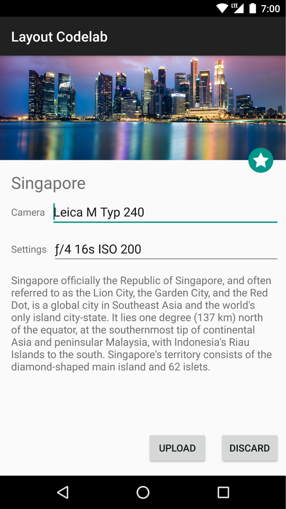
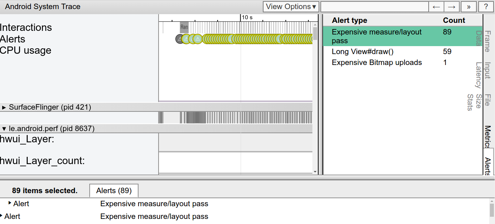
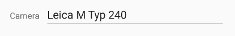
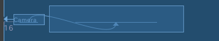
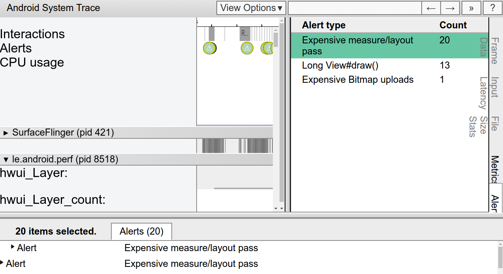
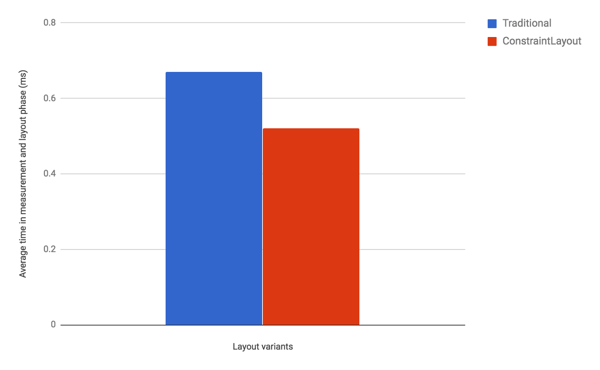

# 了解使用ConstraintLayout的性能优势

原标题：Understanding the performance benefits of using ConstraintLayout  
链接：[https://android-developers.googleblog.com/2017/08/understanding-performance-benefits-of.html](https://android-developers.googleblog.com/2017/08/understanding-performance-benefits-of.html)  
作者：Takeshi Hagikura (开发程序工程师)  
翻译：[arjinmc](https://github.com/arjinmc)  

自去年在Google I / O 宣布[ConstraintLayout](https://developer.android.com/training/constraint-layout/index.html)以来，我们一直在不断改进布局的稳定性和布局编辑器支持。我们还给<i>ConstraintLayout</i>添加了特定功能的新功能可以帮助你构建各种类型的布局，例如[引入链](https://developer.android.com/training/constraint-layout/index.html#constrain-chain)和[设置大小作为比例](https://developer.android.com/training/constraint-layout/index.html#ratio)。除了这些功能之外，还有一个显着的性能优势ConstraintLayout。在这篇文章中，我们将介绍如何从这些性能改进中获益。

## Android如何绘制视图？

为了更好地了解性能<i>ConstraintLayout</i>，让我们回顾一下，看看Android如何绘制视图。

当用户将Android视图引入焦点时，Android框架会引导该视图进行绘制。这个绘图过程包括3个阶段：

1. 测量  
系统完成视图树的自顶向下遍历，以确定每个<i>ViewGroup</i>和View元素应该有多大。当一个<i>ViewGroup</i>被测量时，它也测量其孩子。

2. 布局  
发生另一个自上而下的遍历，每个ViewGroup使用在测量阶段确定的大小来确定其孩子的位置。

3. 绘制  
系统执行另一个自上而下的遍历。对于视图树中的每个对象，Canvas创建一个对象来向GPU发送绘图命令列表。这些命令包括ViewGroup与View对象的大小和位置，其中所述系统在过去2个阶段来确定。

  
<strong>图1.</strong>测量阶段如何遍历视图树的示例  

绘图过程中的每个阶段需要从视图树的自顶向下遍历。因此，在视图层次结构中彼此嵌套（或嵌套）的视图越多，设备绘制视图所需的时间和计算能力就越多。通过在Android应用程序布局中保持平面的层次结构，你可以为应用程序创建一个快速响应的用户界面。

## 传统布局层次结构的消耗

考虑到这个解释，让我们创建一个使用传统的布局层次结构<i>LinearLayout</i>和<i>RelativeLayout</i>对象。

  
<strong>图2.</strong>布局示例  

假设我们要构建一个如上图所示的布局。如果使用传统布局构建XML文件，则XML文件包含类似于以下内容的元素层次结构（在本示例中，我们省略了这些属性）：

```code
<RelativeLayout>
  <ImageView />
  <ImageView />
  <RelativeLayout>
    <TextView />
    <LinearLayout>
      <TextView />
      <RelativeLayout>
        <EditText />
      </RelativeLayout>
    </LinearLayout>
    <LinearLayout>
      <TextView />
      <RelativeLayout>
        <EditText />
      </RelativeLayout>
    </LinearLayout>
    <TextView />
  </RelativeLayout>
  <LinearLayout >
    <Button />
    <Button />
  </LinearLayout>
</RelativeLayout>
```
 
虽然在这种类型的层次结构中通常有改进的空间，但你几乎肯定仍然需要创建具有一些嵌套视图的层次结构。

如前所述，嵌套层次结构可能会对性能产生不利影响。让我们使用Android Studio的[Systrace](https://developer.android.com/studio/profile/systrace-commandline.html)工具来看看嵌套视图如何实际影响UI性能。我们以编程方式调用每个<i>ViewGroup</i>（<i>ConstraintLayout</i>和<i>RelativeLayout</i>）的度量和布局阶段，并在测量和布局调用正在执行时触发Systrace。以下命令生成包含关键事件的概述文件，例如在20秒间隔期间发生的昂贵的度量/布局遍历：

```code
python $ANDROID_HOME/platform-tools/systrace/systrace.py --time=20 -o ~/trace.html gfx view res
```

有关如何使用Systrace的更多详细信息，请参阅[使用Systrace分析UI性能](https://developer.android.com/studio/profile/systrace.html)指南。

Systrace自动突出显示了这个布局的（众多）性能问题，以及修复它们的建议。通过单击“Alerts”选项卡，你将发现绘制此视图层次结构需要80个昂贵消耗的通过测量和布局阶段！

触发许多昂贵的测量和布局阶段远非理想; 如此大量的绘图活动可能会导致用户注意到的跳过的框架。我们可以得出结论，由于嵌套的层次结构像<i>RelativeLayout</i>的及其每个孩子两次测量的特点这样的层次结构，布局性能差。

  
图3.查看Systrace对于使用的布局变体的警报RelativeLayout  

你可以在我们的[GitHub库](https://github.com/googlesamples/android-constraint-layout-performance)中查看有关我们如何执行这些测量的整个代码。

## ConstraintLayout对象的好处

如果使用相同的布局创建<i>ConstraintLayout</i>，则XML文件包含类似于以下内容的元素层次（属性再次省略）：

```code
<android.support.constraint.ConstraintLayout>
  <ImageView />
  <ImageView />
  <TextView />
  <EditText />
  <TextView />
  <TextView />
  <EditText />
  <Button />
  <Button />
  <TextView />
</android.support.constraint.ConstraintLayout>
```

如该示例所示，布局现在具有完全平坦的层次结构。这是因为<i>ConstraintLayout</i>允许你构建复杂的布局，而无需嵌套<i>View</i>和<i>ViewGroup</i>元素。

例如，让我们来看看<i>TextView</i>，并<i>EditText</i>在布局中：

  

使用<i>RelativeLayout</i>，你需要创建一个新<i>ViewGroup</i>的对齐<i>EditText</i>垂直与TextView：

```code
<LinearLayout
    android:id="@+id/camera_area"
    android:layout_width="match_parent"
    android:layout_height="wrap_content"
    android:orientation="horizontal"
    android:layout_below="@id/title" >

    <TextView
        android:text="@string/camera"
        android:layout_width="wrap_content"
        android:layout_height="wrap_content"
        android:layout_gravity="center_vertical"
        android:id="@+id/cameraLabel"
        android:labelFor="@+id/cameraType"
        android:layout_marginStart="16dp" />

    <RelativeLayout
        android:layout_width="match_parent"
        android:layout_height="wrap_content">

        <EditText
            android:id="@+id/cameraType"
            android:ems="10"
            android:inputType="textPersonName"
            android:text="@string/camera_value"
            android:layout_width="match_parent"
            android:layout_height="wrap_content"
            android:layout_centerVertical="true"
            android:layout_marginTop="8dp"
            android:layout_marginStart="8dp"
            android:layout_marginEnd="8dp" />
    </RelativeLayout>
</LinearLayout>
```

通过使用<i>ConstraintLayout</i>替代，你可以通过添加的基线约束达到同样的效果<i>TextView</i>来的基线<i>EditText</i>，而无需创建另一个<i>ViewGroup</i>：

  
<strong>图4. </strong>EditText和TextView之间的约束

```code
<TextView
      android:layout_width="wrap_content"
      android:layout_height="wrap_content"
      app:layout_constraintLeft_creator="1"
      app:layout_constraintBaseline_creator="1"
      app:layout_constraintLeft_toLeftOf="@+id/activity_main_done"
      app:layout_constraintBaseline_toBaselineOf="@+id/cameraType" />
```

在为所使用的版本版本运行Systrace工具时，<i>ConstraintLayout</i>在相同的20秒间隔内，你会看到更少的昂贵的测量/布局传递。这种性能的提高是有道理的，现在我们保持视图层次平坦！

  
<strong>图5.</strong>查看Systrace使用的布局变体的警报<i>ConstraintLayout</i>  

在相关的说明中，我们<i>ConstraintLayout</i>使用[布局编辑器](https://developer.android.com/training/constraint-layout/index.html)构建了我们的布局，而不是用手编辑XML。为了达到使用相同的视觉效果<i>RelativeLayout</i>，我们可能需要手动编辑XML。

##　测量性能差异

我们分析每一项措施和布局通多长时间才两点式布局，<i>ConstraintLayout</i>并且<i>RelativeLayout</i>，通过使用[OnFrameMetricsAvailableListener](https://developer.android.com/reference/android/view/Window.OnFrameMetricsAvailableListener.html)，这是在安卓7.0（API级别24）推出。此类可让你收集有关应用程序UI渲染的逐帧定时信息。

通过调用以下代码，你可以开始录制每帧UI操作：

```code
window.addOnFrameMetricsAvailableListener(
        frameMetricsAvailableListener, frameMetricsHandler);
```

计时信息可用后，应用程序触发<i>frameMetricsAvailableListener()</i>回调。我们对测量/布局性能感兴趣，所以[FrameMetrics.LAYOUT_MEASURE_DURATION](https://developer.android.com/reference/android/view/FrameMetrics.html#LAYOUT_MEASURE_DURATION)在检索实际帧持续时间时调用。

```code
Window.OnFrameMetricsAvailableListener {
        _, frameMetrics, _ ->
        val frameMetricsCopy = FrameMetrics(frameMetrics);
        // Layout measure duration in nanoseconds
        val layoutMeasureDurationNs = 
                frameMetricsCopy.getMetric(FrameMetrics.LAYOUT_MEASURE_DURATION);
```
        

要了解有关<i>FrameMetrics</i>可以接收的其他类型的持续时间信息的更多信息 ，请参阅[FrameMetrics](https://developer.android.com/reference/android/view/FrameMetrics.html) API参考。

## 测量结果：ConstraintLayout更快

我们的性能比较表明，ConstraintLayout进行在测定/布局相比<i>RelativeLayout</i>更好约40％：

  
<strong>图6.</strong>测量/布局（单位：ms，平均100帧）

如这些结果所示，<i>ConstraintLayout</i>可能比传统布局更具有性能。此外，<i>ConstraintLayout</i>还有其他功能可以帮助你构建复杂和执行的布局，如[ConstraintLayout对象部分的优点](https://android-developers.googleblog.com/#bookmark=kix.qjly41rrtsa9)的讨论。有关详细信息，请参阅[使用ConstraintLayout构建响应式UI](https://developer.android.com/training/constraint-layout/index.html)指南。我们建议你在设计应用程序的布局时使用<i>ConstraintLayout</i>。在几乎所有情况下，如果你以前需要深入嵌套的布局，则ConstraintLayout应该是你的布局，以获得最佳性能和易用性。

## 附录：测量环境

上述所有测量均在以下环境中进行。

内容 | 型号
---| ---
设备 | Nexus 5X
Android版本 |  8
ConstraintLayout版本 | 1.0.2

## 下一步是什么

查看[开发者指南](https://developer.android.com/training/constraint-layout/index.html)，[API参考文档](https://developer.android.com/reference/android/support/constraint/ConstraintLayout.html)和[Medium上的文章](https://medium.com/google-developers/building-interfaces-with-constraintlayout-3958fa38a9f7)，以充分了解<i>ConstraintLayout</i>可为你提供的内容。再次感谢所有提交反馈意见的人士，以及自从我们的alpha版本发布以来的几个月<i>ConstraintLayout</i>。我们衷心感谢，我们能够发布生产就绪版本[1.0](http://tools.android.com/recent/constraintlayout10isnowavailable)的<i>ConstraintLayout</i>在今年早些时候。随着我们不断改进<i>ConstraintLayout</i>，请继续使用[Android问题跟踪](http://b.android.com/)向我们发送反馈。