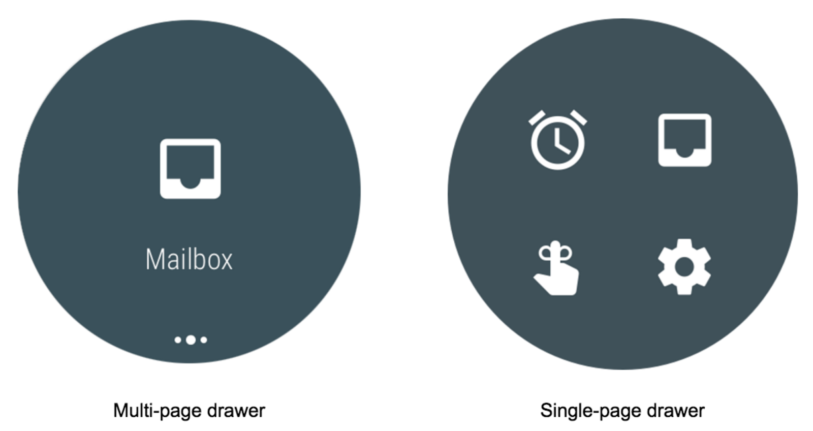
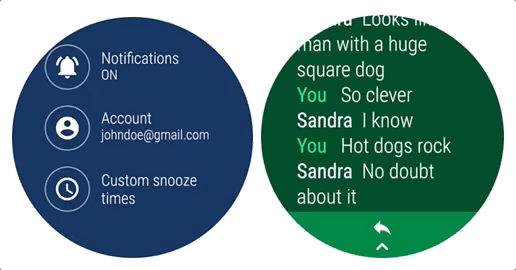
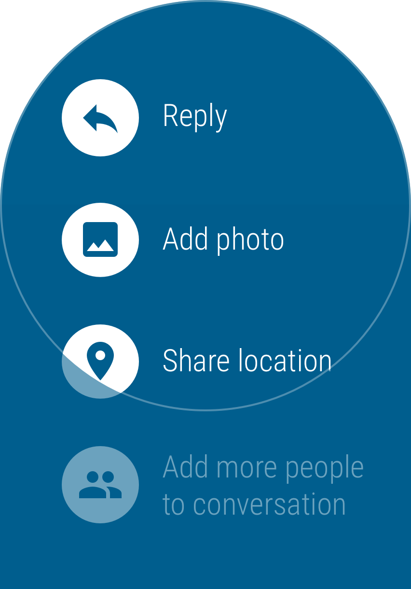
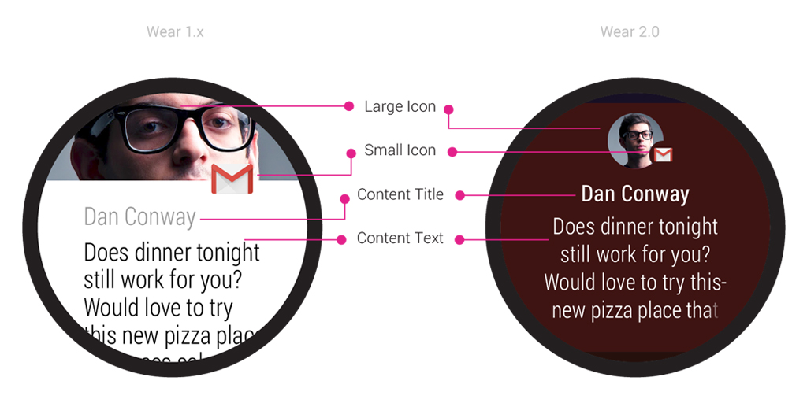
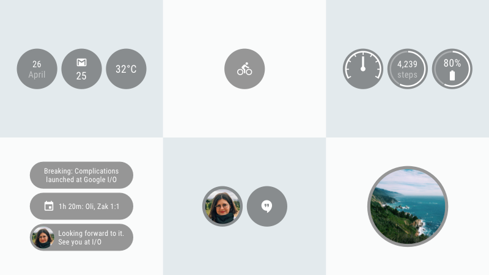
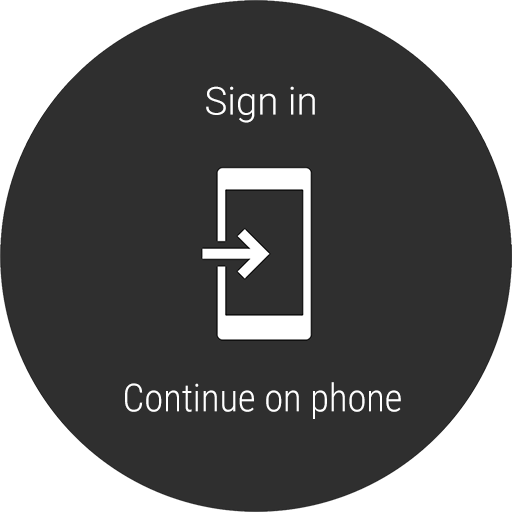

# 如何改善Wear 2.0的应用程序设计

原标题：How to improve app design for Wear 2.0  
链接：[https://android-developers.googleblog.com/2017/08/how-to-improve-app-design-for-wear-20.html](https://android-developers.googleblog.com/2017/08/how-to-improve-app-design-for-wear-20.html)  
作者：Steven Tepper (Google Play应用质量顾问)  
翻译：[arjinmc](https://github.com/arjinmc)   

[Wear 2.0推出](https://android-developers.googleblog.com/2017/02/AndroidWear2.html)了与除采用新的硬件功能的加入支持，早在二月[Material Design主题指导原则](https://www.google.com/design/spec-wear/android-wear/designing-for-watches.html)，和一个简单的垂直UI模式。它还引入了一个[复杂的API](https://developer.android.com/training/wearables/watch-faces/complications.html)，使应用程序更容易提供观看表盘的数据，并观看表盘并入外部数据。最后一个大的更新是，针对Wear 2.0的应用程序现在可以在[独立模式](https://developer.android.com/training/wearables/apps/standalone-apps.html)下运行，而无需连接手机上的随播应用程序。

有关导航，通知，并发症API和独立功能的一些设计注意事项，可帮助你更好地优化Wear 2.0设备：

## 导航

1. <strong>使用[WearableDrawerLayout](https://developer.android.com/training/wearables/ui/ui-nav-actions.html#createa drawer)导航抽屉进行简单和不频繁的导航</strong>：简单的导航包括访问应用程序设置，切换用户或注销等任务。你可以在Wear 2.0上实现这一点，通过从屏幕顶部向下滑动来切换应用的不同视图或部分，或者从屏幕底部向上滑动时可以设置动作抽屉，用于上下文相关操作。
2. <strong>将导航抽屉作为单页抽屉，使用户能够快速浏览视图</strong>：导航抽屉可以呈现为多页或单页抽屉。当用户期望在应用程序的7个或更少的视图之间快速浏览时，单页布局是有用的。请记住，如果应用程序使用单页抽屉，图像应该是清楚可理解的，因为在此布局中不会有任何类型的文本标签。如果有超过7个视图导航到或视图不容易被图标表示，你应该使用多页面的抽屉布局。

  

3. <strong>使用多个应用程序启动器，如果你的应用程序有两个或三个分离的功能</strong>：例如，如果你的应用支持两个activity追踪，各种选择，行动和views和历史分析和跟踪activity的管理，你可以使用多应用程序launchers去处理这些任务。或者，如果你的应用程序有一个简单的主屏幕，这些功能可以放置在屏幕底部。

4. <strong>使用action drawer顶部的方式来提供对主要操作的快速访问</strong>：如果没有与视图相关联的主要操作，请覆盖默认行为，并强制使用溢出按钮来窥视，将所有操作暴露在底部查看，点击时。

  
  

确保对于使用Wear 2.0的设备，你的应用程序可以利用这些新的UI模式来提供一致的用户体验。查看更多关于[Wear导航和action](https://developer.android.com/training/wearables/ui/ui-nav-actions.html)的培训资源和[导航](https://www.google.com/design/spec-wear/components/navigation-drawer.html)和[action](https://www.google.com/design/spec-wear/components/action-drawer.html)抽屉的材料设计规范。

## 通知

Wear 2.0使用更简单的垂直导航模式，去除水平滑动手势以呈现通知的动作。通知操作现在作为通知底部的单个主要操作（如果适用）显示。如果没有主要操作，展开通知会在单个可垂直滚动的视图中显示选项。

通知将在1.x和2.0设备上无需任何更改的情况下工作，但显示不同：

  

为Wear 2.0设备创建应用程序时，通过应用以下最佳实践来改善用户体验：

1. <strong>支持可扩展通知</strong>：使用[BigTextStyle](https://developer.android.com/reference/android/support/v4/app/NotificationCompat.BigTextStyle.html)， 以便用户可以在手表上看到更多内容。
2. <strong>使用通知的折叠视图（如果适用）</strong>： 在适当的情况下，使用setContentIntent（）将通知的主要操作添加到通知的折叠视图。
3. <strong>对于消息传递应用程序</strong>，请使用[MessagingStyle](https://developer.android.com/training/wearables/notifications/noti-styles.html)：使用此样式在扩展通知中提供丰富的聊天应用程序体验。
4. <strong>更新Wear 1.0特有的用户指南</strong>： 通过水平滑动（Wear 1.x模式），删除任何指导用户在卡上行动的文字。
5. <strong>增强通知以使用内联操作</strong>：这样可以让用户无需轻按即可查看扩展的通知详细信息。消息传递通知的操作可以使用几种不同的输入方式，包括智能回复预设，语音和键盘输入。利用这些功能来增加用户的附加功能。

详细了解[如何将可穿戴功能添加到通知](https://developer.android.com/training/wearables/notifications/index.html)中。

## 并发

Wear 2.0中的并发API让表盘开发者和第三方数据提供商能够更轻松地展示用户所需的重要信息。支持API的表盘可以配置为使用手表上安装的任何数据提供者，同时保持对其外观的完全控制。支持复杂API的应用程序允许在任何表盘上访问应用程序的数据。这些并发可以根据数据提供者配置的数据和表盘上分配了多少空间，以各种形式（短文本，图标，远程值，长文本，小图像和大图像）显示。

  
为了确保并发适合手表的整体设计，并妥善处理其数据类型，在添加并发支持时，我们建议表盘制作人应该：

1. <strong>使用Wear 2.0 SDK中找到的[TextRenderer](https://developer.android.com/reference/android/support/wearable/complications/rendering/TextRenderer.html)类</strong>：通过缩小文本，可以将并发中的文本调整到其边界，动态地支持换行符或超过字符串的字符串超过基于文本的并发的范围时。
2. <strong>使用[ComplicationDrawable](https://developer.android.com/reference/android/support/wearable/complications/rendering/ComplicationDrawable.html)类设置背景颜色，形状，边框和字体选项的并发</strong>：这样可以完全控制复杂程度如何呈现给表盘。
3. <strong>设计表盘为用户提供一种方式，通过设置菜单配置或调整手表的复杂性</strong>：要了解如何构建这些设置，请参阅GitHub上[表盘的示例](https://github.com/googlesamples/android-WatchFace)。
4. <strong>使用数据提供程序[测试套件](https://github.com/googlesamples/android-WearComplicationProvidersTestSuite)应用程序将伪数据提供给手表面并发</strong>：这将使你能够验证所有并发症是否正确呈现，并为其边界格式化字体。
5. <strong>作为复杂的数据提供者，通过使用以下方式公开相关数据[ComplicationProviderService](https://developer.android.com/reference/android/support/wearable/complications/ComplicationProviderService.html)</strong>： 简单地定义和配置[ComplicationData](https://developer.android.com/reference/android/support/wearable/complications/ComplicationData.html)应用程序可以提供哪些类型的并发。

## Wear设备上的独立运行功能

1. <strong>如果在使用android.hardware.type.watch硬件功能标志时没有安装随附的应用程序，请确保你的应用程序能够处理自己</strong>：使用此功能可以使你的应用程序可直接在Wear设备上进行搜索和安装，而无需安装配套的手机应用程序，所以确保你的应用程序可以处理自己，以避免混淆或破碎的用户体验。
2. <strong>确保你的穿戴式应用程序不依赖手机应用程序进行登录/验证或主要功能</strong>：当需要复杂的身份验证输入（例如密码输入）时，你的可穿戴应用程序可以指向随播手机，但应依赖于网络用户帐户/密码输入而不是应用程序。
3. <strong>如果伙伴应用程序必须存在于手机上以支持你的应用程序，应用程序应该使用[CapabilityApi](https://developers.google.com/android/reference/com/google/android/gms/wearable/CapabilityApi)</strong>： 这应该用于正确地将用户引导到其配套设备上的Play Store列表，以安装缺少的应用程序。否则，应用程序应该自己运行，使用Wear内置的Wi-Fi，GPS或其他连接功能。
4. <strong>包括关于任何伴随应用程序要求的措辞，或简要提及你的Wear应用程序应如何在Play Store列表描述中运行</strong>：这将有助于设置期望值，并指导用户安装正确的应用程序以获得最佳体验。
5. <strong>如果你的Wearable应用程序可以在没有任何手机随播互动的情况下运行，请将[com.google.android.wearable.standalone](https://developer.android.com/training/wearables/apps/standalone-apps.html)标志加入到manifest中</strong>：此标志表示可穿戴的应用程序可以安装，并且在未配对Android或iOS伴侣时将完全正常运行电话。

 

尽管这里涵盖了很多内容，但还有其他资源可用于确保你的应用或游戏得到优化，并在Wear上使用最新的模式和功能。请务必[查看质量指南](https://developer.android.com/develop/quality-guidelines/wear-app-quality.html)，并查看开发人员培训文档，了解[可穿戴应用程序开发](https://developer.android.com/wear/index.html)和[可穿戴式应用程序设计](https://www.google.com/design/spec-wear/android-wear/introduction.html)的更多最佳实践，以构建高品质的Wear应用程序。