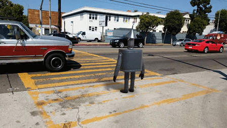

# ARCore：Android的增强现实

原标题：ARCore: Augmented reality at Android scale  
链接：[https://android-developers.googleblog.com/2017/08/arcore-augmented-reality-at-android.html](https://android-developers.googleblog.com/2017/08/arcore-augmented-reality-at-android.html)  
作者：Dave Burke （Android工程副总裁）  
翻译：[arjinmc](https://github.com/arjinmc)  

Android拥有超过20亿的有源设备，是世界上最大的移动平台。而在过去的九年中，我们一直致力于创建一套丰富的工具，框架和API，传递开发者的创作到任何地方。今天，我们发布了一个名为ARCore的新软件开发工具包（SDK）的[预览版](https://developers.google.com/ar/)。它为现有和未来的Android手机带来增强现实功能。开发者现在可以开始尝试。

[视频介绍](https://youtu.be/ttdPqly4OF8)  

在过去三年中，我们一直在探索使用Tango开发移动AR功能的基础技术，而ARCore则是建立在此基础上的。但是，它没有任何额外的硬件，这意味着它可以扩展到Android生态系统。ARCore将运行数百万台设备，从今天开始，Pixel和Samsung的S8，运行7.0 Nougat及以上。我们在预览结束时定位了1亿台设备。我们正在与三星，华为，LG，华硕等制造商合作，为质量和高性能打下坚实的一面。

  

ARCore与Java / OpenGL，Unity和Unreal协同工作，重点关注三件事：

* <u>运动轨迹</u>：使用手机的相机观察房间中的特征点和IMU传感器数据，ARCore在移动时确定手机的位置和方向（姿势）。虚拟对象保持准确放置。
* <u>环境了解</u>：将AR对象放置在地板或桌子上是常见的。ARCore可以使用用于运动跟踪的相同特征点来检测水平表面。
* <u>光判断</u>：ARCore观察环境中的环境光，并使开发人员可以以与周围环境相匹配的方式点亮虚拟对象，使其外观更加逼真。

  

除了ARCore，我们一直在投资于应用程序和服务，这将进一步支持开发人员创造卓越的AR体验。我们构建了[Blocks(块)](https://vr.google.com/blocks/)和[Tilt Brush(倾斜画笔)](https://www.tiltbrush.com/)，使任何人都可以轻松创建出精美的3D内容，用于AR应用程序。正如我们在[I / O](https://www.blog.google/products/google-vr/latest-vr-and-ar-google-io/)中提到的，我们还在致力于视觉定位服务（VPS），这项服务将使世界级的AR体验远远超出桌面。而我们认为Web将成为AR未来的重要组成部分，因此我们还将为Web开发者发布原型浏览器，以便他们也可以开始尝试使用AR。这些自定义浏览器允许开发者创建AR增强型网站，并在Android / ARCore和iOS / ARKit上运行它们。

ARCore是我们向所有人提供AR的下一步工作，今年晚些时候我们将有更多的分享。让我们知道你通过[GitHub](http://github.com/google-ar)的想法，并查看[我们的新AR实验展示](http://experiments.withgoogle.com/ar)，你可以在其中找到可能的一些有趣的例子。告诉我们你在#ARCore的社交媒体上构建了什么？我们将转发我们最喜欢的一些。