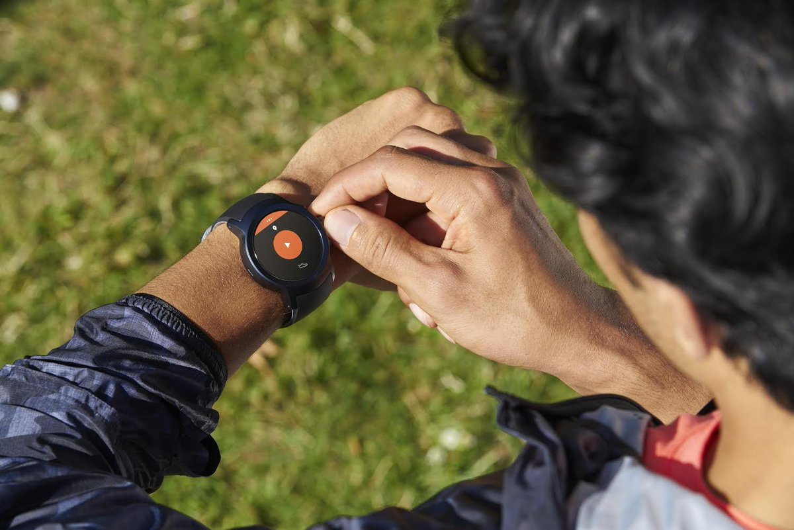

# Google Play政策的更新推进独立Android Wear应用程序

原标题：Updates to Google Play policy promote standalone Android Wear apps  
链接：[https://android-developers.googleblog.com/2017/08/updates-to-google-play-policy-promote.html](https://android-developers.googleblog.com/2017/08/updates-to-google-play-policy-promote.html)  
作者：Ho Lam (Android Wear的首席开发这倡导者)  
翻译：[arjinmc](https://github.com/arjinmc)  

  
<small>Strava - Android和iOS用户都可以使用独立的Wear应用程序</small>  

Android Wear 2.0代表了Android Wear平台的最新发展。它引入了可以直接连接到网络并独立于智能手机工作的[独立应用程序](https://developer.android.com/training/wearables/apps/standalone-apps.html)的概念。这对于不仅向我们的Android用户以及iOS用户提供应用程序至关重要 - 随着我们不断扩大手表和用户的多样化生态系统，这一点越来越重要。此外，Wear 2.0为Wear应用程序带来了多APK支持，可以减少手机应用的APK大小，并可让iOS用户体验Wear应用。

今天，我们宣布，多APK也将适用于Android Wear 1.0手表，因此你现在可以覆盖所有用户，无需将Wear应用程序捆绑在手机应用的APK中。此外，Google Play商店政策将会改变，以促进使用多种APK和独立应用。这涵盖了旨在在手表上运行的所有类型的应用程序，包括手表面，复杂数据提供程序以及可启动应用程序。

## 政策变更

政策更改将从2018年1月18日起生效。此时，以下应用程序将失去Google Play商店中的“增强型Android Wear”徽章，无法在Play商店的Android Wear Top图表中列出：

* 支持Wear通知增强功能的移动应用，但没有单独的Wear应用。
* 使用与移动应用程序捆绑的应用程序，而不是使用多APK。

由于运行Wear 1.0和2.0的设备现在支持multi-APK，因此开发者将Wear应用程序APK嵌入到手机APK中时，应该解除其Wear APK的捆绑，并[以Multi-APK的形式将其上传到Play商店](https://developer.android.com/training/wearables/apps/packaging.html)。这将使他们能够继续符合“Android Wear Wear增强版”徽章的资格，并有资格出现在Android Wear Top图表中。这两个APK可以继续共享相同的软件包名称。

除了提供Top的应用程序图表，我们还会定期整理策划的精选集合。为了有资格选择这些系列，开发者需要将其Wear应用功能独立于手机，作为独立应用。这些应用程序需要使用与iOS和Android手机配对的手表。

## 什么是独立应用程序？

[独立应用](https://developer.android.com/training/wearables/apps/standalone-apps.html)是Wear应用，不需要手机应用来运行。该应用程序不需要网络访问，也可以直接访问网络而无需手机应用程序 - Android Wear 2.0支持的功能。

要将应用程序标记为独立应用程序，请将以下元数据标签放入 <i>AndroidManifest.xml</i>:

```code 
<application>
...
  <meta-data
    android:name="com.google.android.wearable.standalone"
    android:value="true" />
...
</application>
```

在极少数情况下，通过手机和手表之间的数据同步可以增强用户体验。例如，骑自行车的应用程序可以在手机上显示地图的同时使用手表显示当前的步速，并测量用户的心率。在这种情况下，我们建议开发者确保他们的Wear应用程序在没有手机的情况下运行，并将Wear手机体验视为Wear应用程序的可选选项。在这些情况下，Wear应用程序仍然被视为独立的，应该在其Android <i>Manifest.xml</i>文件中标记。

## 戴你想要的

从一开始，Android Wear一直是戴你想要的 - 你想戴的款式，手表和应用程序。这项最新的政策更改可让你突出显示你的Android Wear应用程序，让使用者更了解他们手表上所需的应用程序。