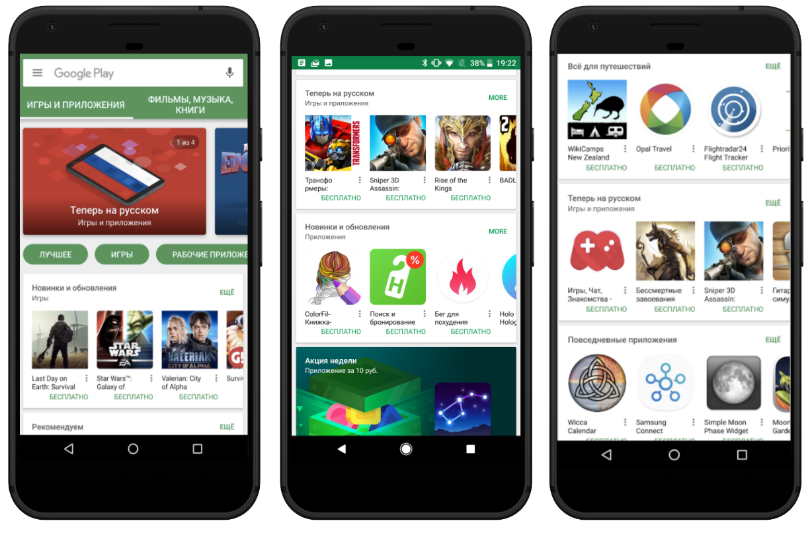

# 你在Google Play的下一个发展市场：在俄罗斯亮出你的标题

原标题：Your next growth market on Google Play: launch your title in Russia  
链接：[https://android-developers.googleblog.com/2017/08/your-next-growth-market-on-google-play.html](https://android-developers.googleblog.com/2017/08/your-next-growth-market-on-google-play.html)  
作者：Dmitri Martynov (Google Play业务发展部)  
翻译：[arjinmc](https://github.com/arjinmc)  

对于许多国际开发商来说，俄罗斯被认为是扩大应用程序或游戏业务的机会。根据2017年“[俄罗斯移动互联网经济[PDF]](http://mobile2017.raec.ru/assets/mobile-internet-economy-in-russia.pdf)”报告，俄罗斯的人是年轻的，年龄35岁以下占45％。[批注1](http://mobile2017.raec.ru/assets/mobile-internet-economy-in-russia.pdf)报告还发现，手机应用内购占人口1.46亿人的160％，这意味着数据计划的人数平均超过一个，远高于其他良好关系的国家。[批注2](http://mobile2017.raec.ru/assets/mobile-internet-economy-in-russia.pdf)去年，Android占俄罗斯所有智能手机的84％，智能手机出货量仍在增长，2017年初与2016年相比，需求增长了11％。

俄罗斯人非常喜欢智能手机的使用，俄罗斯是人均下载量最多的顶级国家之一[批注3](http://mobile2017.raec.ru/assets/mobile-internet-economy-in-russia.pdf)。一半的人口是玩家; 他们最喜欢的游戏类型是战略，建设者和农场，手机，谜题和格斗。最受欢迎的应用程序类别是约会（与本地强大的开发人员），音乐和视频，社交和消息和购物。[批注4](https://newzoo.com/insights/infographics/the-russian-gamer-2017/)

## 帮助你成功俄语本地化的技巧

随着了解俄罗斯移动趋势，市场上有最佳实践，可以帮助你为当地的受众定制应用和游戏，以增加你的业务成功机会。

* 语言本地化
    * 校对和质量保证你的整个应用程序或游戏翻译文本资源和视觉资产。本地化后，你应该质量保证你的应用程序或游戏作为一个整体，而不仅仅是文本资源。
    * 使用精通的母语者。熟悉移动应用程序或游戏术语的母语人士最好完成上下文相关的翻译。
    * 尽可能本地化所有内容。旨在提供尽可能多的本地化内容，提供与原始语言相似的本地语言级别。
    * 确保语言和风格一致。语义上检查整个应用程序/游戏体验的上下文中的翻译文本，使其与本地用户的外观和声音相关。确保使用一致的语言风格（如正式/非正式寻址），并在所有文本和视觉资产中使用相同的术语或名称。
    * 不要忘记[语言规则](https://en.wikipedia.org/wiki/Russian_grammar)。遵循数量，性别，断词，首字母缩略词等的语言规则。如果用户性别未知，请考虑仔细选择单词，以省略指定用户的性别或使用被动语态。
    * 请注意翻译文本的长度。在西里尔语言中，单词和短语往往比英语长，并且可能不适合设计紧密的用户界面。创造性地寻找替代的上下文和本地相关的替代翻译。
    * 使用当地的[日期和时间格式](https://en.wikipedia.org/wiki/Date_format_by_country)。检查当地用户熟悉的国家特定日期/时间格式。
    * 记下“你”的翻译。“你”翻译是上下文的，可以翻译成单数（类似于早期现代英语你）或复数形式（当指多个人或礼貌的形式）。并提醒你，当你选择非正式地解决您的用户（“你”）时，请确保避免指定用户的性别，除非已知。
* 玩商店资产
    * 提供本地化的商店资产，例如标题（例如标题不是普遍知名品牌），商店列表，截图和视频。不要忘记本地化“新功能”部分（如果包含）。
    * 避免你的应用程式或游戏标题中的关键字，试图提高Play商店的曝光率。
* 本地定价，价格点，舍入规则
    * 避免添加您自己的货币指标（如$或£），因为某些市场使用本地定价 - [了解更多关于本地定价](https://support.google.com/googleplay/android-developer/table/3541286?hl=en)。使用俄罗斯卢布官方符号（₽）后的空格，并使用逗号作为小数分隔符，例如49,99₽。
    * 一般来说，应用内，订阅或付费应用/游戏价格应低于西方市场。研究行业的最佳实践和实验，哪些价格点最适合您的应用或游戏商业模式。
    * 确保价格四舍五入遵循“99”或“49”规则。使用[Google Play Console](https://support.google.com/googleplay/android-developer/answer/6334373?hl=en)设定本地价格。
* 文本资源
    * 避免缩写，如果缩短是绝对必要的，请遵循语言规则来缩短词语。
    * 避免将单词和标点符号插入新行。遵循跨行划分字词的语言规则（例如应用程序和 - 应用程序）。
    * 确保字体样式一致。某些字体系可能会以非英文区域显示。请务必检查您所选择的字体将如何显示在不同地区的用户设备上。
* 游戏中的视听资产
    * 在适当和相关的情况下，请考虑将文本字符串除外的视觉资产本地化。注意闪屏！
    * 本地化视频和音频，并使用母语者使其在本地相关。

有关更多的指导，请阅读[本地化清单](https://developer.android.com/distribute/best-practices/launch/localization-checklist.html)。

## 提名你在Google Play商店的“俄罗斯合集”收藏的标题

七月24号，我们推出了第一款现在[俄罗斯合集](https://play.google.com/store/apps/collection/promotion_3002a78_now_in_russian_apps_games)上Google Play，具有国际开发商如24个产品[Kabam的Transformers](https://play.google.com/store/apps/details?id=com.kabam.bigrobot&hl=en)，[GTarcade的Legacy of Discord](https://play.google.com/store/apps/details?id=com.gtarcade.lod&hl=en)，[Yodo1的Crossy Road](https://play.google.com/store/apps/details?id=com.yodo1.crossyroad&hl=en)，[im30的Last Empire - War Z](https://play.google.com/store/apps/details?id=com.longtech.lastwars.gp&hl=en)等等。

  

我们计划在年底前刷新收藏，我们很乐意加入你的题标题！[提交你最近本地化的标题](https://docs.google.com/forms/d/e/1FAIpQLSd8iXQoGnKTmkRLKeEp-U2Yie6l0ozQ5BR79ktVYtn2EUNlfw/viewform)，以便有机会被包含。

