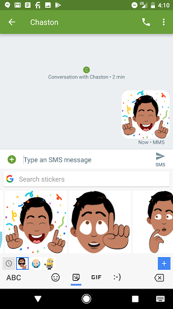

# 在Google Play使用Gboard制作表情

原标题：Create stickers for Gboard on Google Play  
链接：[https://android-developers.googleblog.com/2017/09/create-stickers-for-gboard-on-google.html](https://android-developers.googleblog.com/2017/09/create-stickers-for-gboard-on-google.html)  
作者：Alan Ni  (Gboard产品副经理)  
翻译：[arjinmc](https://github.com/arjinmc)  

消息传递越来越具有表现力 - 今天你可以用emoji，gif或表情来说我爱你。数百万用户每天在Android设备上使用Gboard作为默认键盘分享信息内容。我们想通过允许开发者为Gboard创建自己的表情来进一步推动表达。我们早期的一些合作伙伴包括Bitmoji，迪士尼，甚至我们自己的Allo团队。一旦发布，你的表情可以被世界各地数百万用户看到和分享。

    

使用[Firebase App Indexing API](https://firebase.google.com/docs/app-indexing/)，你可以索引你创建的任何表情资源，将应用发布到Play商店，并在[Gboard Sticker合集(Gboard表情合集)](https://play.google.com/store/apps/collection/promotion_30029ba_stickers_apps_gboard?e=-EnableAppDetailsPageRedesign)中展示。一旦用户从Play商店下载表情包，他们就可以在任何支持图像插入的Android应用中直接从他们的键盘发送表情！

   

## 表情入门

要启动它，你需要添加Firebase App Indexing库。访问[Firebase入门指南](https://firebase.google.com/docs/app-indexing/android/app)查看详情。一旦你设置了Firebase App Indexing，请阅读我们的[表情指南](http://firebase.google.com/docs/app-indexing/android/personal-content#gboard-stickers)，了解如何索引这些表情。接下来，创建你的表情资源！

你应该在更新或安装之后首次运行时构建和索引表情，以尽量减少安装应用程序的用户和在Gboard中看到贴纸之间的滞后。我们的[示例应用程序](https://github.com/firebase/quickstart-android/tree/master/app-indexing)应该提供端到端流程的思路。

## 使你的表情可搜索

用户通常通过搜索关键字来寻找表情。这意味着你需要添加适当的关键字，以便用户找到你的贴纸，你可以使用put方法来添加关键字。在下面的代码片段中，你将看到Snoopy标签上标有“bye”，“snoopy”，“see ya”和“good bye”这些关键字。

```java
new Indexable.Builder("Sticker")
   .setName("Bye")
   // 表情地址
   .setImage("http://www.snoopysticker.com?id=1234")
   // 表情标签分类
   .setUrl("http://sticker/canonical/image/bye")
   // 设置表情标签
   .setDescription("A sticker for Bye")
   // 设定关键字
   .put("keywords", "bye", "snoopy", "see ya", "good bye")
   .put("isPartOf",
        new Indexable.Builder("StickerPack")
          .setName("Snoopy Pack")
          .build())
   .build())};
```

对于较大的表情包，你需要确保使用关键字标记表情，以便用户更容易找到。我们列出了一个[常用的英语短语/关键字](https://docs.google.com/spreadsheets/d/1ssgxg52qsqQgcTMtGqPsuJL2RUBIj_vt5onVW3yFDOE/edit?usp=sharing)列表， 你可以用它来标记你的表情。但不要忘记将你的表情国际化 - 为此，你需要首先检测设备语言，然后对与该语言相对应的关键字进行索引。

## 在表情合集中展示

最后，与世界分享你的表情！要在Play商店的表情合集中列出，请填写[此表单](https://goo.gl/forms/otRBKpqKj6hTbUX92)。 但首先，请使用最新版本的[Gboard](https://play.google.com/store/apps/details?id=com.google.android.inputmethod.latin&hl=en&e=-EnableAppDetailsPageRedesign)来测试表情，如果你的应用程序具有高品质表情，并且与Gboard配合使用，我们将其添加到表情合集中; 这是数百万Gboard用户看到的最好方法！

我们非常兴奋看到你可以构建那些表情包。