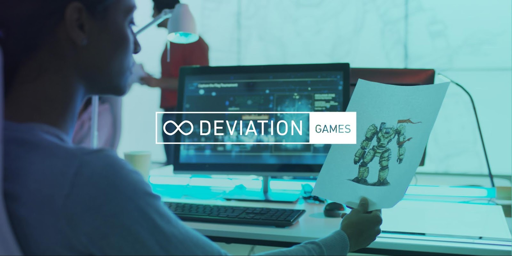

# Google和Ideas联合发起计划，以支持游戏设计中的包容性

原标题：Google and Ideas United Launch Program to Support Inclusivity in Game Design  
链接：[https://android-developers.googleblog.com/2017/09/google-and-ideas-united-launch-program.html](https://android-developers.googleblog.com/2017/09/google-and-ideas-united-launch-program.html)  
作者：Daraiha Greene(多媒体策略媒体项目经理CS教育), Kate Brennan & Mathilde Cohen Solal (Google Play)  
翻译：[arjinmc](https://github.com/arjinmc)  

今天，我们很高兴地宣布无限偏差：游戏。 [无限偏差(arjinmc注解:反歧视)](http://infinitedeviation.com/)是由Google计算机科学（CS）在媒体和[Ideas联合](http://ideasunited.com/)创建的一个倡议，以通过将创意和计算机科学以意想不到的方式结合在一起，以解决代表性问题 - 确保计算机科学家的表征包括女性，肤色，LGBTQIA +社区，残疾人和其他代表性不足的群体。去年，无限偏差产生了[一系列叙事短片](http://infinitedeviation.com/)，以消除计算机科学中的陈规定型观念，并很高兴与Google Play合作，将无限偏差计划带入游戏。

目前，[游戏行业鉴定为女性人士只有23％的](https://c.ymcdn.com/sites/www.igda.org/resource/resmgr/files__2016_dss/IGDA_DSS_2016_Summary_Report.pdf)，只有[3％的游戏开发者是非洲裔美国人](http://www.newsweek.com/2016/10/21/video-games-race-black-protagonists-509328.html)。确保女性从事[视频游戏](https://www.blog.google/products/google-play/wonder-woman-partnership/)中有代表性，让年轻女孩有机会[创建自己的游戏](https://www.blog.google/products/google-play/wonder-woman-partnership/)，Google Play致力于为游戏带来新的多样化的声音。该计划为游戏设计师提供了所有背景的游戏设计者提供原始手机游戏概念的机会，并与Google Play合作开发，发布和推广。申请人可以提交他们的手机游戏概念，截止日期10月9日。

    

前三名创意将由行业专家小组选出，设计师将收到他们在Google Play上使用游戏的资源和支持。游戏将以创造力和创新力，以及他们讲述与代表不足的观众产生共鸣的原创故事的能力进行评判。

参加者必须具有不到两年的专业游戏设计经验才能获得资格。有关该程序的更多信息，包括如何申请，你可以访问[InfiniteDeviation.com](http://infinitedeviation.com/games)。

通过推广与代表性不足的观众产生共鸣的原创游戏，我们希望该计划能够为计算机科学，打击偏见以及通过多种享受的活动而培育出更多的接受感。