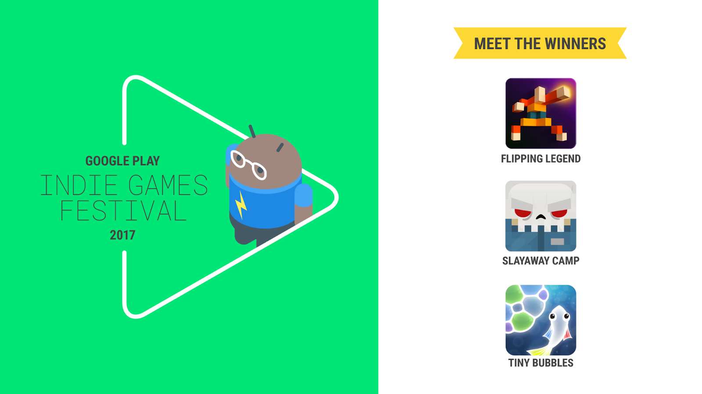

# 公告旧金山独立游戏节的获奖者

原标题：Announcing the Winners from the Indie Games Festival in San Francisco  
链接：[https://android-developers.googleblog.com/2017/09/announcing-winners-from-indie-games.html](https://android-developers.googleblog.com/2017/09/announcing-winners-from-indie-games.html)  
作者：Kacey Fahey （Google Play开发人员市场部）
翻译：[arjinmc](https://github.com/arjinmc)  

在上周末的Google Play独立游戏节，我们欢迎数百名与会者尝试并享受来自独立社区的各种令人惊叹的游戏。比赛是非常艰难的，最后我们认识到三个获胜者：

* Hiding Spot 的 [Flipping Legend](https://play.google.com/store/apps/details?id=com.noodlecake.flippinglegend)
* Blue Wizard Digital 的 [Slayaway Camp](https://play.google.com/store/apps/details?id=com.bluewizard.slayawaycamp&hl=en)
* Pine Street Codeworks 的 Tiny Bubbles(即将推出)

   

我们还要为这样一个有趣和令人兴奋的活动,祝贺十大开发商和所有分享游戏的决赛入围者的其他成员。查看 Google Play上的精彩游戏[集合](https://play.google.com/store/apps/collection/promotion_30023d4_games_indie_games_festival_2017)。

这是其他七场比赛，排在前十名：

* Roboto Games 的 [Age of Rivals](https://play.google.com/store/apps/details?id=com.robotogames.ageofrivals)
* V2 Games Inc. 的 [Beast Brawlers - PvP Arena](https://play.google.com/store/apps/details?id=io.v2g.beastbrawlers)
* Raincrow Studios, LLC 的 [Covens](https://play.google.com/store/apps/details?id=com.CovensMapTest.RainCrow&e=-EnableAppDetailsPageRedesign)
* pixelbizarre 的 [Crashy Cars](https://play.google.com/store/apps/details?id=com.headupgames.crashycars)
* Happy Square Studio Inc 的 [Jigsaw Story](https://play.google.com/store/apps/details?id=com.HappySquareStudio.JigsawStory1&hl=en)
* Gorilla Bean Games 的 [Loteria Latin Bingo](https://play.google.com/store/apps/details?id=com.gorillabeangames.loterialatinbingo)
* RAC7 的 [Splitter Critters](https://play.google.com/store/apps/details?id=com.rac7.SplitterCritters&hl=en)

那天开始有参加者参加了20场入围比赛。他们经历了不同的流派和风格的游戏，并鼓励与开发者谈论他们的工作，以及如何使手机游戏生活。该活动汇集了孩子们，成年人，游戏爱好者和非玩家，并且是手机游戏创造的有趣体验的绝佳表现。

下午，参加者投票选出最喜爱的十大游戏并进行演讲。这些开发商有三分钟时间向评委小组提供最好的机会。评委投票结果后，三名获胜者和七名选手获得评选。

如果你喜欢独立游戏，并想跟上我们最喜欢的独立选择，请访问Google Play上的[独立角落](https://g.co/playindie)。