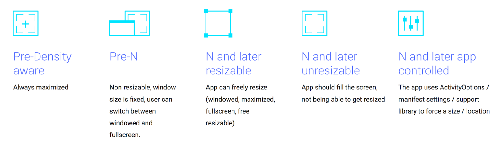

# 优化Chromebook的Android应用

原标题：Optimize your Android apps for Chromebooks  
链接：[https://android-developers.googleblog.com/2017/09/optimize-your-android-apps-for.html]https://android-developers.googleblog.com/2017/09/optimize-your-android-apps-for.html)  
作者：Cheryl Lindo Jones (Google Play移动应用解决方案顾问)  
翻译：[arjinmc](https://github.com/arjinmc)  

随着更多Chromebook可用Google Play，现在，你可以将Chromebook的[Android应用程序优化](https://android-developers.googleblog.com/2016/05/bring-your-android-app-to-chromebooks.html)到更广泛的受众群体。为优化大屏幕所做的更改将有助于能够投影到桌面显示器的移动设备，如三星Galaxy S8。现在可访问Play商店的[Chromebook型号列表](https://www.chromium.org/chromium-os/chrome-os-systems-supporting-android-apps)继续增长。

优化Chromebook的Android应用程序或游戏时，需要考虑几个不同之处：

* 更大的屏幕尺寸和更高的分辨率
* 多窗口和可调整大小的窗口支持
* 不同的硬件输入方式：键盘，触控板，鼠标，触控笔
* 可转换的Chromebook可用于笔记本电脑和平板电脑模式

Chromebook用户可以随时更改屏幕分辨率，切换各种输入方式，并从笔记本电脑转换为平板电脑模式，因此Android应用和游戏应优雅地处理所有这些情况。

## Google Play的可发现性

如果Android应用程序或游戏需要Chromebook中无法使用的硬件（如手机功能或GPS），则这些标题不会显示在Chromebook用户的Google Play上，与Android平板电脑上的Play类似。开发者应通过执行以下操作来最大限度地发现Google Play的可发现性：

在清单中设置请求的权限和使用功能，以确保与Chromebook的[兼容性](https://developer.android.com/topic/arc/manifest.html)。并不是所有的Chromebook都将具有智能手机典型的触摸屏，GPS或后置摄像头。更新manifest，以便不需要在Chromebook上常见的传感器和硬件。例：

```code
<uses-feature android:name="android.hardware.touchscreen"
    android:required="false" />
```

此外，为了教育Chromebook用户对已实施的任何Chrome操作系统特定功能，例如支持诸如键盘，触控板和触控笔等其他输入法，或者通过响应式布局支持大型高分辨率屏幕，开发者应该更新应用程序Google Play上的说明。提供屏幕截图，展示应用程式或游戏在较大屏幕上的运作情况，以及Chromebook上的标题如何运作。

## 优化功能

虽然大多数应用和游戏在Chromebook上都没有任何变化，但在Chromebook用户中，提供优化一致的体验仍然是一个好主意。

## 大屏幕和可调整大小的窗口

Chromebook用户将更倾向于多任务，一次打开多个应用程序和/或游戏，利用屏幕尺寸，并以与桌面或笔记本电脑外形相符的方式操作。与Android手机不同，他们还可以根据需要更改屏幕分辨率以适应更多屏幕，或放大字体，UI和图形。多窗口支持和完全可调整大小的窗口支持是此用法的关键。当屏幕分辨率和方向改变时，图形，字体，布局和触摸目标应相应调整。

同样重要的是要注意，只是因为应用程序或游戏窗口不在焦点，这并不意味着它不可见。例如，如果视频应用在非活动窗口中打开，则应该继续播放“在后台”中的内容，因为它仍然可以沿另一个应用窗口显示。在这种情况下，要完全支持[多窗口使用](https://developer.android.com/guide/topics/ui/multi-window.html#lifecycle)，请暂停视频onStop()并继续onStart()。

定位Android N（API级别24及更高版本）将向Chrome操作系统窗口管理器发出信号，指出不应使用兼容性限制。这允许开发者更多的灵活性和控制来支持窗口大小调整。

    

系统将会最好地处理目标[窗口管理](https://developer.android.com/topic/arc/window-management.html)，Android N的表现最好，但是对于前N API支持，窗口可以在应用启动时选择的默认大小之间切换，也可以在可视窗口栏的全屏模式之间切换窗口UI隐藏在沉浸式全屏模式中。

当处理不同的窗口模式时，重要的是知道应用程序或游戏的窗口区域将被窗口控制栏的存在或不存在所抵消。应用程序不应该假定该窗口中的activity始终处于（0,0）。相应地调整布局和触摸目标。在窗口调整大小或方向更改后，应用程序或游戏变得无响应是有些常见的，因为它没有优雅地处理窗口控制栏的存在，或Chromebook屏幕的更高分辨率设置。

## 定位支持

由于笔记本电脑的外形尺寸，Chromebook用户希望将Chrome作为Chromebook应用的默认方向。不过，由于用户与智能手机交互的典型方式，Android应用程序通常认为纵向是支持的默认方向。为了向用户提供灵活性，强烈建议支持纵向和横向。一些Chromebook是可转换的，所以用户可以随意改变笔记本电脑和平板电脑模式，根据给定用例的舒适程度，在纵向和横向之间进行切换。

最重要的是，如果可能，如果方向或窗口大小改变，则不需要重新启动。如果用户正在填写表单，创建或编辑某些内容，或在游戏中的某个级别的中间，并且由于窗口更改（有意或无意）而失去进度，则这是一个糟糕的用户经验。

开发者可以使用<i>onConfigurationChanged()</i>并通过将该行添加到activity的manifest来动态处理这些更改来监视窗口配置更改 ：

```code
android:configChanges="screenSize|smallestScreenSize|orientation|screenLayout"
```

如果绝对需要在窗口更改时重新启动，至少通过使用该<i>onSaveInstanceState()</i>方法恢复状态，以使工作或状态不会丢失。

此外，重要的是在用户正在浏览activity时与应用程序的方向保持一致。目前，该系统强制Android应用程序遵循根activity的方向来帮助维护一致性。然而，这可能导致一种情况，也许应用程序以横向方向开始，并且通常为纵向定向布局的登录屏幕弹出，现在由于无响应的布局而不能优化。此外，仍然可能存在跳转activity以与应用的主要方向不同的方向开始的情况。在设计活动布局时，请牢记这些可能的情况。

最后，开发人员应该了解在Chromebook上处理相机和方向的差异。显然，Android手机具有位于纵向屏幕顶部的前置和后置相机。Chromebook上的前置摄像头位于景观导向屏幕的顶部。许多Chromebook没有后置摄像头。如果一个应用程序需要一个摄像头，最好使用android.hardware.camera.any访问前置摄像头，如果后置摄像头不可用。再次，开发人员应该瞄准Android N，如果可能，允许应用程序可调整大小，以便系统可以妥善定向相机预览。

## 支持多种输入法

Chromebook用户习惯使用键盘和触控板与网页和应用进行交互。有效地支持Android应用的这两种输入方式意味着：

* 支持桌面应用用户可能熟悉的命令的热键
* 使用箭头和制表键和触控板来导航activity
* 允许悬停和打开上下文菜单
* 支持其他触控板手势，以提高桌面/笔记本电脑模式下的生产力

像消息收发应用程序中返回发送文本一样简单，或者允许用户通过按住选项卡键导航字段将使应用程序在Chromebook上更加高效和凝聚力。

虽然Chrome操作系统具有模拟触摸屏滚动和其他触摸事件的[兼容模式](https://developer.android.com/topic/arc/input-compatibility.html#compatibility_mode)，但最好通过声明来优化Android应用

```code
<uses-feature
    android:name="android.hardware.type.pc"
    android:required="false" />
```
  
在manifest中禁用兼容性模式，以进一步定义对键盘和触控板的自定义支持。

类似地，当通过键盘上的标签或箭头键导航时，系统可以猜测将焦点提供给正确的视图。但是，为了获得最佳性能，指定键盘导航，应在[activity的manifest处理](https://developer.android.com/training/keyboard-input/navigation.html),使用<i>android:nextFocusForward</i>的标签导航属性，并且<i>android:nextFocusUp</i>，<i>android:nextFocusDown</i>，<i>android:nextFocusLeft</i>，<i>android:nextFocusRight</i>为箭头键导航属性。

有关相关说明，某些Chromebook没有触摸屏，因此Chrome上精心优化的Android应用程序不应假设用户可以执行典型的滑动和多点触控式手势来浏览应用或游戏。如果仅使用键盘或触控板无法执行主要功能，则用户体验将严重影响非触摸屏Chromebook。尝试“翻译”现有的触摸屏轻击并将手势滑入可以在触控板或使用键盘上轻松完成的任务。

较新的Chromebook正在获得手写笔支持，允许为素描本和笔记应用程序，照片编辑器，游戏等提供更丰富的互动。鼓励开发者使用[可用的API](https://developer.android.com/topic/arc/input-compatibility.html#stylus)来支持压敏度，倾斜和橡皮擦输入。为了让用户在使用手写笔进行写作，绘画或玩游戏时，可以轻松地将手放在屏幕上，支持掌握拒绝。系统将尝试忽略用户休息手掌的输入，但是如果注册了这种错误的触摸事件，Android应用程序应优雅地处理<i>ACTION_CANCEL</i>事件以擦除错误的输入。

通过支持所有这些额外的输入法，用户将能够充分利用笔记本电脑模式，使Chromebook更有效率地工作或更具创意。

## 学习更多

虽然本文已介绍了很多内容，但我们还有其他资源可以进一步了解如何优化Chromebook的应用和游戏。阅读我们的Medium帖子[让你的应用在Chromebook上运行良好的技巧](https://www.google.com/url?q=https://medium.com/googleplaydev/get-your-android-apps-working-great-on-chromebooks-cec2db6ee521&sa=D&usg=AFQjCNFNFXzNeh6oh1IaTnKlhuIAkoy4TA)，并观看我们在Google I / O 2017的会议，[Android应用程序的Chromebook和大屏幕设备](https://www.youtube.com/watch?v=v6QH89i4YCI)。还有Android开发者网站上还提供用于[构建Chrome操作系统应用程序](https://developer.android.com/topic/arc/index.html)的培训材料。如果你有任何问题，请加入[Android开发者社区](https://plus.google.com/+AndroidDevelopers)并使用主题标签#AndroidAppsOnChromeOS发表。