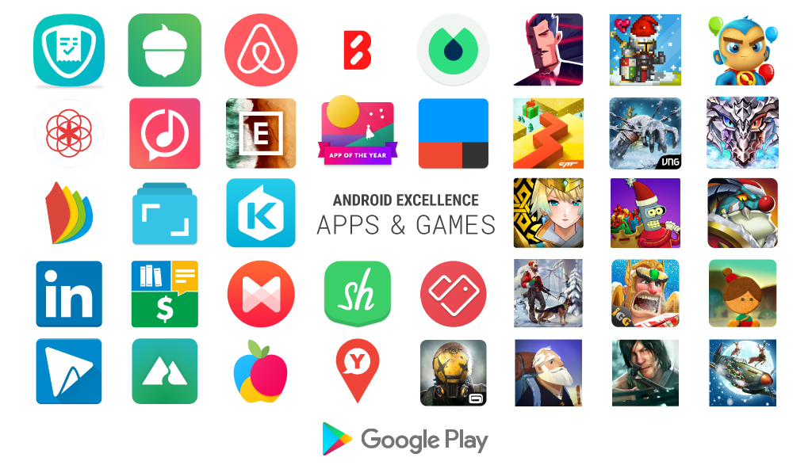

# Android Excellence：祝贺新增的应用程序和游戏

原标题：Android Excellence: Congratulations to the newly added apps and games  
链接：[https://android-developers.googleblog.com/2018/01/android-excellence-congratulations-to.html](https://android-developers.googleblog.com/2018/01/android-excellence-congratulations-to.html)  
作者：Kacey Fahey (Google Play开发者营销)  
翻译：[arjinmc](https//github.com/arjinmc)  

开创新的一年，我们很高兴欢迎我们最新的Android Excellence[应用程序](https://play.google.com/store/apps/topic?id=campaign_editorial_3002b4f_android_excellence_apps&hl=en)和[游戏](https://play.google.com/store/apps/topic?id=campaign_editorial_3002b50_android_excellence_games&hl=en)。这些获奖者代表Play商店中的一些最佳体验和最佳性能应用和游戏，并且可以在编辑选择页面上找到其他很棒的选择。

  

如果你正在寻找一些新的应用程序，下面是一些亮点。

* [EyeEm](https://play.google.com/store/apps/details?id=com.baseapp.eyeem&hl=en)：一个伟大的照片编辑器应用程序与一整套过滤器和工具，使你的照片闪耀。从社区学习风格提示，甚至通过EyeEm市场出售你的图片。
* [Musixmatch](https://play.google.com/store/apps/details?id=com.musixmatch.android.lyrify)：检查Musixmatch的更新的应用程序，同时学习歌词，所有你最喜欢的歌曲。该应用程序与许多顶级音乐流媒体服务兼容，你甚至可以跟随你的Android Wear设备或Chromecast支持的大屏幕。
* [ViewRanger](https://play.google.com/store/apps/details?id=com.augmentra.viewranger.android)：通过使用ViewRanger发现新的路线和路线指南，计划你的下一个远足冒险。使用手机相机检查Skyline功能，通过增强现实识别全球超过900万个网站。

这里有一些我们最喜欢的新游戏加入收藏。

* [Fire Emblem Heroes](https://play.google.com/store/search?q=Fire+Emblem+Heroes)：任天堂的流行策略RPG游戏专营现在重新为移动设备。战斗战斗，发展你的英雄的技能，并尝试各种游戏模式几个小时的令人兴奋的游戏。
* [Lumino City](https://play.google.com/store/apps/details?id=air.com.noodlecake.luminocity)：在这个屡获殊荣的益智冒险游戏中探ew索迷人的papercraft风格的世界。美丽的风景全是手工制作的。
* [Old Man's Journey](https://play.google.com/store/apps/details?id=es.brokenrul.oldmansjourney)：绚丽的风景，沉浸式的配乐和深沉的情感，帮助你揭开老人的人生故事，同时解开谜题，塑造景观，决定未来。

祝贺新推出的Android Excellence应用和游戏。

### 新的Android卓越应用程序	

[1tap](https://play.google.com/store/apps/details?id=io.onetap.app.receipts.uk)

[Acorns](https://play.google.com/store/apps/details?id=com.acorns.android)

[Airbnb](https://play.google.com/store/apps/details?id=com.airbnb.android)

[Blink Health](https://play.google.com/store/apps/details?id=com.blinkhealth.blinkandroid)

[Blinkist](https://play.google.com/store/apps/details?id=com.blinkslabs.blinkist.android)

[Clue](https://play.google.com/store/apps/details?id=com.clue.android)

[Ditty](https://play.google.com/store/apps/details?id=com.zya.ditty)

[EyeEm](https://play.google.com/store/apps/details?id=com.baseapp.eyeem)

[Fabulous](https://play.google.com/store/apps/details?id=co.thefabulous.app)

[IFTTT](https://play.google.com/store/apps/details?id=com.ifttt.ifttt)

[iReader](https://play.google.com/store/apps/details?id=com.chaozh.iReader)

[Journey](https://play.google.com/store/apps/details?id=com.journey.app)

[KKBOX](https://play.google.com/store/apps/details?id=com.skysoft.kkbox.android)

[LinkedIn](https://play.google.com/store/apps/details?id=com.linkedin.android)

[Mobills: Budget Planner](https://play.google.com/store/apps/details?id=br.com.gerenciadorfinanceiro.controller)

[Musixmatch](https://play.google.com/store/apps/details?id=com.musixmatch.android.lyrify)

[Shpock](https://play.google.com/store/apps/details?id=com.shpock.android)

[Stocard](https://play.google.com/store/apps/details?id=de.stocard.stocard)

[Video Editor](https://play.google.com/store/apps/details?id=com.wevideo.mobile.android)

[ViewRanger](https://play.google.com/store/apps/details?id=com.augmentra.viewranger.android)

[YAZIO](https://play.google.com/store/apps/details?id=com.yazio.android)

[YOP](https://play.google.com/store/apps/details?id=com.yopapp.yop)

### 新的Android Excellence游戏

[Agent A](https://play.google.com/store/apps/details?id=co.yakand.agentaapuzzleindisguise)

[Bit Heroes](https://play.google.com/store/apps/details?id=com.kongregate.mobile.bitheroes.google)

[Bloons Supermonkey 2](https://play.google.com/store/apps/details?id=com.ninjakiwi.supermonkey)

[Dancing Line](https://play.google.com/store/apps/details?id=com.cmplay.dancingline)

[DEAD WARFARE: Zombie](https://play.google.com/store/apps/details?id=com.vng.android.mps.dead.zombie2)

[Dragon Project](https://play.google.com/store/apps/details?id=net.gogame.dragon)

[Fire Emblem Heroes](https://play.google.com/store/apps/details?id=com.nintendo.zaba)

[Futurama: Worlds of Tomorrow](https://play.google.com/store/apps/details?id=com.tinyco.futurama)

[Idle Heroes](https://play.google.com/store/apps/details?id=com.droidhang.ad)

[Last Day on Earth: Survival](https://play.google.com/store/apps/details?id=zombie.survival.craft.z)

[Lords Mobile](https://play.google.com/store/apps/details?id=com.igg.android.lordsmobile)

[Lumino City](https://play.google.com/store/apps/details?id=air.com.noodlecake.luminocity)

[Modern Combat Versus](https://play.google.com/store/apps/details?id=com.gameloft.android.ANMP.GloftMVHM)

[Old Man's Journey](https://play.google.com/store/apps/details?id=es.brokenrul.oldmansjourney)

[The Walking Dead No Man's Land](https://play.google.com/store/apps/details?id=com.nextgames.android.twd)

[War Wings](https://play.google.com/store/apps/details?id=com.tencent.warwings2)

在Google Play 的[编辑选择](https://play.google.com/store/apps/topic?id=editors_choice)部分探索其他优秀的应用和游戏，并发现[最佳实践](https://developer.android.com/distribute/best-practices/index.html)，帮助你创建高质量人们所爱的应用和游戏。