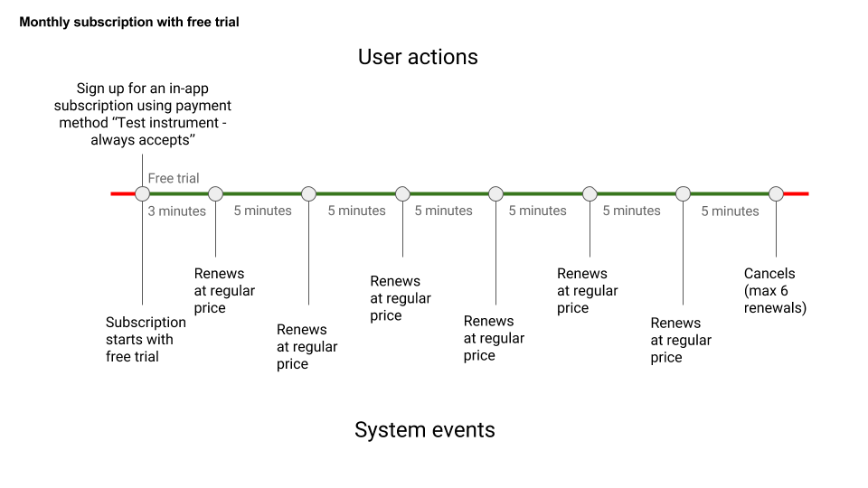
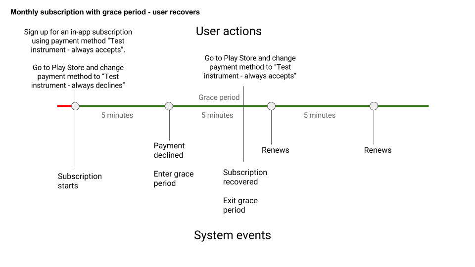
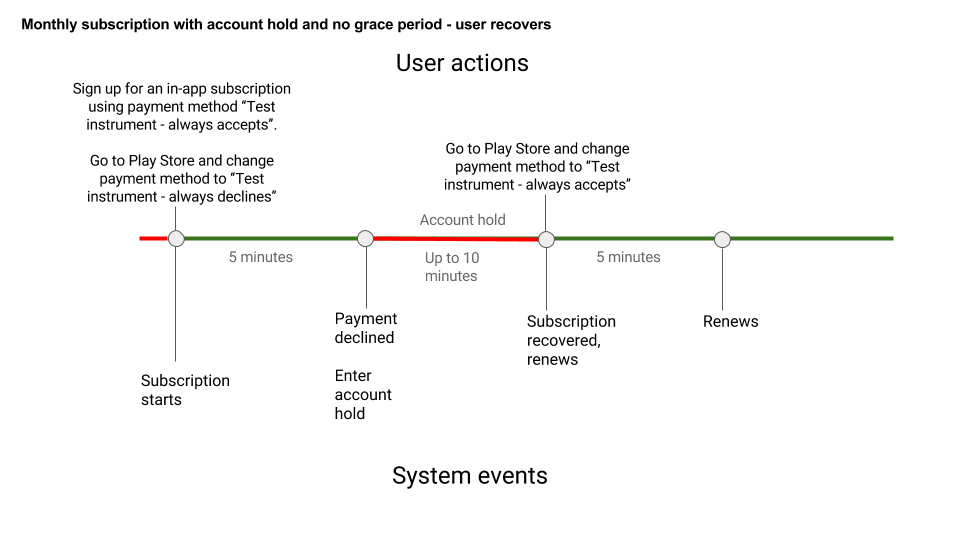

# 更快的更新速度测试订阅

原标题：Faster Renewals for Test Subscriptions  
链接：[https://android-developers.googleblog.com/2018/01/faster-renewals-for-test-subscriptions.html](https://android-developers.googleblog.com/2018/01/faster-renewals-for-test-subscriptions.html)  
作者：unknown
翻译：[arjinmc](https//github.com/arjinmc)  

测试你的应用内订阅是确保你为客户提供高质量服务的关键步骤。

为了使测试变得更简单，更快捷，<strong>从2月20日开始</strong>，我们将采用许可测试账户进行测试更新。目前，许可证测试账户的订阅每天更新。新的更改将允许你在一个小时内测试整个订阅周期，包括6个续订。我们也将缩短宽限期和账户持有等功能的测试时间间隔。

请注意，这些变化即将到来，你可以在更改之前相应地更新你的测试流程。另外请注意，2018年2月20日仍然有效的现有测试订阅将被自动取消。

### 更新时间
续订时间将根据订阅期限而有所不同：

订阅期限	| 测试订阅期
--- | ---
1周	| 5分钟
1个月 | 5分钟
3个月 | 10分钟
6个月 |15分钟
1年	| 30分钟

对于测试订阅，以下功能的时间间隔也将缩短：

功能 | 测试期间
--- | ---
免费试用	| 3分钟
介绍性价格期	| 与测试订阅期相同
宽限期（3天和7天）| 5分钟
账户持有	| 10分钟

注：这些时间是近似的; 你可能会看到一个事件的精确时间的一些小的变化。为了弥补变化，请调用[Google Play开发者API](https://developers.google.com/android-publisher/api-ref/purchases/subscriptions)在每个订阅到期日期之后查看当前状态。

### 更新限制
由于更新频率的增加，续订数量限制为6次定期续订（不包括介绍价格/免费试用）。续约6次后，订阅将被自动取消。

### 例子
以下是几个应用新续订时间的例子。

#### 免费试用
  

#### 宽限期
  

### 账户持有
  

不要忘记检查[测试应用内结算](https://developer.android.com/google/play/billing/billing_testing.html)页面以获取更多关于测试你的订阅的详细信息。如果你仍然有问题，请在[Stackoverflow](https://stackoverflow.com/)上通过评论或使用标签google-play发表你的问题。