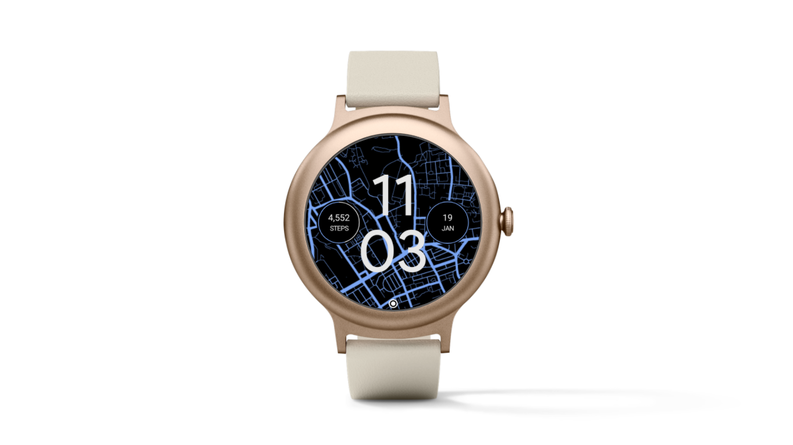
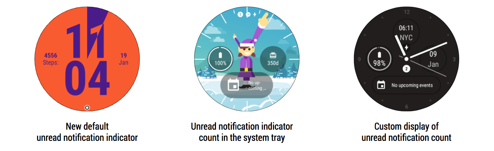

# Android Wear SDK和模拟器更新

原标题：Android Wear SDK and Emulator Update  
链接：[https://android-developers.googleblog.com/2018/01/android-wear-sdk-and-emulator-update.html](https://android-developers.googleblog.com/2018/01/android-wear-sdk-and-emulator-update.html)  
作者：Hoi Lam (Android Wear首席开发者倡导者)  
翻译：[arjinmc](https://github.com/arjinmc)  

  

今天，我们推出了最新版本的Android Wear SDK（2.2.0），并增加了一些与手表相关的功能。其中包括为所有手表面添加未读通知指示符，这是计划成为即将发布的Android Wear消费者版本的一部分。使用Wear SDK 2.2.0，你可以自定义通知指示符或显示你自己的通知指示符。开发者社区版可以通过SDK和模拟器优先使用此功能，因此你可以验证指标是否符合你的表盘设计。此外，我们正在为[ComplicationDrawable](https://developer.android.com/reference/android/support/wearable/complications/rendering/ComplicationDrawable.html)类增强功能，并发布基于Android Oreo的Wear模拟器的最终版本。 

## 介绍未读通知指示符

通知是穿戴体验的重要组成部分。因此，从Wear的下一个消费者版本（版本2.9.0）开始，如果有新的未读通知，则缺省情况下会在表盘底部显示一个点状指示符。通过使用最新版本的模拟器，表盘开发者可以使用自己的表盘预览指示器。开发者可以通过以下方式自定义指标的accent颜色[WatchFaceStyle.setAccentColor](https://developer.android.com/reference/android/support/wearable/watchface/WatchFaceStyle.html#setAccentColor(int))- 默认颜色是白色，如下面的示例所示，但开发者可以将圆点周围的环的颜色设置为自己选择的accent颜色，以匹配表盘的其余部分。
如果新指示符不符合你的表盘设计，则可以使用它关闭[WatchFaceStyle.setHideNotificationIndicator](https://developer.android.com/reference/android/support/wearable/watchface/WatchFaceStyle.html#setHideNotificationIndicator()) 并选择另一个显示通知的选项，包括：1）使用[WatchFaceStyle.setShowUnreadCountIndicator](https://developer.android.com/reference/android/support/wearable/watchface/WatchFaceStyle.html#setShowUnreadCountIndicator()),或显示系统托盘中未读通知的数量;或2）[WatchFaceStyle.getUnreadCount](https://developer.android.com/reference/android/support/wearable/watchface/WatchFaceService.Engine.html#getUnreadCount())以符合你的表盘独特风格的方式使用和显示数字来获取未读通知的数量。 

  

## 增强ComplicationDrawable

我们在去年的Google I / O上发布了这个[ComplicationDrawable](https://developer.android.com/reference/android/support/wearable/complications/rendering/ComplicationDrawable.html)类，我们正在继续改进它。在这个最新的SDK版本中，我们添加了两个增强功能：

* <strong>权限处理</strong> - 如果手表面缺乏显示复杂内容的正确权限，[TYPE_NO_PERMISSION](https://developer.android.com/reference/android/support/wearable/complications/ComplicationData.html#TYPE_NO_PERMISSION)则会发出复杂类型。<i>ComplicationDrawable</i>现在自动处理这个，并将启动一个权限请求[onTap](https://developer.android.com/reference/android/support/wearable/complications/rendering/ComplicationDrawable.html#onTap(int, int, long))。如果你之前实施了自己的代码来启动权限屏幕，请检查权限屏幕是否没有触发两次，如有必要，请删除不需要的代码。
* <string>Drawable回调</string> - 如果复杂程序包含图像或图标，则在其他初始数据到达后可能需要一些时间才能加载。因此，我们以前的建议是每秒重绘一次屏幕。但是，例如，对于每分钟只更新一次的表盘面而言，这是不必要的。因此，我们添加了新<i>ComplicationDrawable</i>的支持[Drawable.Callback](https://developer.android.com/reference/android/graphics/drawable/Drawable.Callback.html)。那些每秒更新一次屏幕的开发者应该采用这个新的回调来重新加载图片时的表盘。

有关更多信息，请参阅[Android Wear版本说明](https://developer.android.com/wear/releases/index.html)，其中包含有关模拟器的其他信息。

## 更多的改进到来
Wear 2.0发布以来，过去几个月中，你已经注意到了Android Wear的稳定版本。在未来的几个月中，我们正在开发更多，并期待在功能准备就绪的情况下共享更多。

