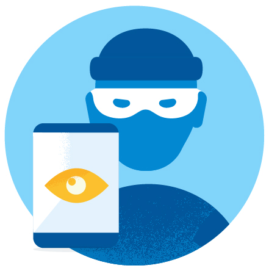

# 2017年，我们如何应对不良应用和恶意开发者

原标题：How we fought bad apps and malicious developers in 2017  
链接：[https://android-developers.googleblog.com/2018/01/how-we-fought-bad-apps-and-malicious.html](https://android-developers.googleblog.com/2018/01/how-we-fought-bad-apps-and-malicious.html)  
作者：Andrew Ahn (Google Play产品经理)  
翻译：[arjinmc](https://github.com/arjinmc)  

  

应用程序将设备带进生活 - 让你立即预订旅程，连接和与朋友分享回忆，提醒当前行程，与世界各地的人玩游戏，并在办公室或在路上完成工作。Google Play致力于为数十亿Android用户提供安全的体验，以便查找和发现这些应用。多年来，这一承诺使Google Play变得更加值得信赖和安全。去年，我们将用户安装不良应用程序的可能性减半，保护用户和设备免受伤害，使Google Play成为那些试图滥用应用程序生态系统以谋取利益的人的更具挑战性的地方。

在2017年，我们拿下超过70万个违反Google Play政策的应用，比2016年的应用多出70％。我们不仅删除了更多不良应用，而且还能够早日识别并采取行动。事实上，有99％的滥用内容的应用程序在任何人安装之前都被识别并拒绝。通过新的机器学习模型和技术，我们可以通过显着改进检测滥用行为的能力（如假冒，不适当的内容或恶意软件）来实现这一目标。

我们还开发了新的检测模型和技术，可以大规模识别屡犯者和滥用的开发者网络。这导致在2017年有超过10万名不合格的开发者被收购，并且让不良行为者更难以创建新的账户并尝试发布另一套不好的应用。

以下是我们在2017年采取行动的一些糟糕应用的一些示例：

## 仿冒

试图通过冒充着名应用来欺骗用户是最常见的违规行为之一。出名的标题为特定的关键字获得大量的搜索流量，所以不好的诱导试图利用这些流量来收集安装。他们通过尝试通过欺骗性方法（例如使用易混淆的unicode字符或在不同的语言环境中隐藏模拟应用程序图标）模仿应用程序到Play商店来做到这一点。在2017年，我们拿下了超过25万的假冒应用程序。

 

## 不适当的内容

我们不允许包含或宣传不当内容的应用，如色情，极端暴力，仇恨和非法活动。改进的机器学习模型通过大量传入的应用程序提交进行筛选，并将其标记为潜在的违规，帮助人类审阅者有效地检测和执行有问题的应用程序。由于这种改进的检测方法，去年成千上万具有不适当内容的应用程序被删除。

## 潜在的有害应用（PHA）

PHA是一种恶意软件，可能会损害人或其设备，例如，进行SMS欺诈，充当特洛伊木马程序或钓鱼用户信息的应用程序。虽然数量不多，但PHA会对Android用户构成威胁，我们会投入巨资，将其保留在Play商店之外。寻找这些不好的应用程序并不是微不足道的，因为恶意开发者为了使他们的应用程序看起来尽可能合法而付出了额外的努力，但随着2017年推出[Google Play Protect](https://www.android.com/play-protect/)，平均每年PHA安装在Google Play上的费用同比减少了50百分比。

    

尽管新的和增强的检测功能导致了不良应用程序和恶意开发者的记录减少，但我们知道有一些人仍然设法逃避和欺骗我们的防御层。我们非常认真地对待这些问题，并将继续创新我们的能力，以更好地检测和防范恶意应用程序及其背后的恶意行为者。我们致力于使Google Play成为全球最值得信赖和安全的应用商店。

 

