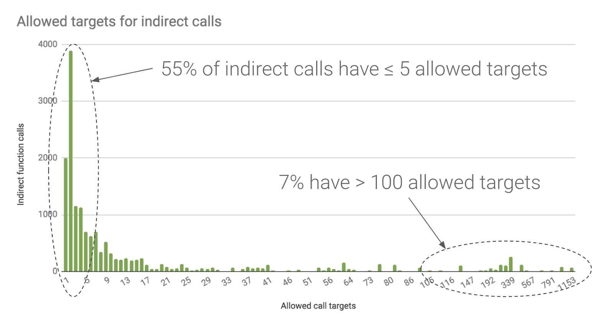
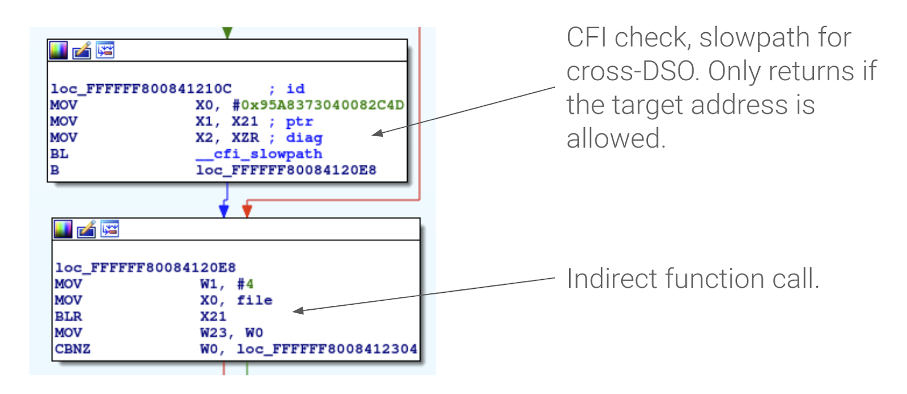

# Android内核中的控制流完整性

原标题：Control Flow Integrity in the Android kernel  
链接：[https://android-developers.googleblog.com/2018/10/control-flow-integrity-in-android-kernel.html](https://android-developers.googleblog.com/2018/10/control-flow-integrity-in-android-kernel.html)  
作者：Sami Tolvanen (Android安全人员软件工程师)  
翻译：[arjinmc](https://github.com/arjinmc)  

Android的安全模型由Linux内核强制执行，这使其成为攻击者的诱人目标。我们在以前的Android版本和Android 9中做了[内核的强化](https://android-developers.googleblog.com/2017/08/hardening-kernel-in-android-oreo.html)，我们通过专注于针对代码重用攻击的[基于编译器的安全缓解](https://android-developers.googleblog.com/2018/06/compiler-based-security-mitigations-in.html)来继续这项工作。

谷歌的Pixel 3将是第一款在内核中采用LLVM前沿[控制流完整性（CFI）](https://clang.llvm.org/docs/ControlFlowIntegrity.html)实施的Android设备，我们已经在[Android内核版本4.9和4.14中提供了CFI支持](https://source.android.com/devices/tech/debug/kcfi)。这篇文章描述了内核CFI的工作原理，并为开发者在启用该功能时可能遇到的最常见问题提供了解决方案。

## 防止代码重用攻击

利用内核的常用方法是使用bug来覆盖存储在内存中的函数指针，例如存储的回调指针或已被推送到堆栈的返回地址。这允许攻击者执行内核代码的任意部分，即使他们不能注入自己的可执行代码。这种获取代码执行的方法在内核中特别受欢迎，因为它使用了大量的函数指针，以及使代码注入更具挑战性的现有内存保护。

CFI尝试通过添加额外的检查来确认内核的控制流保持在预先计算的图形内来缓解这些攻击。如果错误提供对一个bug的写访问权限，这不会阻止攻击者更改函数指针，但它会严重限制有效的调用目标，这使得在实践中利用这样的bug更加困难。

  
<small>图1.在Android设备内核中，LLVM的CFI将55％的间接调用限制为最多5个可能的目标，80％限制为最多20个目标。</small>

## 通过链接时间优化（LTO）获得完整的程序可见性

为了确定每个间接分支的所有有效调用目标，编译器需要立即查看所有内核代码。传统上，编译器一次处理单个编译单元（源文件），并将目标文件合并到链接器。LLVM的CFI解决方案是要求使用LTO，其中编译器为所有C编译单元生成特定于LLVM的bitcode，并且LTO感知链接器使用LLVM后端来组合bitcode并将其编译为本机代码。

  
<small>图2. LTO在内核中的工作原理的简要概述。所有LLVM bitcode在链接时被组合，优化并生成为本机代码。</small>

几十年来，Linux一直使用GNU工具链来组装，编译和链接内核。虽然我们继续将GNU汇编程序用于独立汇编代码，但LTO要求我们切换到LLVM的集成汇编程序以进行内联汇编，并将GNU gold或LLVM自己的lld作为链接器。在巨大的软件项目上切换到相对未经测试的工具链将导致兼容性问题，我们已在针对内核版本[4.9](https://android-review.googlesource.com/q/topic:android-4.9-lto)和[4.14](https://android-review.googlesource.com/q/topic:android-4.14-lto)的 arm64 LTO补丁集中解决了这些问题。

除了使CFI成为可能之外，由于全局优化，LTO还可以生成更快的代码。但是，额外的优化通常会导致更大的二进制大小，这在资源非常有限的设备上可能是不合需要的。禁用LTO特定的优化（例如全局内联和循环展开）可以通过牺牲一些性能增益来减少二进制大小。使用GNU gold时，可以通过以下对LDFLAGS的添加来禁用上述优化：

```code
LDFLAGS += -plugin-opt=-inline-threshold=0 \
           -plugin-opt=-unroll-threshold=0
```
请注意，禁用单个优化的标志不是稳定LLVM接口的一部分，在将来的编译器版本中可能会更改。

## 在Linux内核中实现CFI

[LLVM的CFI](https://clang.llvm.org/docs/ControlFlowIntegrity.html#indirect-function-call-checking)实现在每个间接分支之前添加一个检查，以确认目标地址指向具有正确签名的有效函数。这可以防止间接分支跳转到任意代码位置，甚至限制可以调用的函数。由于C编译器不对间接分支强制执行类似的限制，因为函数类型声明不匹配导致了几个CFI违规，即使在我们在内核[4.9](https://android-review.googlesource.com/q/topic:android-4.9-cfi)和[4.14](https://android-review.googlesource.com/q/topic:android-4.14-cfi)的CFI补丁集中解决的核心内核中也是如此。

内核模块为CFI添加了另一个复杂功能，因为它们在运行时加载，并且可以独立于内核的其余部分进行编译。为了支持可加载模块，我们在内核中实现了LLVM的跨DSO CFI支持，包括加速跨模块查找的CFI阴影。在使用[跨DSO](https://clang.llvm.org/docs/ControlFlowIntegrity.html#shared-library-support)支持进行编译时，每个内核模块都包含有关有效本地分支目标的信息，内核根据目标地址和模块的内存布局从正确的模块中查找信息。

  
<small>图3.注入arm64内核的交叉DSO CFI检查示例。类型信息在X0中传递，目标地址在X1中验证。</small>

CFI检查自然会给间接分支增加一些开销，但由于更积极的优化，我们的测试表明影响很小，在许多情况下整体系统性能甚至提高了1-2％。

## 为Android设备启用内核CFI

arm64的CFI要求clang版本>=5.0且binutils>=2.27。内核构建系统还假定LLVMgold.so插件在LD_LIBRARY_PATH中可用。用于[clang](https://android.googlesource.com/platform/prebuilts/clang/host/linux-x86/+/master)和[binutils](https://android.googlesource.com/platform/prebuilts/gcc/linux-x86/aarch64/aarch64-linux-android-4.9/+/master)的预构建工具链二进制文件在AOSP中可用，但也可以使用上游二进制文件。

启用内核CFI需要以下内核配置选项：

```code
CONFIG_LTO_CLANG=y
CONFIG_CFI_CLANG=y
```

在调试CFI违规或设备启动期间，使用CONFIG_CFI_PERMISSIVE=y也可能有用。此选项将违规转换为警告而不是内核恐慌。

如上一节所述，我们在Pixel 3上启用CFI时遇到的最常见问题是由函数指针类型不匹配引起的良性违规。当内核遇到这种违规时，它会打印出一个运行时警告，其中包含失败时的调用堆栈，以及未通过CFI检查的调用目标。更改代码以使用正确的函数指针类型可以解决问题。虽然我们已经修复了Android内核中所有已知的间接分支类型不匹配，但是在设备特定的驱动程序中仍然可以找到类似的问题，例如：

```code
CFI failure (target: [<fffffff3e83d4d80>] my_target_function+0x0/0xd80):
------------[ cut here ]------------
kernel BUG at kernel/cfi.c:32!
Internal error: Oops - BUG: 0 [#1] PREEMPT SMP
…
Call trace:
…
[<ffffff8752d00084>] handle_cfi_failure+0x20/0x28
[<ffffff8752d00268>] my_buggy_function+0x0/0x10
…
```
<small>代码块4.由CFI故障引起的内核恐慌的示例。</small>

另一个潜在的缺陷是地址空间冲突，但这在驱动程序代码中应该不太常见。LLVM的CFI检查仅了解内核虚拟地址以及在另一个异常级别运行或间接调用物理地址的任何代码都将导致CFI违规。可以通过使用__nocfi属性禁用单个函数的CFI来解决这些类型的故障，甚至可以使用Makefile中的$(DISABLE_CFI)编译器标志禁用整个代码文件的CFI。

```code
static int __nocfi address_space_conflict()
{
      void (*fn)(void);
 …
/* branching to a physical address trips CFI w/o __nocfi */
 fn = (void *)__pa_symbol(function_name);
      cpu_install_idmap();
      fn();
      cpu_uninstall_idmap();
 …
}
```  
<small>代码块5.修复由地址空间冲突引起的CFI故障的示例</small>

最后，与许多强化功能一样，CFI也可能因内存损坏错误而被触发，否则可能导致随后的内核崩溃。这些可能更难调试，但是像[KASAN](https://www.kernel.org/doc/html/v4.14/dev-tools/kasan.html)等内存调试工具可以在这里提供帮助。

## 结论

我们已经在Android内核4.9和4.14中实现了LLVM的CFI支持。谷歌的Pixel 3将是第一款提供这些保护功能的Android设备，我们已通过Android通用内核向所有设备供应商提供该功能。如果您要发布运行Android 9的新arm64设备，我们强烈建议启用内核CFI以帮助防止内核漏洞。

LLVM的CFI保护间接分支免受攻击者的攻击，这些攻击者设法访问存储在内核内存中的函数指针。这使得发现内核的常用方法更加困难。我们未来的工作还涉及使用LLVM的[Shadow Call Stack](https://clang.llvm.org/docs/ShadowCallStack.html)保护函数返回地址免受类似的攻击，这将在即将发布的编译器版本中提供。