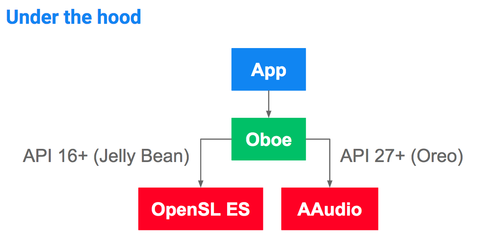

# 介绍Oboe：用于低延迟音频的C++库

原标题：Introducing Oboe: A C++ library for low latency audio  
链接：[https://android-developers.googleblog.com/2018/10/introducing-oboe-c-library-for-low.html](https://android-developers.googleblog.com/2018/10/introducing-oboe-c-library-for-low.html)  
作者：Don Turner (开发者倡导者，Android音频框架)  
翻译：[arjinmc](https://github.com/arjinmc)  

本周我们发布了[Oboe](https://github.com/google/oboe)第一个可用于生产的版本——一个用于构建实时音频应用程序的C++库。Oboe在最广泛的Android设备上提供尽可能低的音频延迟，以及其他一些好处。

## 单一API

Oboe 在Oreo MR1（API 27+）上利用了[AAudio](https://developer.android.com/ndk/guides/audio/aaudio/aaudio)的改进性能和功能，同时在API 16+上保持向后兼容性（使用[OpenSL ES](https://developer.android.com/ndk/guides/audio/opensl/)）。它有点像AndroidX的[原生音频](https://developer.android.com/ndk/guides/audio/) 。

  

## 减少编写和维护的代码

使用Oboe，您只需3行代码即可创建音频流（相比OpenSL ES中的50多行）：

```code
AudioStreamBuilder builder;
AudioStream *stream = nullptr;
Result result = builder.openStream(&stream);
```

## 其他优势

* 方便的C++ API（使用C ++ 11标准）
* 快速发布过程：作为源库提供，错误修复可以在几天内推出，比Android平台发布周期快得多
* 减少猜测：提供已知音频bug的变通方法，并为流属性提供合理的默认行为，例如采样率和音频数据格式
* 开源并由Google工程师维护（尽管我们欢迎外部贡献）

## 入门

看一下简短的视频介绍：  
[视频介绍](https://youtu.be/csfHAbr5ilI)  

查看[文档](https://github.com/google/oboe/blob/master/docs/GettingStarted.md)，[代码示例](https://github.com/google/oboe/tree/master/samples)和[API参考](https://codelabs.developers.google.com/codelabs/musicalgame-using-oboe/index.html#0)。甚至还有一个[代码实验库](https://codelabs.developers.google.com/codelabs/musicalgame-using-oboe/index.html#0)，向您展示如何构建基于节奏的游戏。

如果您有任何问题，[请在这里提交](https://github.com/google/oboe/issues/new)，我们很乐意听到您的在使用。