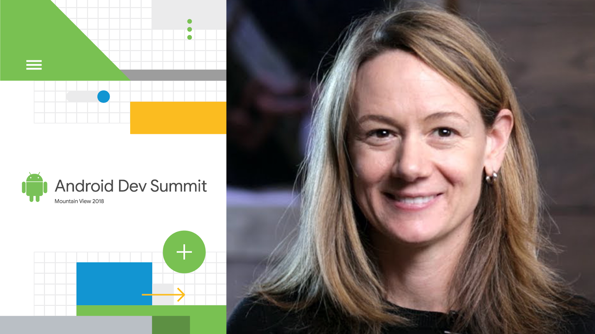

# 为#AndroidDevSummit做好准备，11月7日开始！

原标题：Get ready for #AndroidDevSummit, kicking off November 7!  
链接：[https://android-developers.googleblog.com/2018/10/get-ready-for-androiddevsummit-kicking.html](https://android-developers.googleblog.com/2018/10/get-ready-for-androiddevsummit-kicking.html)  
作者：Android官方  
翻译：[arjinmc](https://github.com/arjinmc)  

在不到一个月的时间里，我们将现场直播在11月7日和8日开始的加利福尼亚州山景城的计算机历史博物馆2018年[Android Dev Summit](https://developer.android.com/dev-summit/)，我们将有两天来自Android工程团队的深度技术会议，超过30场会议现场直播。第一波会议刚刚发布到网站上：[查看并开始计划](https://developer.android.com/dev-summit/schedule/day1)。

峰会将于11月7日太平洋标准时间晚上10点在主题演讲开始，您将直接听到Dave Burke和其他人对Android开发的现状和未来的看法。从那里开始，我们将深入研究Google工程团队提供的[两个深度技术内容（两天！）](https://www.google.com/url?q=https://developer.android.com/dev-summit/schedule/day1&sa=D&source=hangouts&ust=1539461547803000&usg=AFQjCNH_wSTOuXyAKRAq6JBa-bCLa5_Ziw)，主题包括Android Pie，Android Studio，Kotlin，Android Jetpack，Google Play等。我们还将为那些亲自参加的人提供演示和办公时间; 更多关于未来几周！

  

我们收到了希望亲自参加的开发商的大量兴趣; 如果你是那些表示有兴趣但没有收到门票的人之一，我们已经联系到你并分享了这个消息，但我们想再次道歉，我们无法找到你的位置。不过请放心，我们仍然会尽我们所能来免费获得更多门票，而且我们将会接触到我们能够在节目开始之前入选的人。如果您确实收到了门票，但您的计划已经更改且您无法再参加，请发送电子邮件至android-dev-summit@google.com告知我们，我们将为您解除而把门票给等候名单上的其他人。

如果您无法亲自加入，您可以随时加入我们的在线：我们将在[Android Dev Summit网站](https://developer.android.com/dev-summit/)上直播所有会议，并在整个会议期间在[YouTube](https://www.youtube.com/user/androiddevelopers)上提供，以便按照您自己的节奏观看。此外，我们将直接从计算机历史博物馆分享更新到我们的社交渠道，所以一定要遵循！