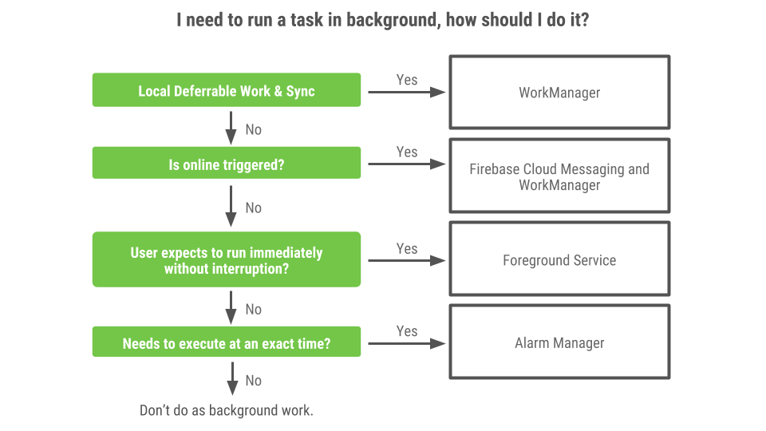

# Android中的现代后台执行

原标题：Modern background execution in Android  
链接：[https://android-developers.googleblog.com/2018/10/modern-background-execution-in-android.html](https://android-developers.googleblog.com/2018/10/modern-background-execution-in-android.html)  
作者：Luiz Gustavo Martins (DevRel合作开发商倡导者）  
翻译：[arjinmc](https://github.com/arjinmc)  

这是一系列博客文章中的第三篇，其中概述了Android中关于电量的策略和指导。

多年来，在Android上执行后台任务已发展。要[编写现代应用程序](https://www.youtube.com/watch?v=IrMw7MEgADk)，学习如何以现代方式运行后台任务非常重要。

## 什么时候是应用程序在后台？

在了解后台执行是什么之前，我们需要清楚地了解Android何时理解应用程序在前台。如果满足以下任何条件，则认为应用程序位于前台：

* 无论活动是开始还是暂停，该app都有可见的activity。
* 该应用程序有一个[前台服务](https://developer.android.com/reference/android/app/Service#startForeground(int,%20android.app.Notification))。
* 另一个前台应用程序通过[绑定到其中一个服务](https://developer.android.com/guide/components/bound-services)或使用其中一个[内容提供者](https://developer.android.com/guide/topics/providers/content-providers)连接到应用程序。例如，如果另一个应用程序或系统绑定到它，则应用程序位于前台：
	* [IME](https://developer.android.com/guide/topics/text/creating-input-method)
	* [壁纸服务](https://developer.android.com/reference/android/service/wallpaper/WallpaperService)
	* [通知监听器](https://developer.android.com/reference/android/service/notification/NotificationListenerService)
	* [语音](https://developer.android.com/reference/android/service/voice/VoiceInteractionService)或[文本](https://developer.android.com/reference/android/service/voice/VoiceInteractionService)服务
	* 将音乐流式传输到汽车时的音乐应用。（Android自动特定案例）

如果这些条件都不成立，则认为该应用程序位于后台。

## 后台执行变更

在后台运行任务会消耗设备的有限资源，如RAM和电池。这可能会导致糟糕的用户体验。例如，后台任务可能降低设备的电池寿命，或者用户可能在诸如观看视频，玩游戏，使用相机的时体验差的设备性能。

为了延长电池寿命并提供更好的用户体验，Android已在多个版本中进行了演变，以确定后台执行的限制。这些限制包括：

* [Dize和应用程序待机](https://developer.android.com/about/versions/marshmallow/android-6.0-changes#behavior-power)，在屏幕关闭时限制应用程序行为，设备处于空闲状态且未充电。
* [后台定位限制](https://developer.android.com/about/versions/oreo/background-location-limits)，限制后台应用程序检索用户当前位置的频率。
* [后台服务限制](https://developer.android.com/about/versions/oreo/background#services)，限制后台服务以隐藏/不可见的方式运行和消耗CPU/网络。
* 最近，[App Standby Buckets](https://developer.android.com/preview/features/power#buckets)可以限制用户未使用的应用程序可用的设备资源，以及[App Restrictions](https://developer.android.com/topic/performance/background-optimization#bg-restrict)，如果应用程序出现不良行为，系统将提示用户限制应用程序在后台访问系统资源，以及几个[省电改进方案](https://developer.android.com/about/versions/pie/power#battery-saver)。

## 用例和解决方案

决定使用哪些工具来实现后台执行需要开发者清楚地了解他们想要完成什么以及在哪些限制下。此流程图可以帮助您做出决定：

  

* [WorkManager](https://developer.android.com/topic/libraries/architecture/workmanager)是后台执行的推荐解决方案，考虑了所有操作系统后台执行限制。如果您需要保证任务即使延迟也会运行，您应该使用WorkManager。此API允许您安排作业（[一次性](https://developer.android.com/reference/androidx/work/OneTimeWorkRequest)或[重复](https://developer.android.com/topic/libraries/architecture/workmanager/basics#recurring)）以及[链接和组合作业](https://developer.android.com/topic/libraries/architecture/workmanager/advanced#chained)。您还可以对它们应用执行[约束](https://developer.android.com/reference/androidx/work/Constraints)，例如在设备空闲或计费时触发，或在内容提供者更改时执行。

一个示例是，如果您需要压缩日志以将其上载到您的服务器。为此，您可以创建两个[工作请求](https://developer.android.com/reference/androidx/work/WorkRequest)：

	* 第一：压缩文件。在此步骤中，您可以添加设备应该充电的约束。
	* 第二：将其上传到服务器。对于此请求，您应该添加网络连接约束，以便只有在有有效连接时才会触发工作。

在将两个任务排入队列后，当您的应用程序可以访问您需要的资源时，WorkManager将负责执行它们。

WorkManager的另一个不错的功能是它尊重电源管理功能，因此如果作业被安排在定义的时间运行并且设备当时处于Doze状态，WorkManager将尝试在[维护窗口](https://developer.android.com/training/monitoring-device-state/doze-standby#understand_doze)期间运行任务，如果满足约束或解除Doze之后。

* 如果要安排长时间运行的任务以响应外部事件（如同步新的在线内容），请使用[Firebase Cloud Messaging](https://firebase.google.com/docs/cloud-messaging/)通知您的应用，然后使用WorkManager创建工作请求以同步内容。您可以在“[使用FCM通知您的用户](https://android-developers.googleblog.com/2018/09/notifying-your-users-with-fcm.html)”中了解有关此内容的更多信息。
* 如果应用程序需要完成用户启动的任务而不延期，即使用户离开应用程序或关闭屏幕，例如在音乐/视频播放或导航的情况下，您应该使用[前台服务](https://developer.android.com/guide/components/services)。（本系列的下一篇博客文章深入研究了这个用例。）
* 如果您需要在触发操作的<em>准确</em>时间运行任务，涉及用户交互，并且无法延迟，请使用[AlarmManager](https://developer.android.com/reference/android/app/AlarmManager)（更具体地说，使用方法[setExactAndAllowWhileIdle](https://developer.android.com/reference/android/app/AlarmManager#setExactAndAllowWhileIdle(int,%20long,%20android.app.PendingIntent))）。时间闹钟的示例包括：
	* 提醒吃药
	* 电视节目即将开始的通知。

触发闹钟后，您只需几秒钟即可完成工作，您的应用可能无法访问网络（例如在[Doze](https://developer.android.com/training/monitoring-device-state/doze-standby)期间或App Standby存储桶中）。如果您确实需要网络或执行长任务，请使用WorkManager。每次触发[唤醒](https://developer.android.com/topic/performance/vitals/wakeup)闹钟时，设备都会退出低功耗模式并保持[部分唤醒锁定](https://developer.android.com/topic/performance/vitals/wakelock)，这会对电池寿命产生重大影响。这可以通过[Google Play控制台](https://g.co/play/console)提供的[Android Vitals](https://developer.android.com/topic/performance/vitals/)上突出显示的过多唤醒统计数据进行监控。

综上所述：

用例	| 例子 | 解决方案
--- | --- | ---
保证执行可延期的工作 | 1.将日志上传到您的服务器  2.加密/解密要上载/下载的内容 | WorkManager
为响应外部事件而启动的任务 | 同步新的在线内容，如电子邮件 | [FCM](https://firebase.google.com/docs/cloud-messaging/) + WorkManager
即使用户离开应用程序，也要继续执行需要立即运行的用户启动的工作 | 1.音乐播放器 2.跟踪活动 3.过境导航 | 前台服务
触发涉及用户交互的操作，例如确切时间的通知。 | 1.闹钟 2.医学提醒 3.有关电视节目即将开始的通知 | AlarmManager

明智地使用后台执行，这样您就可以构建很酷的应用程序，在节省电池的同时让用户高兴。如果您需要有关在Android上执行后台任务的更多信息，[Android开发者网站](https://developer.android.com/guide/background/)上的内容非常丰富。

注意：WorkManager仍处于公共预览状态。如果您现在需要替代解决方案，则应使用[JobScheduler](https://developer.android.com/reference/android/app/job/JobScheduler)，尽管它具有不适用于WorkManager的限制。JobScheduler是Android Framework的一部分，仅适用于Android API 21及更高版本; WorkManager适用于[API 14](https://developer.android.com/reference/androidx/work/WorkManager)及更高版本。

致谢：本系列博客文章由Android Framework和DevRel团队合作制作