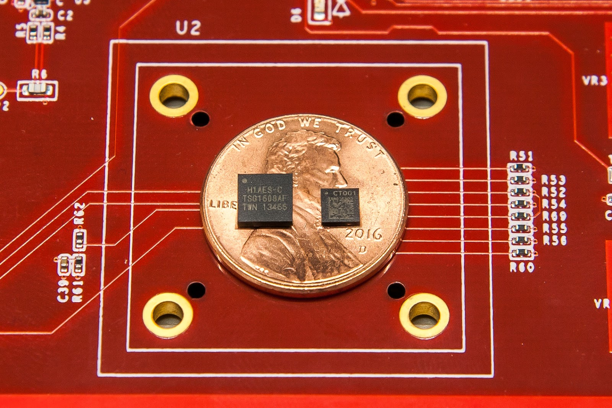
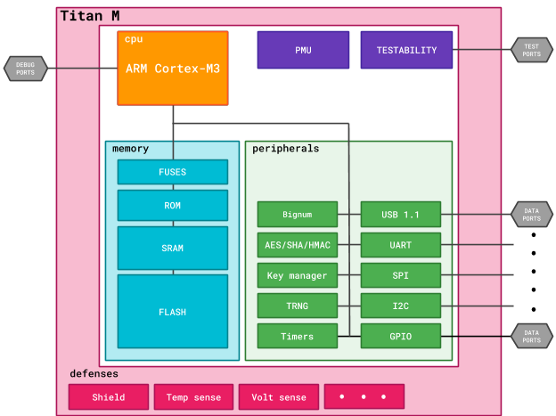

# 建立Titan：通过一个小芯片提高安全性

原标题：Building a Titan: Better security through a tiny chip  
链接：[https://android-developers.googleblog.com/2018/10/building-titan-better-security-through.html](https://android-developers.googleblog.com/2018/10/building-titan-better-security-through.html)  
作者：Nagendra Modadugu 和 Bill Richardson (谷歌设备安全组织)  
翻译：[arjinmc](https://github.com/arjinmc)  

在上周举办的[Made by Google](https://www.youtube.com/watch?time_continue=1759&v=EsoQGTA1SxY)活动中，我们讨论了人工智能+软件+硬件的组合，以帮助整理您的信息。为了更好地保护硬件级别的信息，我们新推出的Pixel 3和Pixel 3 XL设备包括一个Titan M芯片。我们在[关键字博客](https://www.blog.google/products/pixel/titan-m-makes-pixel-3-our-most-secure-phone-yet/)上简要介绍了Titan M及其一些好处，在这篇文章中我们深入介绍了它的一些技术细节内容。

Titan M是由Google设计和制造的第二代低功耗安全模块，是[Titan系列](https://cloudplatform.googleblog.com/2017/08/Titan-in-depth-security-in-plaintext.html)的一部分。如关键字博客[文章](https://www.blog.google/products/pixel/titan-m-makes-pixel-3-our-most-secure-phone-yet/)中所述，Titan M执行多项安全敏感功能，包括：

* 存储并强制执行[Android Verified Boot](https://source.android.com/security/verifiedboot/avb)使用的锁定和回滚计数器。
* 使用[Weaver API](https://source.android.com/reference/hidl/android/hardware/weaver/1.0/IWeaver)安全地存储秘密和速率限制无效尝试检索它们。
* 为[Android Strongbox Keymaster](https://developer.android.com/training/articles/keystore#HardwareSecurityModule)模块提供支持，包括[Trusted User Presence](https://developer.android.com/reference/android/security/keystore/KeyInfo?authuser=0&hl=nn#isTrustedUserPresenceRequired())和[Protected Confirmation](https://developer.android.com/training/articles/security-android-protected-confirmation)。Titan M与Pixel的侧面按钮有直接的电路连接，因此远程攻击者不能假按钮按下。这些功能可供第三方应用程序使用，例如[FIDO U2F](https://fidoalliance.org/specifications/overview/)身份验证。
* 执行出厂重置策略，以便丢失或被盗的电话只能由授权所有者恢复运行。
* 确保即使Google没有主人与[Insider Attack Resistance](https://android-developers.googleblog.com/2018/05/insider-attack-resistance.html)的合作也无法解锁手机或安装固件更新。

在Pixel 3设备中包括Titan M可以大大减少攻击面。由于Titan M是一个独立的芯片，因此物理隔离可以减少整个类的硬件级漏洞，例如[Rowhammer](https://googleprojectzero.blogspot.com/2015/03/exploiting-dram-rowhammer-bug-to-gain.html)，[Spectre](https://spectreattack.com/spectre.pdf)和[Meltdown](https://meltdownattack.com/meltdown.pdf)。Titan M的处理器，缓存，内存和持久存储不与手机系统的其余部分共享，因此这些侧通道攻击依赖于单个组件内部电路之间微妙的，无计划的交互几乎是不可能的。除了物理隔离外，Titan M芯片还包含许多防御功能，可以抵御外部攻击。

但是Titan M不仅仅是一个强化的安全微控制器，而是考虑到Pixel设备的全生命周期安全方法。Titan M的安全性考虑了Android可见的所有功能，直至最低级别的物理和电力电路设计，并将每个物理设备扩展到我们的供应链和制造流程。在物理层面，我们整合了针对移动体验优化的基本功能：低功耗，低延迟，硬件加密加速，篡改检测以及安全，及时的固件更新。我们通过创建自定义配置流程改进并投资了Titan M的供应链，从最早的硅片阶段开始，我们提供透明度和控制。

最后，为了透明，Titan M固件源代码很快就会公开发布。虽然Google拥有签署Titan M固件所需的根密钥，但是为了二进制透明的目的，可以基于公共源重现二进制构建。

## 近距离看Titan M

  
Titan（左）和Titan M（右）

Titan M的CPU是一款ARM Cortex-M3微处理器，专门针对侧通道攻击进行了强化，并增强了防御功能，可以检测和响应异常情况。Titan M CPU内核还提供多个控制寄存器，可用于逐渐减少对芯片配置设置和外设的访问。上电后，Titan M使用内置于芯片芯片中的公钥验证其基于闪存的固件的签名。如果签名有效，则闪存被锁定，因此无法修改，然后固件开始执行。

Titan M还具有多种硬件加速器：AES，SHA和用于公钥算法的可编程大数量协处理器。这些加速器非常灵活，可以使用固件提供的密钥进行初始化，也可以使用密钥管理器模块生成的芯片专用密钥和硬件绑定密钥进行初始化。芯片专用密钥是基于从真随机数发生器（TRNG）导出的熵在内部生成的，因此这些密钥在其整个生命周期内从不在外部可用。

在实施Titan M固件时，我们必须考虑许多系统限制。例如，将尽可能多的安全功能打包到Titan M的64 KB RAM中，需要所有固件专门从堆栈中执行。并且为了减少闪存磨损，即使在大多数硬件模块关闭的低功耗模式下，RAM内容也可以保留。

下图提供了此处描述的芯片组件的高级视图。

  

## 通过透明度和创新提高安全性

我们实施Titan M的核心是两个更广泛的趋势：透明度和构建未来创新的平台。

围绕设计过程的每一步 - 从逻辑门到启动代码再到应用程序 - 的透明度让我们对我们为用户提供的防御充满信心。我们知道里面是什么，它是如何到达的，它是如何工作的，以及谁可以做出改变。

定制硬件使我们能够提供现成组件中不易获得的新功能，新功能和性能。这些变化允许更高保障的使用案例，如双因素身份验证，医疗设备控制，P2P支付以及其他我们将帮助发展的用途。

随着我们的手机越来越多地生活在手机中，保持这些手机的安全性和可靠性变得越来越重要。Google非常重视这一责任。Titan M是我们不断努力改善所有用户隐私和安全的最新举措。