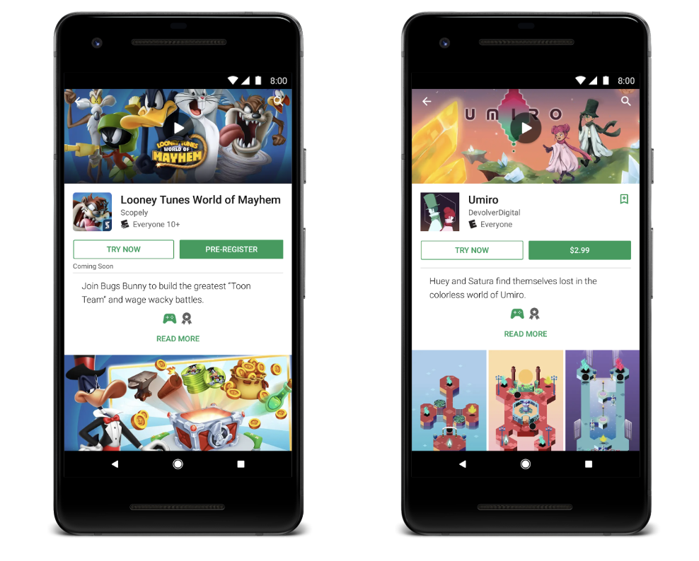
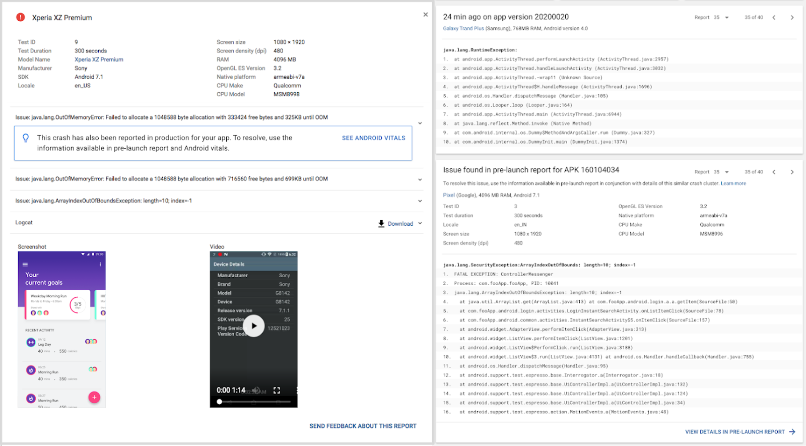

# Playtime 2018：帮助您在更小的bundle中构建更好的应用程序

原标题：Playtime 2018: Helping you build better apps in a smaller bundle  
链接：[https://android-developers.googleblog.com/2018/10/playtime-2018.html](https://android-developers.googleblog.com/2018/10/playtime-2018.html)  
作者：Matt Henderson （Google Play产品经理）  
翻译：[arjinmc](https://github.com/arjinmc)  

今天，我们开始播放我们的年度全球活动系列Playtime，在柏林和旧金山举办，800多名参会者，分享世界各地专家的见解以及我们产品的最新更新。随后将在圣保罗，新加坡，台北，首尔和东京举办活动。

在Google Play上，我们会继续投资各种工具，让您更轻松地开发和分发您的应用给全球受众。以下是我们今天宣布的一些令人兴奋的更新：

## 构建较小的应用

Android App Bundle是[Android的新发布格式](https://goo.gl/aboutappbundles)，您可以使用它轻松地以较小的应用程序大小提供出色的体验。较小的应用程序具有[更高的转换率](https://medium.com/googleplaydev/shrinking-apks-growing-installs-5d3fcba23ce2)，我们的用户研究表明应用程序大小是推动卸载的主要动力。借助Android App Bundle的模块化，您还可以按需提供功能，而不是在安装时，进一步减小应用程序的大小。

成千上万的应用程序包已经投入生产，平均尺寸减少了35％。今天，我们宣布更新，提供您切换到bundle包的其他原因。

* 更大的尺寸节省：现在，在没有额外的开发者工作的情况下，应用程序包在下载时平均减少8％，在M +设备上减少16％。这些新节省来自支持未压缩的本机库，无需在设备上存储多个副本。
* 更容易切换：您现在可以在[Android Studio 3.2](https://android-developers.googleblog.com/2018/09/android-studio-32.html)稳定版和[Unity 2018.3 beta](https://blogs.unity3d.com/2018/10/03/support-for-android-app-bundle-aab-in-unity-2018-3-beta/)版中构建应用程序包。
* 改进了对大型应用程序的支持：您现在可以上传大型应用程序包，其中安装的APK大小最多为500MB，而无需使用扩展文件。此功能处于早期访问状态，我们将在未来将其推广给所有开发者。

要了解有关Android App Bundle，动态功能以及构建较小的模块化应用程序所获得的所有好处的更多信息，[请阅读我们的Medium帖子](https://medium.com/googleplaydev/what-a-new-publishing-format-means-for-the-future-of-android-2e34981793a)。

## 构建统一的免安装体验

我们一直在倾听您的反馈意见，以便更轻松地构建免安装应用，我们最近将大小限制增加到10MB，以便在Play商店中启用TRY并[删除网址要求](https://android-developers.googleblog.com/2018/08/streamlining-developer-experience-for.html)。对于游戏开发者，我们已经与Unity合作了在Unity上的[Google Play Instant插件](https://goo.gl/instantunity)，并直接在新的[Cocos Creator](https://goo.gl/instantcocos)中构建。

我们现在使用Android App Bundle来解决构建即时应用程序的主要难点之一。以前，您需要发布免安装应用程序和可安装的应用程序。使用Android Studio 3.2，您可以发布免安装应用启用的bundle包，但仍需要发布主要应用bundle包。

现在，您不必维护单独的代码。借助[Android Studio 3.3 beta](https://developer.android.com/studio/preview/features/)版，开发者可以发布单个应用程序包并对其进行分类，或者将特定模块分类为即时启用。统一的应用程序包是免安装应用程序体验的未来，我们希望您能尝试一下。

## 扩展免安装试验

Google Play Instant现在可用于高级游戏和预注册广告系列，因此人们可以在游戏启动前尝试游戏并生成其他动态更新。新的应用和游戏每天都会加入Google Play Instant，我们很高兴欢迎Devolver Digital推出的Umiro和Scopely的Looney Tunes World of Mayhem作为第一批利用这些新功能的人。

  

## 降低崩溃率并提高质量

Play Console提供了两种工具来帮助您监控性能并提高应用程序的质量。启动前报告会在位于Firebase测试实验室的实际设备上运行您的应用，并生成有用的元数据，以帮助您在将应用推向生产之前识别和修复问题。Android vitals可帮助您在现实世界中跟踪用户设备上应用的性能和质量。

现在，我们将它们连接在一起，以提供更多可操作的见解。每当在启动前报告执行期间也看到Android vitals中的真实世界崩溃时，您将在Android vitals仪表板中获得预发布报告中的所有额外元数据，以便您可以更有效地进行调试。这也是双向连接，因此如果在现实世界中已经发生的发布前报告中发生崩溃，您将能够看到Android vitals中的当前影响，这将有助于您更好地确定突出显示的问题的优先级通过发布前报告。

  

## 优化您的应用和业务

我们已经进行了多次更新，以便通过Play更轻松地管理您的应用和业务。

* <em>保留订阅者的工具</em>：在I / O，我们引入了取消调查，您可以在其中深入了解订阅者取消的原因。现在，我们正在测试用户暂时停止订阅而非彻底取消的能力，并让您能够提供促销以赢回已取消的订阅者。
* <em>更灵活的订阅定价</em>：您现在可以更改现有订阅的价格，而无需在Play Billing Library 1.2版中创建新的SKU。您还可以提供计划更改，并在现有续订日期生效。
* <em>更强大的指标</em>：我们在Play控制台中添加了新工具，以帮助您评估核心指标。增加内容包括累积数据，30天滚动平均指标以及不同时段的汇总，以更好地匹配您的业务节奏。您还可以将任何已配置的报告下载为CSV文件。
* <em>更轻松的应用更新</em>：您现在可以提示用户更新，而无需使用名为应用内更新的新API离开您的应用。开发者既可以显示全屏体验，也可以让用户从下载中重新启动，或者通过优雅的状态监控帮助用户在后台下载和安装。该计划目前处于早期访问阶段，将在未来几个月内推出。

## 了解Play的新方法

我们同样很高兴能够通过新的互动课程推出[App Success学院](https://developer.android.com/google-play/academy/)，以帮助开发者充分利用Play控制台，了解Play政策，并利用最佳实践来提高质量并提高业务绩效。这个免费的新课程让您可以通过测验和成就来跟踪您的学习进度，以展示您的专业知识。今天提供英语版本，即将添加新内容和翻译课程。

我们继续受到您的构建以及您对全世界人民的影响的启发。查看我们的#IMakeApps系列，该系列旨在庆祝创建应用和游的精彩戏并[分享您的#IMakeApps故事](https://events.withgoogle.com/imakeapps/registrations/new/)。