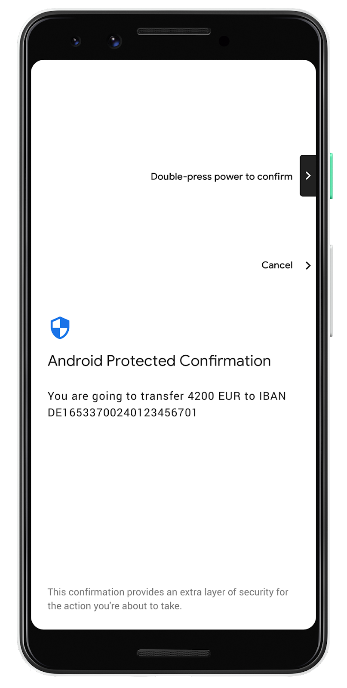

# Android Protected Confirmation：将事务安全性提升到新的水平

原标题：Android Protected Confirmation: Taking transaction security to the next level  
链接：[https://android-developers.googleblog.com/2018/10/android-protected-confirmation.html](https://android-developers.googleblog.com/2018/10/android-protected-confirmation.html)  
作者：Janis Danisevskis (Android安全信息安全工程师)  
翻译：[arjinmc](https://github.com/arjinmc)  

在Android Pie中，我们引入了Android Protected Confirmation（保护证实），这是第一个主要的移动OS API，利用硬件保护的用户界面（Trusted UI）完全在主要移动操作系统之外执行关键事务。此受信任用户界面可保护您对欺诈性应用程序或受损操作系统所做的选择。当应用程序调用受保护的确认时，控制权将传递到受信任的用户界面，其中显示事务数据并获得用户对该数据正确性的确认。

  

一旦确认，您的意图在传递给依赖方（例如您的银行）时会以加密方式进行身份验证并且不可伪造。受保护的确认增加了银行对您的行为的信心，为交易提供更高级别的保护。

受保护的确认还增加了与其他形式的辅助身份验证相关的额外安全性，例如一次性密码或[交易验证号](https://en.wikipedia.org/wiki/Transaction_authentication_number)。这些机制对于移动用户来说可能是令人沮丧的，并且也无法防止可能破坏交易数据或拦截一次性确认文本消息的受损设备。

用户批准交易后，受保护的确认会以数字方式对确认消息进行签名。由于签名密钥永远不会离开受信任用户界面的硬件沙箱，因此应用恶意软件和受损操作系统都无法欺骗用户授权任何内容。受保护的确认签名密钥是使用Android的标准[AndroidKeyStore](https://developer.android.com/training/articles/keystore) API 创建的。在开始使用Android Protected Confirmation进行端到端安全交易之前，应用必须使用远程信赖方注册公共KeyStore密钥及其[Keystore证明](https://source.android.com/security/keystore/attestation)证书。证明证书证明密钥只能用于签署受保护的确认。

Android Protected Confirmation有许多可能的用例。在Google I / O 2018上，Android安全会议中的展示了合作伙伴计划以各种方式利用[Android Protected Confirmation的新功能](https://www.youtube.com/watch?v=r54roADX2MI)，包括加拿大皇家银行的个人转账; 用于用户身份验证的Duo Security，Nok Nok Labs和ProxToMe; 和Insulet Corporation和Bigfoot Biomedical，用于医疗设备控制。

Insulet是全球领先的无内胎贴片胰岛素泵制造商，已经证明了他们如何在测试环境中修改FDA批准的Omnipod DASH TM胰岛素管理系统，以利用Protected Confirmation确认注射的胰岛素量。该技术通过使患有糖尿病的人能够利用其方便，熟悉且安全的智能手机进行控制而不必依赖于辅助的，突兀的且昂贵的遥控装置，有望改善生活质量并降低成本。（注意：Omnipod DASH™系统不能与Pixel 3移动设备或受保护的确认一起使用）。

[视频介绍](https://youtu.be/bvZ8NoIuELo)

这项工作满足了行业的重要需求。由于智能手机不适合FDA批准的医疗设备模具，我们一直与FDA 合作，作为全行业联盟[DTMoSt](https://www.diabetestechnology.org/dtmost.shtml)的一部分，为手机安全控制医疗设备（如胰岛素泵）制定标准。像受保护的确认这样的技术在获得用户意图和医疗安全的更高保证方面起着重要作用。

要将Protected Confirmation集成到您的应用程序中，请查看[Android Protected Confirmation培训文章](https://developer.android.com/training/articles/security-android-protected-confirmation)。Android Protected Confirmation是Android Pie中的可选功能。由于它具有低级硬件依赖性，因此运行Android Pie的所有设备可能不支持受保护的确认。Google Pixel 3和3XL设备是第一个支持Protected Confirmation的设备，我们正与其他制造商密切合作，在更多设备上采用这一市场领先的安全创新。