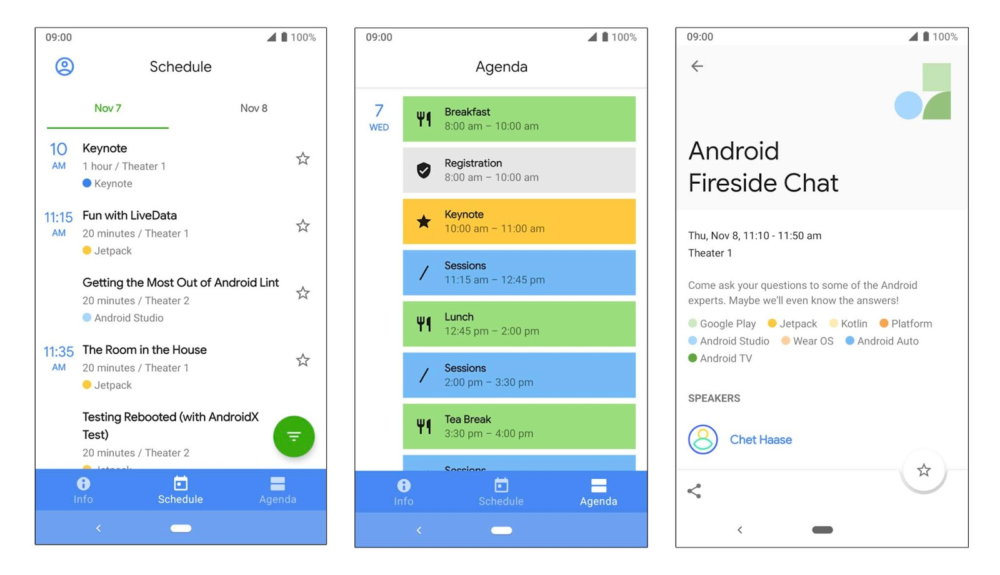

# Android Dev Summit应用程序正式可用！为11月7-8日做好准备

原标题：The Android Dev Summit app is live! Get ready for November 7-8  
链接：[https://android-developers.googleblog.com/2018/10/the-android-dev-summit-app-is-live-get.html](https://android-developers.googleblog.com/2018/10/the-android-dev-summit-app-is-live-get.html)  
作者：Matt Pearring (开发者营销副产品营销经理)  
翻译：[arjinmc](https://github.com/arjinmc)  

在短短一周内，我们将在11月7日和8日开始在加利福尼亚州山景城的计算机历史博物馆现场直播[Android Dev Summit](https://developer.android.com/dev-summit/) 2018，我们将有两天来自Android工程团队的深度技术会议，有超过30个会议的现场直播。该应用程序刚刚上线; 在[Google Play上](https://play.google.com/store/apps/details?id=com.google.samples.apps.adssched)下载并开始规划。

通过该应用程序，您可以浏览会议日程安排，其中包含主题演讲，会话和点子讲座的详细信息。您还可以通过将活动保存到个性化的时间表来规划您的峰会体验。今年的应用程序也是一个[免安装应用程序](https://developer.android.com/topic/google-play-instant/)，因此您可以在安装之前先试用它！

  
<small>Android Dev Summit应用截图</small>

如果您无法亲自加入，您可以随时加入我们的在线 - 我们将在[Android Dev Summit网站](https://developer.android.com/dev-summit/)或[app](https://play.google.com/store/apps/details?id=com.google.samples.apps.adssched)上直播所有论坛，并在整个会议期间在[YouTube](https://www.youtube.com/user/androiddevelopers)上提供这些会议，以便您可以按照自己的节奏观看。此外，我们将直接从计算机历史博物馆分享更新到我们的社交渠道，所以一定要遵循！

