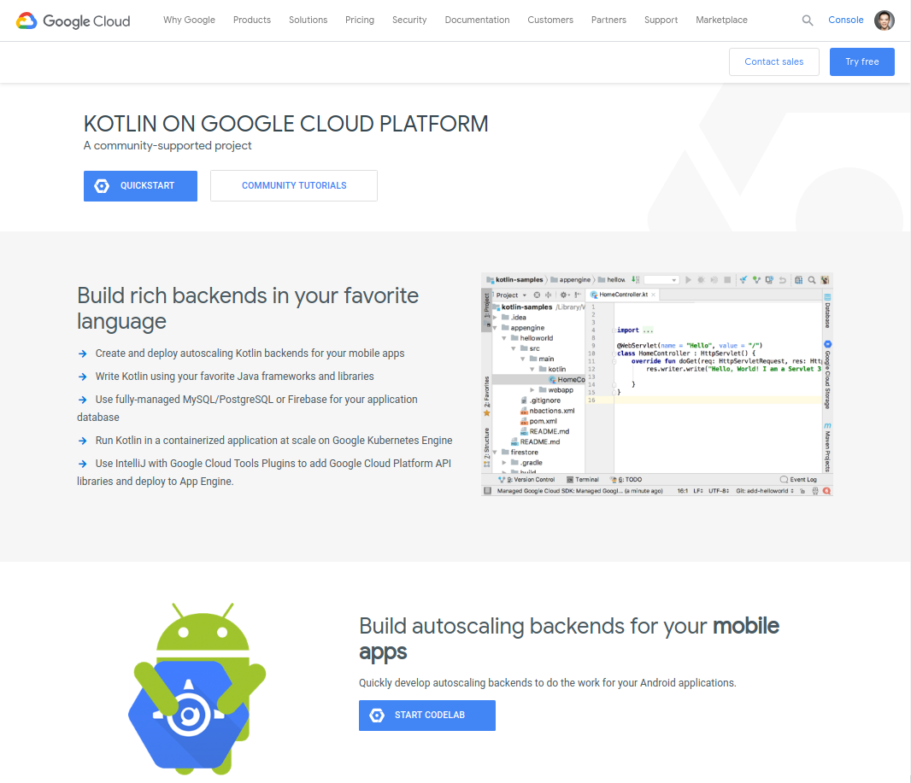

# 超越适用于Android的Kotlin Momentum

原标题：Kotlin Momentum for Android and Beyond  
链接：[https://android-developers.googleblog.com/2018/10/kotlin-momentum-for-android-and-beyond.html](https://android-developers.googleblog.com/2018/10/kotlin-momentum-for-android-and-beyond.html)  
作者：James Lau（[@jmslau](https://twitter.com/jmslau)），产品经理  
翻译：[arjinmc](https://github.com/arjinmc)  

今天标志着[KotlinConf 2018](http://kotlinconf.com/)的开始- 每年Kotlin社区最大的面对面聚会。对于Kotlin来说，2018年是一个重要的一年，因为该语言继续得到采用并赢得开发者的喜爱。<strong>事实上， Google Play上排名前1000的Android应用</strong>中有27％已经使用了Kotlin。更重要的是，Android开发者喜欢这种语言，在我们最近的调查中满意度超过<strong>97％</strong>。毫无疑问，Kotlin被评选为2018年StackOverflow调查中[最受喜爱的第二语言](https://insights.stackoverflow.com/survey/2018#most-loved-dreaded-and-wanted)。

Google支持Kotlin作为Android开发的一流编程语言。在过去的12个月中，我们为Kotlin开发者的体验提供了许多重要的改进。这包括[Kotlin友好的SDK](https://android-developers.googleblog.com/2018/08/android-pie-sdk-is-now-more-kotlin.html)，[Android KTX](https://developer.android.com/kotlin/ktx)，[新的Lint检查](https://android.github.io/kotlin-guides/interop.html#lint-checks)以及[Android Studio](https://developer.android.com/studio/)中的各种Kotlin支持改进。我们还在我们的[官方文档](https://developer.android.com/docs/)，[Kotlin的新旗舰示例](https://developer.android.com/kotlin/resources)，[新的Kotlin Bootcamp Udacity课程](https://www.udacity.com/course/kotlin-bootcamp-for-programmers--ud9011)，[＃31DaysOfKotlin](https://medium.com/androiddevelopers/31daysofkotlin-week-1-recap-fbd5a622ef86)和[其他深入内容](https://medium.com/androiddevelopers/tagged/kotlin)。我们致力于继续改进Kotlin开发者的体验。

随着语言的不断发展，越来越多的开发者正在全球范围内发现Kotlin的优势。最近，我们前往印度并与像[Zomato](https://www.zomato.com/)等本地开发商合作，以更好地了解采用Kotlin如何使他们的Android开发受益。Zomato是一家领先的餐厅搜索和发现服务公司，业务遍及24个国家，每月用户超过1.5亿。Kotlin帮助Zomato显着减少了应用程序中的代码行数，并且还帮助他们在编译时发现了应用程序中的重要缺陷。您可以在下面的视频中观看他们的采用Kotlin故事。

[视频介绍](https://youtu.be/ao9QvtpszOU)  
<small>Android开发者故事：Zomato使用Kotlin编写更安全，更简洁的代码。</small>

超越Android，我们很高兴地宣布Google Cloud Platform团队今天推出了专门的[Kotlin门户](https://cloud.google.com/kotlin)。这将有助于开发者更轻松地在Google Cloud上查找与Kotlin相关的资源。我们希望让您尽可能轻松地使用Kotlin，无论是在移动设备还是在云端。

  
<small>Google Cloud Platform的Kotlin主页</small>

对大多数公司而言，采用新语言是一项重大决策，您需要确信您选择的语言将拥有光明的未来。这就是谷歌与JetBrains合作并建立Kotlin基金会的原因。基金会将确保Kotlin继续快速发展，保持自由并保持开放。您可以在[这里](https://kotlinfoundation.org/)了解有关Kotlin基金会的更多信息。

成为Kotlin开发者是一个激动人心的时刻。如果您还没有尝试过Kotlin，我们鼓励您加入这个不断发展的全球社区。您可以访问[kotlinlang.org](https://kotlinlang.org/)或[Android Developer Kotlin](https://developer.android.com/kotlin)页面开始。