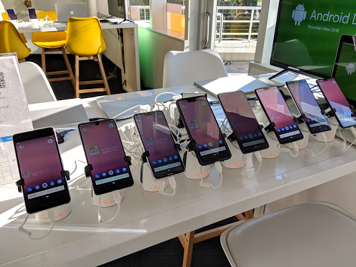
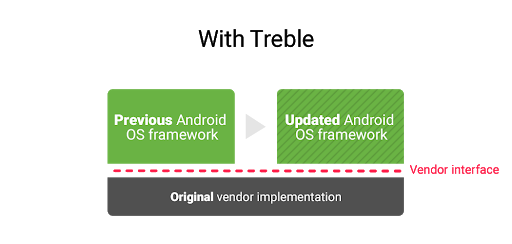
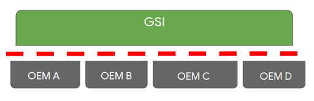

# Project Treble更新

原标题：An Update on Project Treble  
链接：[https://android-developers.googleblog.com/2018/11/an-update-on-project-treble.html](https://android-developers.googleblog.com/2018/11/an-update-on-project-treble.html)  
作者：Iliyan Malchev (项目高级架构师)  
翻译：[arjinmc](https://github.com/arjinmc)  

  

上周在2018年[Android Dev Summit](https://android-developers.googleblog.com/2018/11/unfolding-right-now-at-androiddevsummit.html)上，我们展示了在不同OEM设备上运行的相同[通用系统映像](https://source.android.com/setup/build/gsi)（GSI），从而展示了[Project Treble](https://android-developers.googleblog.com/2017/05/here-comes-treble-modular-base-for.html)的优势。我们强调了Android 9 Pie的GSI可用性，应用程序开发者可以使用它在任何符合Treble标准使用Android 9开发的设备上测试他们的应用程序。

Project Treble于2017年推出Android Oreo，使OEM和芯片供应商能够比以前更快地开发和部署Android更新。从那时起，我们一直与设备制造商合作定义供应商接口（VINTF），并在Android设备上明确区分供应商和框架代码。

  

展望未来，所有使用Android 9 Pie或更高版本推出的设备都将符合Treble标准，并充分利用Treble架构提供更快的升级。多亏了Treble，我们预计2018年底运行Android 9 Pie的OEM厂商将会看到更多设备，而2017年底运行Android Oreo的设备数量则相同。

  

GSI基于最新的[AOSP源代码](https://android.googlesource.com/?format=HTML)构建，包括OEM提供的最新错误修复。设备制造商已经使用GSI验证其设备上供应商界面的实现，Android应用开发者现在可以利用GSI的强大功能在不同设备上测试他们的应用。使用GSI，您可以在最新Android甜点的纯AOSP版本上测试您的应用程序，包括最新功能和行为更改，以及任何已解锁闪存的Treble兼容设备。

我们将继续努力使GSI对应用程序开发者更具可访问性和实用性。例如，GSI可以提前访问您可以在符合Treble标准的Android 9设备上运行的未来Android平台版本，因此您可以在AOSP发布之前启动应用程序开发和验证。

如果您有兴趣今天尝试使用GSI，请查看[文档](https://developer.android.com/topic/generic-system-image/)以获取有关如何自行构建GSI的完整说明，并将其更新到符合Treble标准的设备。