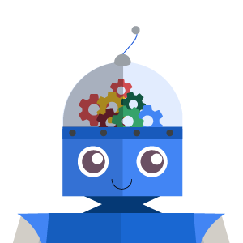

# Google使用机器学习与潜在有害的应用程序与作斗争：数据集和模型

原标题：Combating Potentially Harmful Applications with Machine Learning at Google: Datasets and Models  
链接：[https://android-developers.googleblog.com/2018/11/combating-potentially-harmful.html](https://android-developers.googleblog.com/2018/11/combating-potentially-harmful.html)  
作者：Mo Yu (Android安全和隐私团队)  
翻译：[arjinmc](https://github.com/arjinmc)  

  

在[之前的博客一片文章](https://android-developers.googleblog.com/2018/05/keeping-2-billion-android-devices-safe.html)中，我们讨论了使用机器学习来对抗[潜在有害应用程序（PHA）](https://source.android.com/security/reports/Google_Android_Security_PHA_classifications.pdf)。此博客文章介绍了Google如何使用机器学习技术来检测和分类PHA。我们将讨论PHA检测领域的挑战，包括数据规模，PHA行为的正确识别以及PHA家族的发展。接下来，我们将介绍两个使机器学习模型的培训和实施成为可能的数据集，例如应用分析数据和Google Play数据。最后，我们将介绍一些我们使用的方法，包括逻辑回归和深度神经网络。

## 使用机器学习来扩展

检测PHA具有挑战性并且需要大量资源。我们的安全专家需要了解应用程序如何与系统和用户交互，分析复杂信号以查找PHA行为，并发展他们的策略以保持领先于[PHA作者](https://source.android.com/security/reports/Google_Android_Security_PHA_classifications.pdf)。每天，Google Play Protect（GPP）都会分析超过50万个应用，这为我们的安全专家提供了大量新数据。

利用机器学习有助于我们更快，更大规模地检测PHA。我们可以通过添加额外的计算资源来检测更多PHA。在许多情况下，机器学习可以在训练数据中找到PHA信号而无需人为干预。有时，这些信号与安全专家发现的信号不同。机器学习可以更好地利用这些数据，更有效地发现信号之间隐藏的关系。

Google Play Protect的机器学习保护有两个主要部分：数据和机器学习模型。

## 数据源

用于创建模型的数据的质量和数量对于系统的成功至关重要。出于PHA检测和分类的目的，我们的系统主要使用两个匿名数据源：分析应用程序的数据和用户体验应用程序的数据。

## 应用程序数据

Google Play Protect会分析可在互联网上找到的每个应用。我们通过分解每个应用程序的APK并通过深入分析提取PHA信号来创建数据集。我们在每个应用程序上执行各种流程，以查找与范围内的PHA类别相关的特定功能和行为（例如，SMS欺诈，网络钓鱼，权限提升）。静态分析检查APK文件中的不同资源，而动态分析检查应用程序实际运行时的行为。这两种方法相互补充。例如，动态分析需要执行应用程序，无论其代码是如何混淆（混淆阻碍静态分析），静态分析可以帮助检测代码中的隐藏尝试，这可能在实践中最终绕过基于动态分析的检测。

## Google Play数据

除了分析每个应用程序，我们还尝试了解用户如何看待该应用程序。从Google Play收集的用户反馈（例如安装，卸载，用户评分和评论的数量）可以帮助我们识别有问题的应用。同样，有关开发者的信息（例如他们使用的证书及其已发布应用程序的历史记录）提供了可用于识别PHA的宝贵知识。所有这些指标都是在开发者每天提交新应用（或新版本的应用）以及数百万Google Play用户时生成的。此信息有助于我们了解应用的质量，行为和目的，以便我们识别新的PHA行为或识别类似的应用。

通常，我们的数据源会产生原始信号，然后需要将其转换为机器学习功能以供我们的算法使用。某些信号（例如应用程序请求的权限）具有明确的语义含义并且可以直接使用。在其他情况下，我们需要设计数据以制作更强大的新功能。例如，我们可以汇总特定开发者拥有的所有应用的评级，因此我们可以计算每位开发者的评级，并使用它来验证未来的应用。我们还使用了几种技术来关注有趣的数据。为了创建稀疏数据的紧凑表示，我们使用[嵌入](https://en.wikipedia.org/wiki/Word_embedding)。为了帮助简化数据以使其对模型更有用，我们使用[功能选择](https://en.wikipedia.org/wiki/Feature_selection)。根据目标，功能选择有助于我们保留最相关的信号并删除不相关的信号。

通过结合我们的不同数据集并投资于[功能工程](https://en.wikipedia.org/wiki/Feature_engineering)和功能选择，我们提高了可以提供给各种类型的机器学习模型的数据质量。

## 模型

  

建立一个良好的机器学习模型就像建造一座摩天大楼：优质的材料很重要，但一个伟大的设计也是必不可少的。与摩天大楼中的材料一样，良好的数据集和功能对机器学习很重要，但是一个好的算法对于有效和高效地识别PHA行为至关重要。

我们训练模型以识别属于特定类别的PHA，例如SMS欺诈或网络钓鱼。这些类别非常广泛，并且根据符合定义的PHA系列的数量包含大量样本。或者，我们也有一些模式专注于更小的规模，例如一个家庭，它由一组应用程序组成，这些应用程序是同一个PHA活动的一部分，并且共享相似的源代码和行为。一方面，具有单一模型来处理整个PHA类别在简单性方面可能是有吸引力的，但精确度可能是一个问题，因为模型将不得不概括大量被认为具有共同点的PHA的行为。另一方面，开发多个PHA模型可能需要额外的工程工作，但可能以降低范围为代价获得更好的精度。

我们使用各种建模技术来修改我们的机器学习方法，包括有监督和无监督的方法。

我们使用的一种监督技术是[逻辑递归](https://en.wikipedia.org/wiki/Logistic_regression)，它已在业界广泛采用。这些模型结构简单，可以快速培训。可以分析逻辑递归模型，以了解它们构建的不同PHA和应用程序功能的重要性，从而使我们能够改进我们的功能工程流程。经过几个周期的培训，评估和改进，我们可以在生产中推出最佳模型并监控其性能。

对于更复杂的案例，我们采用[深度学习](https://en.wikipedia.org/wiki/Deep_learning)。与逻辑递归相比，深度学习擅长捕捉不同特征之间的复杂交互并提取隐藏模式。Google Play中的数百万个应用提供了丰富的数据集，这有利于深度学习。

除了我们的目标功能工程工作，我们还尝试了深度神经网络的许多方面。例如，深度神经网络可以具有多个层，并且每个层具有多个神经元来处理信号。我们可以尝试每层的层数和神经元来改变模型行为。

我们还采用无监督的机器学习方法。许多PHA使用类似的滥用技巧和技巧，因此它们看起来几乎完全相同。无监督方法有助于定义外观或行为相似的应用集群，这使我们能够更有效地缓解和识别PHA。如果我们对模型有信心，或者可以请求人类专家帮助验证模型的发现，我们可以自动化对该类应用程序进行分类的过程。

PHA不断发展，因此我们的模型需要不断更新和监控。在生产中，模型使用最近的应用程序的数据，这有助于他们保持相关性。但是，需要不断检测新的滥用技术和行为，并将其输入我们的机器学习模型，以便能够捕获新的PHA并掌握最新的趋势。这是模型创建和更新的连续循环，还需要调整以确保整个系统的精度和覆盖范围与我们的检测目标相匹配。

## 展望

作为Google首次采用AI的战略的一部分，我们的工作利用了整个公司的许多机器学习资源，例如Google Brain和Google Research开发的工具和基础架构。2017年，我们的机器学习模型[成功检测到Google Play Protect确定的60.3％的PHA](https://source.android.com/security/reports/Google_Android_Security_2017_Report_Final.pdf)，涵盖超过20亿台Android设备。我们将继续研究和投资机器学习，以扩展和简化Android生态系统中PHA的检测。

  

## 致谢

这项工作是与Google Play Protect，安全浏览和Play滥用团队联合开发的，其中包括Andrew Ahn，Hrishikesh Aradhye，Daniel Bali，Hongji Bao，Yajie Hu，Arthur Kaiser，Elena Kovakina，Salvador Mandujano，Melinda Miller，Rahul Mishra，Damien Octeau，Sebastian Porst，Chuangang Ren，Monirul Sharif，Sri Somanchi，Sai Deep Tetali，Zhikun Wang和Mo Yu。

