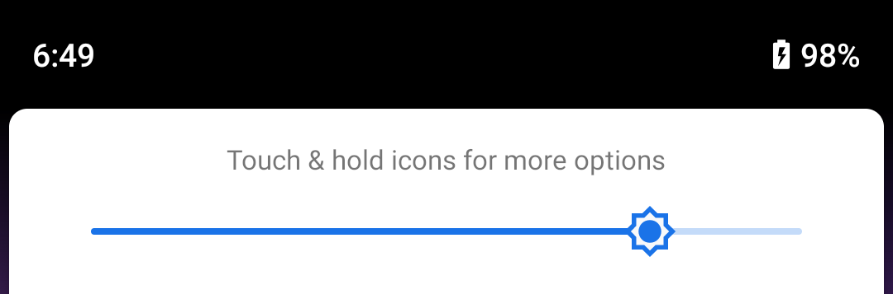
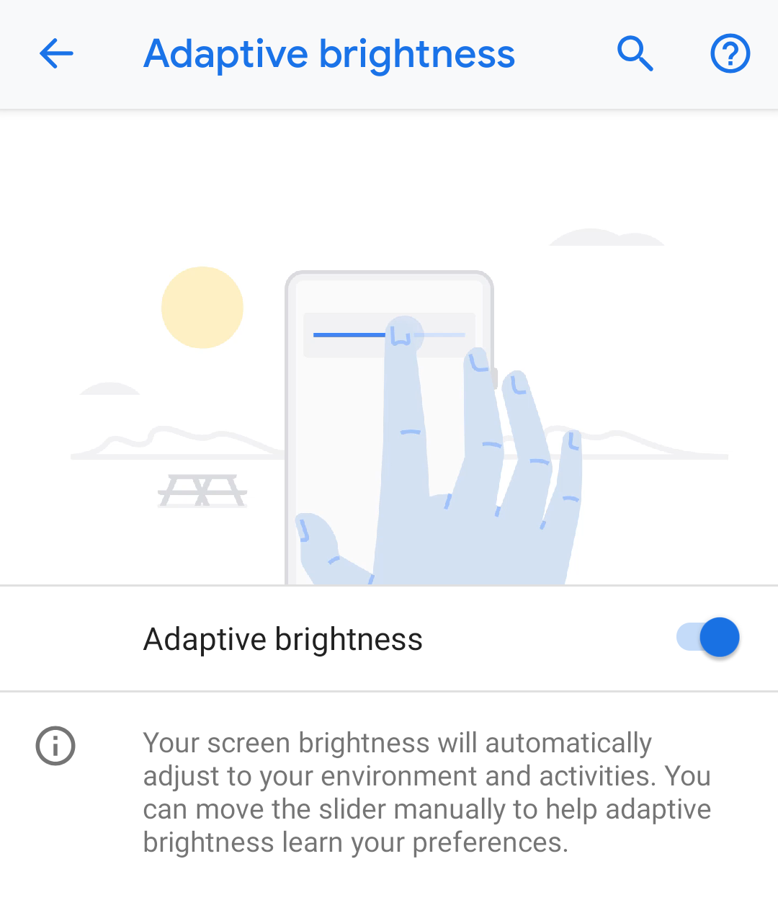

# 为了每个用户获取适合的屏幕亮度

原标题：Getting screen brightness right for every user  
链接：[https://android-developers.googleblog.com/2018/11/getting-screen-brightness-right-for.html](https://android-developers.googleblog.com/2018/11/getting-screen-brightness-right-for.html)  
作者：Ben Murdoch(软件工程师)和Michael Wright(Android框架工程师)  
翻译：[arjinmc](https://github.com/arjinmc)  

移动设备上的屏幕对用户体验至关重要。Android P中改进的自适应亮度功能可自动管理显示，以符合您对亮度级别的偏好，从而无论当前的照明环境如何，您都可以获得最佳体验。

Android中的屏幕亮度通过“快速设置”或设置应用程序进行管理

（设置→显示→亮度级别）。

  

在Android Pie中，默认情况下启用自适应亮度（设置→显示→自适应亮度）。

  

启用后，Android会自动选择适合用户当前环境光条件的屏幕亮度。在Android Pie之前，亮度滑块并不代表绝对屏幕亮度级别，而是一个全局调整因子，用于在所有环境光照水平下提升或降低设备制造商的预设屏幕亮度级别：

* 将滑块设置为中心导致设备使用预设。
* 将滑块设置在中心左侧会应用负比例因子，使屏幕比预设更暗。
* 将滑块设置在中心右侧会应用正比例因子，使屏幕比预设更亮。

因此，在环境低亮度条件下，您可能更喜欢比预设水平更亮的屏幕，并相应地向上移动亮度滑块。但是，因为这种调整会提高所有环境光线亮度，所以您可能会发现自己需要在更亮的环境光线下将亮度滑块向下移动。等等，来回。

为了改善这种体验，我们在Android Pie中引入了两个重要的屏幕亮度变化：

1. 更好的滑块控制
2. 个性化的亮度等级

## 更好的滑块控制

滑块控件现在表示绝对屏幕亮度而不是全局调整因子。这意味着当自适应亮度打开时，您可能会看到它自行移动。这是预期的行为！

人类以对数而不是线性标度1感知亮度。这意味着当屏幕暗而不亮时，屏幕亮度的变化会更加明显。为了匹配这种感知差异，我们更新了通知阴影和系统设置应用程序中的亮度滑块UI，以更加人性化的方式工作。这意味着您可能需要将滑块向前移动到比以前版本的Android更高的相同绝对屏幕亮度，并且在设置暗屏亮度时，您可以更准确地控制要设置的亮度。

## 屏幕亮度的个性化

在Android P之前，在开发新的Android设备时，设备制造商将根据显示器制造商的建议和一些实验确定从环境亮度到屏幕亮度的基线映射。该设备的所有用户将接收相同的基线映射，并在使用设备时，移动亮度滑块以设置其全局调整因子。要确定最终屏幕亮度，系统将首先查看房间亮度和基线映射以查找该情况的默认屏幕亮度，然后应用全局调整因子。

我们发现，在许多情况下，这种全局调整因素并没有充分反映个人偏好 - 也就是说，用户往往会在新的照明环境中经常更换滑块。

对于Android Pie，我们与DeepMind的研究人员合作构建了一个机器学习模型，该模型将观察用户与屏幕亮度滑块的交互，并在设备上训练以个性化环境光水平到屏幕亮度的映射。

这意味着Android将了解给定照明环境中用户的屏幕亮度。用户通过手动调节滑块来教它，并且随着软件训练随着时间的推移，用户应该需要进行更少的手动调节。在测试该功能时，我们观察到一周后，几乎一半的测试用户手动调整较少，而所有内部测试用户的滑块交互总数减少了10％以上。我们开发的模型是可更新的，并且将根据Android Pie已发布的实际使用情况进行调整。这意味着随着时间的推移，模​​型将继续变得更好。

我们认为屏幕亮度是应该起作用的事情之一，Android Pie中的这些变化是实现这一目标的一步。无论您身在何处，模型都可以直接在设备而不是云上运行，并在设备充电时过夜训练。

改进的自适应亮度功能现在可在Pixel设备上使用，我们现在正与我们的OEM合作伙伴合作，将Adaptive Brightness整合到其设备的Android Pie版本中。

## 笔记
 
1.[https://en.wikipedia.org/wiki/Weber%E2%80%93Fechner_law#Vision  ↩](https://en.wikipedia.org/wiki/Weber%E2%80%93Fechner_law#Vision)