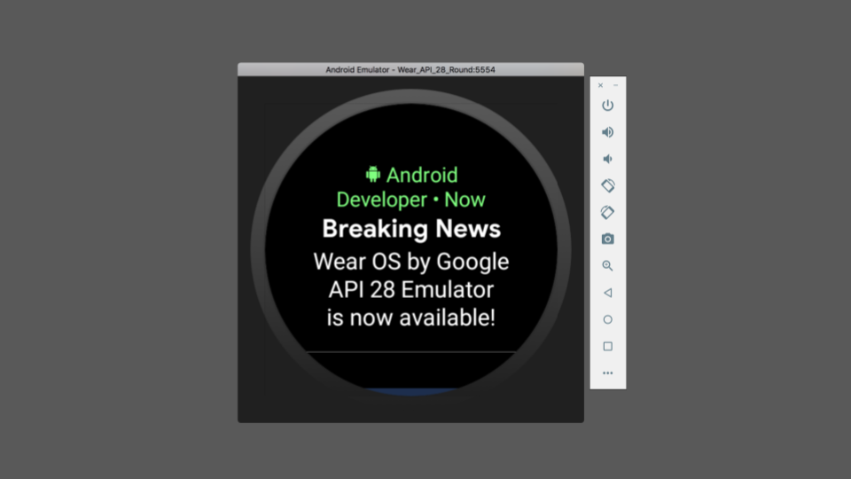

# 谷歌Wear OS：包含重新设计UI的最终的API 28版模拟器

原标题：Wear OS by Google: final API 28 emulator with new redesigned UI  
链接：[https://android-developers.googleblog.com/2018/11/wear-os-by-google-final-api-28-emulator.html](https://android-developers.googleblog.com/2018/11/wear-os-by-google-final-api-28-emulator.html)  
作者：[Hoi Lam](https://twitter.com/hoitab)(首席开发者倡导者)  
翻译：[arjinmc](https://github.com/arjinmc)  

  

今天，我们正在为开发者推出最终的API 28模拟器映像。此图片还将包含我们在8月份宣布的UI重新设计。您应该验证应用的通知是否适用于新的通知流，以及您的应用是否适用于之前为API 28发布的更改。

## API 28有什么新功能？

以下是API 28模拟器的亮点：

* <strong>[新通知流](https://android-developers.googleblog.com/2018/08/make-most-of-notifications-with.html)</strong> - 您应该确保使用颜色正确标记通知，并且通知足够简洁以适应新布局。不再支持自定义通知布局。
* <strong>[App Standby Buckets](https://developer.android.com/about/versions/pie/power#buckets)</strong> - Wear OS根据应用程序的最新使用频率和频率，优先处理应用程序对资源的请求。建议开发者遵循最佳实践，以确保他们的应用程序表现良好，无论应用程序在哪个桶中。
* <strong>[用户输入和数据隐私](https://developer.android.com/about/versions/pie/android-9.0-changes-all#privacy-changes-all)</strong> - 为了增强用户隐私，API 28引入了新的更改，限制后台应用程序访问设备传感器。根据应用程序要求，开发人员可能需要使用前台服务来持续访问传感器数据。

请注意，与新通知流相关的更改将推广到支持API 25及更高版本的设备。通过使用API​​ 28模拟器映像，您可以在推出完成之前测试通知现在的行为方式。

## 保持反馈意见

仅仅因为我们现在处于发布版本并不意味着我们的工作就在这里停止。请继续通过[Google的Wear OS问题跟踪器](https://issuetracker.google.com/issues/new?component=192711&template=840908)提交所有错误/增强请求。

最后，我们非常感谢您在开发者预览期间提供的所有宝贵意见。它在我们的决策过程中发挥了重要作用 - 特别是关于App Standby Buckets。谢谢！