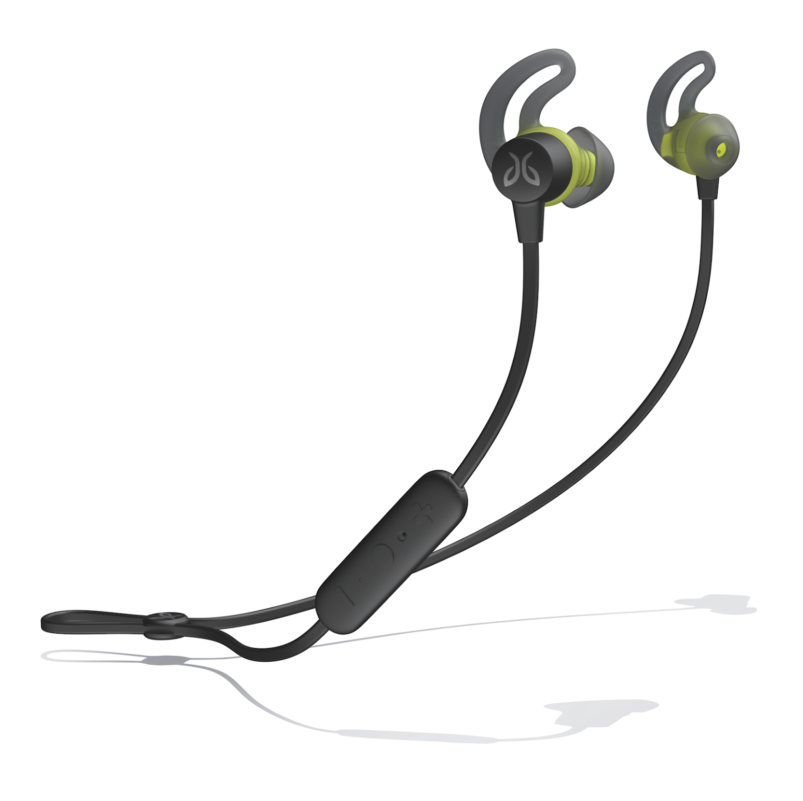

# 快速配对更新

原标题：Fast Pair Update  
链接：[https://android-developers.googleblog.com/2018/11/fast-pair-update.html](https://android-developers.googleblog.com/2018/11/fast-pair-update.html)  
作者：Seang Chau（工程副总裁）  
翻译：[arjinmc](https://github.com/arjinmc)  

去年我们发布了[快速配对(Fast Pair)](https://android-developers.googleblog.com/2017/10/announcing-fast-pair-effortless.html)，这是一套规格，可以更轻松地将蓝牙耳机和扬声器连接到Android设备。

今天，我们正在让人们更轻松地将快速配对兼容配件连接到与同一Google帐户相关联的设备。快速配对会将配件连接到用户当前和未来的Android手机（6​​.0+），我们将在2019年增加对Chromebook的支持。

  
<small>快速配对为您的Android手机提供无压力的蓝牙配对。</small>

我们一直与数十家制造商密切合作，其中许多制造商在未来几个月内将新的快速配对兼容设备推向市场。这包括已经销售[Tarah无线运动耳机](https://www.jaybirdsport.com/en-us/tarah-wireless-sport-headphones.html#985-000704)的Jaybird，以及来自Anker SoundCore，Bose等知名品牌的即将推出的产品。

  
<small>Jaybird Tarah，快速配对兼容的运动耳机已在市场上出售。</small>

我们还希望制造商能够轻松地以最少的额外工程量来运送兼容的产品。我们与业界领先的蓝牙音频公司（如[Airoha Technology Corp.](http://www.airoha.com/)，[BES](http://www.bestechnic.com/Home/Index/index/lan_type/2)和[Qualcomm Technologies International，Ltd。（QTIL）](https://www.qualcomm.com/)合作，为其软件开发套件添加本机快速配对支持。

如果您是一家对创建快速配对兼容蓝牙设备感兴趣的制造商，请前往我们的[附近设备控制台](https://developers.google.com/nearby/devices)注册您的产品并验证其是否已正确实施[快速配对](https://developers.google.com/nearby/fast-pair/spec)规格。