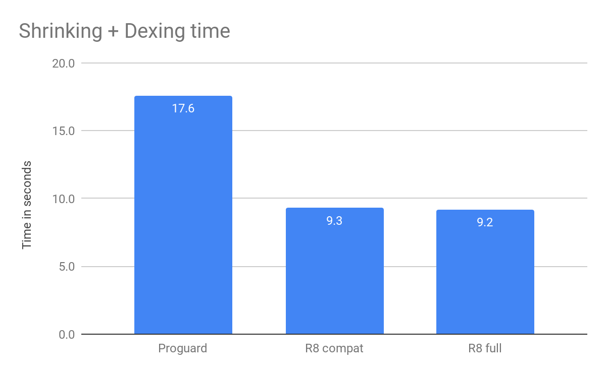
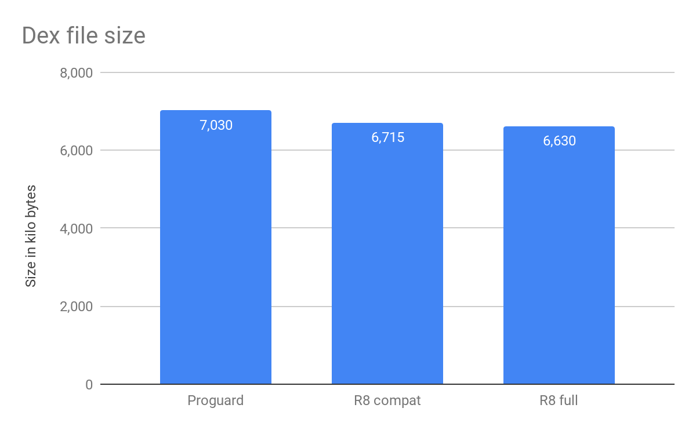
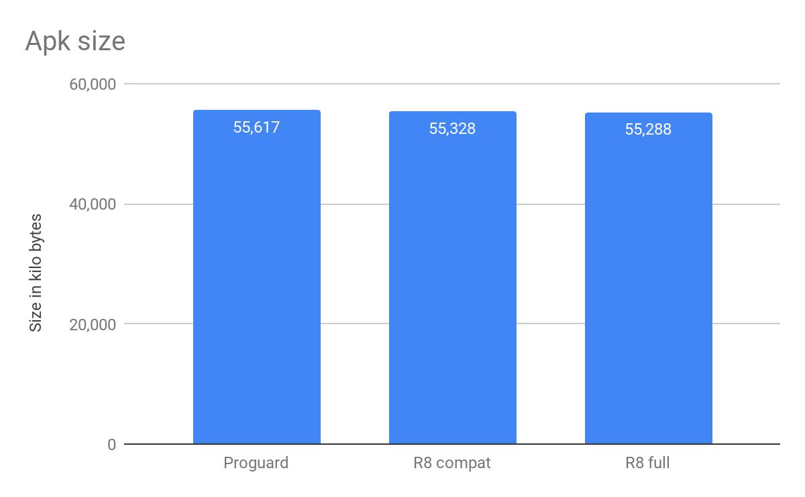

# R8是谷歌的新代码缩小器，可在Android studio 3.3 beta中使用

原标题：R8, the new code shrinker from Google, is available in Android studio 3.3 beta  
链接：[https://android-developers.googleblog.com/2018/11/r8-new-code-shrinker-from-google-is.html](https://android-developers.googleblog.com/2018/11/r8-new-code-shrinker-from-google-is.html)  
作者：Leo Sei (Android Studio R8的产品经理)  
翻译：[arjinmc](https://github.com/arjinmc)  

Android开发者知道APK大小是用户参与的重要因素。代码缩小有助于通过消除未使用的代码和资源来减少APK的大小，并使您的实际代码占用更少的空间（也称为缩小或混淆）。

这就是我们投资改善代码缩减以使其更快，更高效的原因。我们很高兴地宣布下一代代码缩减器R8可作为[Android Studio 3.3 beta](https://androidstudio.googleblog.com/2018/10/android-studio-33-beta-2-is-available.html)的一部分进行预览。

R8一步到位地完成了所有的萎缩，脱臼和德兴。与当前的代码收缩解决方案Proguard相比，R8可以更快地缩小代码，同时改善输出大小。

以下数据来自Santa Tracker应用程序的基准测试，您可以在此[GitHub库](https://github.com/madsager/santa-tracker-android)中找到包含基准详细信息的项目。

    
    
    

## 怎么试试呢

R8适用于Android Studio 3.3 beta，可与Proguard规则配合使用。要尝试它，请在项目的gradle.properties文件中设置以下内容：

```code
android.enableR8=true
```

对于更具冒险精神的人来说，R8也拥有与Proguard不直接兼容的完整模式。为了尝试这一点，您还可以在gradle.properties文件中另外设置以下内容：

```code
android.enableR8.fullMode=true
```

这会启用更多优化，可以进一步减少应用程序的大小。但是，您可能需要一些额外的保留规则才能使其正常工作。

我们已在多个应用程序上测试了R8的正确性和性能，结果很有希望，因此我们计划很快将R8转换为Android工作室中的默认收缩器。

请试试R8，我们很乐意听取您的反馈意见。您可以使用[此链接](https://b.corp.google.com/issues/new?component=326788&template=1025938)提交bug报告。