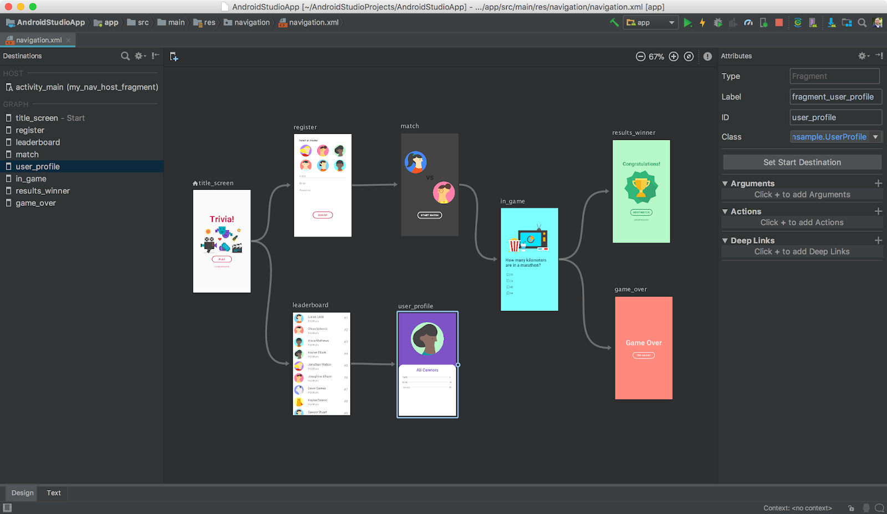
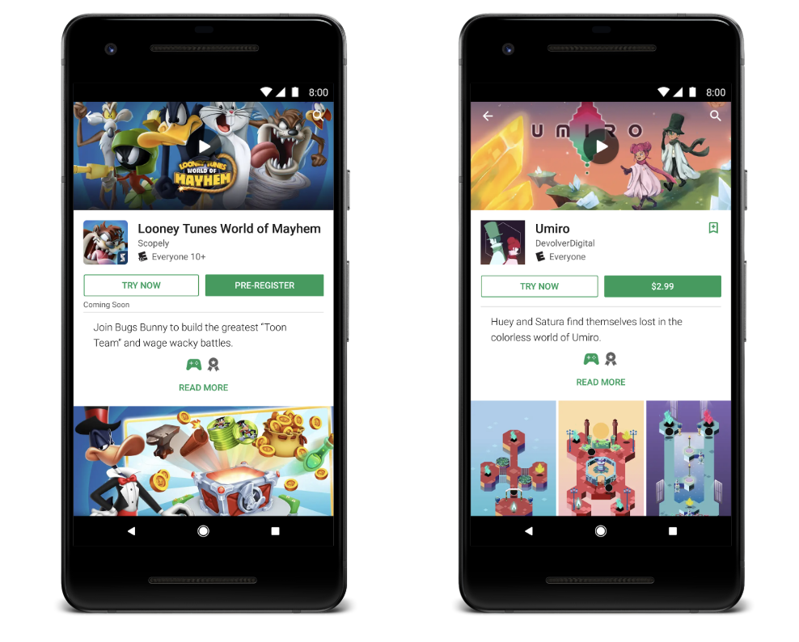

# AndroidDevSummit现在正在开始！

原标题：Unfolding right now at #AndroidDevSummit!  
链接：[https://android-developers.googleblog.com/2018/11/unfolding-right-now-at-androiddevsummit.html](https://android-developers.googleblog.com/2018/11/unfolding-right-now-at-androiddevsummit.html)  
作者：Stephanie Cuthbertson (产品管理总监)  
翻译：[arjinmc](https://github.com/arjinmc)  

今天，在加利福尼亚州山景城的计算机历史博物馆，我们开始了[Android开发者峰会](https://developer.android.com/dev-summit/)，回顾过去10年的Android，然后又开始为Android开发者提供一些重要的新功能。以下是我们分享的一些内容！

[视频介绍](https://youtu.be/ei_5R0CvLm4)  

## Android展现新的体验

早在Android 1.6，Android和我们的合作伙伴就已经考虑了不同的屏幕尺寸和密度，使平台能够支持各种外形和新体验，如Android TV，Android Auto，Wear OS甚至Chromebook上的Android应用。手机屏幕是Android合作伙伴设置标准的区域，在手机屏幕较小时引入“平板手机”。快进到今天，当一个平板手机......只是一部手机，标准尺寸的用户已经开始喜爱。

现在我们看到Android设备制造商创建了一个新类别：<strong>Foldables(折屏设备)</strong>。利用新的柔性显示技术，屏幕可以完全弯曲和折叠。

  

从广义上讲，有两种变体：双屏设备和单屏设备。折叠后，折叠式设备看起来像手机，放在口袋或钱包里。当展开时，它们的定义特征就是我们所说的屏幕连续性。例如，使用折叠的较小屏幕启动视频 - 稍后您可以坐下来展开设备以获得更大的平板电脑大小的屏幕，从而获得美观，身临其境的体验。随着您的展开，应用程序无缝地转移到更大的屏幕而不会错过任何节拍。我们正在针对这种新外形优化Android。而且，进行更改以帮助各地的开发者利用这些创造的可能性，创造出令人惊叹的全新体验，吸引用户并使用户满意的新方式。在本周的Dev Summit上收看Foldables会议以了解更多信息。预计将看到来自几家Android制造商的可折叠产品，包括今天预览的一款三星计划明年推出的折叠设备。

## Kotlin：使用增长最快的语言

我们在2017年使[Kotlin](https://developer.android.com/kotlin/)成为Android上的一流语言。本月我们在Android Studio中使用Kotlin创建了超过118,000个新项目 - 来自那些选择分享指标的用户。这比去年增加了10倍。就GitHub贡献者数量的增长而言，它已成为增长最快的语言，并被投票选为Stack Overflow上最受欢迎的第二语言。在我们的调查中，越多的开发者使用Kotlin，他们的满意度就越高。

上周，JetBrains[发布了最新版本的Kotlin，1.3](https://blog.jetbrains.com/kotlin/2018/10/kotlin-1-3/)，它带来了新的语言功能，API，错误修复和性能改进：

* <strong>内联类</strong>允许您创建一个不分配的类型，除非装箱。对于Android应用所针对的受限设备，在保留类型安全的同时避免分配是一个很大的优势。
* <strong>无符号数字</strong>现在是Kotlin标准库的一部分，包括UIn​​t，UByte和ULong。这些新类型使用内联类构建。
* 以前为Android或JVM编写的<strong>多平台</strong>代码现在也可以针对Javascript或本机。这解锁了在更多平台上重用部分代码库的可能性。
* <strong>协同</strong>支持现在稳定。语言和库支持相结合，简化了与异步操作交互的方式，并执行对每个Android应用程序至关重要的并发工作。

Kotlin 1.3的所有这些新功能都将集成到我们提供的Kotlin特定API中 - 其中大部分都是通过KT​​X扩展作为Jetpack的一部分。

## Android Jetpack：导航，Work Manager和Slice

在Google I / O，我们发布了[Jetpack](https://developer.android.com/jetpack/)，这是下一代工具和Android API，可以加速Android应用程序的开发。Jetpack建立在支持库和架构基础之上。前1000名应用程序和游戏中有80％正在使用生产中的新Jetpack库之一。

今年夏天，我们将[AndroidX](https://developer.android.com/jetpack/androidx/) - Jetpack的原始Android支持库的演变 - 转移到公共AOSP。这意味着您可以实时查看实现的功能和错误修复，并为任何AndroidX库做出贡献。您可以在[这里](https://android.googlesource.com/platform/frameworks/support/+/androidx-master-dev/README.md)了解更多关于促进。

我们一直致力于在两个新的架构组件库上获得尽可能多的反馈和改进：<strong>导航</strong>和<strong>工作管理器</strong>，我们计划本月将两者都移至Beta版。导航架构组件提供了一种使用单个Activity在您的应用程序中实现Android导航原理的简化方法。此外，Android Studio中的新导航编辑器可以创建和编辑您的导航架构。这消除了导航样板，为您提供原子导航操作，更简单的动画过渡等。WorkManager使您能够以最有效的方式轻松执行后台任务，根据应用程序状态和设备API级别选择最合适的解决方案。

  
<small>导航编辑器</small>

我们也很高兴看到Android Slices转向公共搜索实验！在今年的I / O中，我们引入了Slice，这是一种将用户引入应用程序的新方法。Slice就像是您应用的迷你片段，您可以在其中显示内容和动作。您可以预订航班，播放视频或致电乘车。切片是我们希望很早就开放的另一个例子，但我们想花时间把它弄好。我们本月将与Doist，Kayak和其他人一起进入公共EAP。我们将在Google搜索结果中运行切片的实验。要了解更多信息，今天还将在Dev Summit举办一场会议，提供更多信息和最佳实践。

## Android Studio：专注于生产力，构建速度，质量和基础

[Android Studio](https://developer.android.com/studio/)是我们用于Android开发的官方IDE。我们问你在哪里花的时间最多？当我们从Android Studio的选择用户收集数据时，我们发现每次发布时构建时间都会越来越快，有时甚至高达20％，但我们也看到构建时间越来越慢。那么，这两件事情怎么可能都是真的呢？我们一直在努力去理解。

事实证明，构建是一个非常复杂的生态系统。开发者的选择有很大的不同。我们的开发者正在使用非常广泛（且不断增长）的操作系统，自定义插件，注释处理器，语言组合。所有这些都会显着影响时间。在一个案例中，一些用户喜欢添加的插件默默地将构建速度降低了45％。了解这一点，我们意识到我们需要构建分析和分析工具，以便您可以轻松了解减慢构建的速度。我们还在自己的插件上投入更多资金来加速性能，以确保我们继续提高核心构建的性能。

[Android Studio 3.3今天推出了beta 3](https://developer.android.com/studio/preview/)。在即将发布的版本中，我们希望看到对质量和基础的强烈关注：减少崩溃和挂起的次数，优化内存使用，以及修复影响用户的bug。我们今天还宣布，我们将在明年年初在Android操作系统上为Android Studio提供官方支持的IDE; 在[这里](https://developer.android.com/topic/arc/studio)了解更多。

## Android App Bundles和动态功能

自2012年以来，应用程序规模急剧增长，增长了5倍。但较大的应用程序存在缺点：较低的安装转换率，较低的更新速率和较高的卸载量。这就是我们构建[Android App Bundle](https://developer.android.com/platform/technology/app-bundle/)的原因，这是一种新的发布格式，只提供用户在特定设备上运行应用程序所需的代码和资源; 与通用APK相比，平均应用程序可节省35％的尺寸。应用程序包还可以为每个版本节省您的时间和精力，因为您不需要使用多APK等不完整的解决方案。[Android Studio 3.2](https://android-developers.googleblog.com/2018/09/android-studio-32.html)为应用程序包提供了完整的IDE支持，现在有数千个应用程序包在生产中总计数十亿次安装，包括谷歌的应用程序，如YouTube，谷歌地图，谷歌照片和谷歌新闻。

应用程序包现在支持<strong>未压缩的本机库</strong>; 由于不需要额外的开发者工作，应用程序包现在使用本机库的应用程序平均下载8％，M+设备上的磁盘小16％。

切换到app bundle后，您还可以开始模块化您的应用。使用[动态功能模块](https://developer.android.com/studio/projects/dynamic-delivery#dynamic_feature_modules)，您可以按需加载任何应用程序功能，而不是在安装时加载。您不需要在每台设备上永久保留仅使用一次的大功能; 动态功能可以在您的应用请求时动态安装和卸载。

## 应用内更新API

我们听说您需要更多控件来确保用户运行最新版本的应用。为解决此问题，我们推出了<strong>In-app Updates API</strong>。我们正在与早期访问合作伙伴一起测试API，并很快将其发​​布给所有开发者。

这个API有两种选择; 第一种是关键更新的全屏体验，当您希望用户等待立即应用更新时。第二个选项是灵活更新， 这意味着用户可以在下载更新时继续使用该应用程序。您可以完全自定义更新流程，使其成为应用程序的一部分。

  

## 免安装发现
我们也比以往更容易采用[免安装应用程序](https://developer.android.com/topic/google-play-instant/)。我们最近使用网络网址可选，让您可以获取现有的Play商店深层链接流量，并向用户发送即时体验（如果可用）。此外，我们已将Play商店和网络横幅上的“立即尝试”按钮的即时应用大小限制提高到10MB，以便更容易采用。

在Android Studio 3.3测试版中，您现在可以构建可免安装启用的应用包。这意味着您现在可以从单个Android Studio项目构建和部署免安装和安装的体验，并将它们包含在单个Android App Bundle中。您只需为免安装和安装的应用程序上传一个工件。

  

作为开发者，您的反馈对于塑造这些投资领域至关重要; 你是我们工作方式的一部分，从早期的想法，到EAP和canary，Beta，并在发布后迭代。我们希望您在接下来的两天加入我们，无论您是在[观看直播中的30多场会议](https://developer.android.com/dev-summit/)，加入社交活动，还是在山景城内与我们一起观看。来自团队，真诚地感谢您的所有深思熟虑的反馈和贡献。我们希望您喜欢Android Dev Summit。