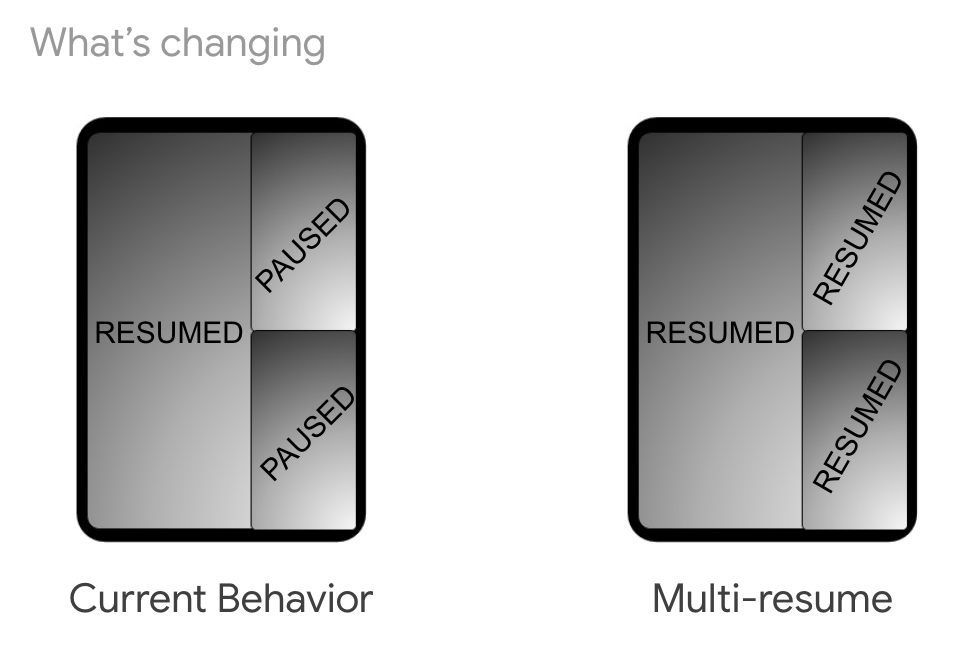

# 将你的app适配可折叠手机

原标题：Get your app ready for foldable phones  
链接：[https://android-developers.googleblog.com/2018/11/get-your-app-ready-for-foldable-phones.html](https://android-developers.googleblog.com/2018/11/get-your-app-ready-for-foldable-phones.html)  
作者：Leo Sei（Android版产品经理)  
翻译：[arjinmc](https://github.com/arjinmc)   

正如您可能从Android Dev Summit中听到的那样，我们[宣布了](https://android-developers.googleblog.com/2018/11/unfolding-right-now-at-androiddevsummit.html)我们正在扩展Android的支持以包括可折叠设备，以准备来自[三星](https://news.samsung.com/us/sdc-2018-samsung-mobile-ux-one-ui-infinity-flex-display-bixby-smartthings-platform/)等硬件合作伙伴的即将推出的设备。

以下是一组建议和信息，以确保您的应用程序在此新外形上提供出色的用户体验（您还可以在[这里](https://youtu.be/UwEyK5WATFA)查看Android Dev Summit专场会议）

## 1.屏幕连续性

在这种新的外形尺寸上，您的应用程序可以自动从一个屏幕转换到另一个屏幕（例如，折叠/展开可折叠手机时）。

在此过渡期间，您的应用将收到新布局的配置更改（在某些情况下可能会有密度）。

要在从一个屏幕切换到另一个屏幕时提供出色的用户体验，您需要确保您的应用程序正确支持[运行时配置更改](https://developer.android.com/guide/topics/resources/runtime-changes)。

<u>如何测试</u>：各种设备的模拟器应该很快就可以使用（例如，三星将在Q4后期发布折叠/展开仿真器apk，它应该适用于三星Galaxy S4平板电脑以及Android工作室中的AOSP模拟器）。

## 2.多重恢复

今天，当一个应用程序处于多窗口但没有聚焦时，它处于OnPause状态。

虽然我们提供了有关[如何支持多窗口](https://developer.android.com/guide/topics/ui/multi-window)的建议，但我们注意到大量应用程序未根据这些建议处理onPause状态（视频暂停或停止，未显示即时消息等）。

为了帮助开发者以最小的工作量在多窗口上提供最佳用户体验，我们允许设备制造商在P中的多窗口中保持所有应用程序恢复。

 

要在Android P中选择加入此行为，请在应用清单中添加以下元数据：

```code
<meta-data android:name="android.allow_multiple_resumed_activities" android:value="true" />
```

注意：在下一个Android版本中，我们正在研究如何优化此行为的兼容性。

<u>如何测试</u>：此行为目前没有设备，但设备制造商正在努力更新现有设备以允许开发者进行测试。请继续关注设备制造商的更多详情。

## 3.多显示

从Android 8.0（API级别26）开始，该平台为多个显示器提供增强的支持。如果活动支持多窗口模式并且在具有多个显示的设备上运行，则用户可以将活动从一个显示移动到另一个显示。当应用程序启动activity时，应用程序可以指定activity应在哪个显示器上运行。请参阅[这里](https://developer.android.com/about/versions/oreo/android-8.0#mds)获取完整文档

<u>如何测试</u>：您可以使用“Developer options>Simulate secondary displays” 选项进行测试。 请记住，那些模拟显示不处理输入。