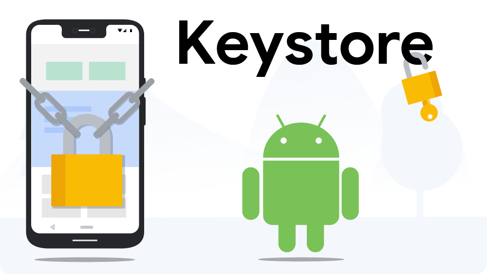

# 新的Keystore功能让您的Android Pie更加安全

原标题：New Keystore features keep your slice of Android Pie a little safer  
链接：[https://android-developers.googleblog.com/2018/12/new-keystore-features-keep-your-slice.html](https://android-developers.googleblog.com/2018/12/new-keystore-features-keep-your-slice.html)  
作者：Brian Claire Young和Shawn Willden (Android安全)，Frank Salim (Google支付)  
翻译：[arjinmc](https://github.com/arjinmc)  

  

## 新Android Pie Keystore的功能

Android [Keystore](https://source.android.com/security/keystore)为应用程序开发者提供了一组用于保护用户数据的加密工具。Keystore将软件库中可用的加密原语从Android OS移到安全硬件中。密钥受到保护，仅在安全硬件中使用，以保护应用程序机密免受各种形式的攻击。密钥库使应用程序能够指定密钥的使用方式和时间限制。

Android Pie为Keystore引入了新功能。我们将在这篇文章中讨论其中的两个新功能。第一种方法可以限制密钥使用，以保护敏感信息。第二个便于安全密钥使用，同时保护应用程序或操作系统中的密钥材料。

## 键盘锁密钥

有时移动应用程序接收数据但如果用户当前没有使用该设备则不需要立即访问它。在设备屏幕锁定时发送到应用程序的敏感信息必须保持安全，直到用户想要访问它为止。Android Pie通过引入keyguard绑定加密密钥来解决这个问题。当屏幕被锁定时，这些密钥可用于加密或验证操作，但不可用于解密或签名。如果设备当前使用PIN，模式或密码锁定，则任何使用这些密钥的尝试都将导致无效操作。键锁绑定键可在设备锁定时保护用户的数据，并且仅在用户需要时才可用。

除了一个重要的区别外，Keyguard绑定和身份验证绑定都以类似的方式运行。密钥保护绑定将密钥的可用性直接与屏幕锁定状态联系起来，而身份验证绑定使用常量超时。使用密钥保护绑定，一旦设备被锁定，密钥就会变为不可用，并且只有在用户解锁设备时才能再次使用密钥。

值得注意的是，键盘锁绑定是由操作系统强制执行的，而不是安全硬件。这是因为安全硬件无法知道屏幕何时被锁定。硬件强制的Android密钥库保护功能（如身份验证绑定）可与密钥保护绑定结合使用，以实现更高级别的安全性。此外，由于密钥保护绑定是一种操作系统功能，因此任何运行Android Pie的设备都可以使用它。

设备支持的任何算法的密钥都可以是密钥绑定。要生成或导入密钥作为密钥保护绑定，请在密钥生成或导入时在[KeyGenParameterSpec](https://developer.android.com/reference/android/security/keystore/KeyGenParameterSpec.Builder)或[KeyProtection](https://developer.android.com/reference/android/security/keystore/KeyProtection.Builder)构建器对象上调用[setUnlockedDeviceRequired(true)](https://developer.android.com/reference/android/security/keystore/KeyGenParameterSpec.Builder#setUnlockedDeviceRequired(boolean))。

## 安全密钥导入

Secure Key Import是Android Pie中的一项新功能，允许应用程序以更安全的方式将现有密钥配置到Keystore中。密钥的来源，可以位于本地数据中心或云中的远程服务器，使用来自用户设备的公共包装密钥加密安全密钥。[SecureKeyWrapper](https://developer.android.com/reference/android/security/keystore/WrappedKeyEntry)格式的加密密钥（也包含允许使用导入密钥的方式的描述）只能在属于生成包装密钥的特定设备的密钥库硬件中解密。密钥在传输过程中进行加密，对应用程序和操作系统保持不透明，这意味着密钥只能在导入它们的安全硬件中使用。

  

安全密钥导入在应用程序打算与Android设备共享密钥但希望阻止密钥被截获或离开设备的情况下非常有用。Google Pay使用安全密钥导入在Pixel 3手机上配置一些密钥，以防止密钥被截获或从内存中提取。还有各种企业用例，例如从证书颁发机构托管中恢复的S / MIME加密密钥，以便可以使用相同的密钥来解密多个设备上的电子邮件。

要利用此功能，请查看[这篇培训文章](https://developer.android.com/training/articles/keystore#ImportingEncryptedKeys)。请注意，安全密钥导入是一种安全的硬件功能，因此仅适用于部分Android Pie设备。要确定设备是否支持它，应用程序可以使用[PURPOSE_WRAP_KEY](https://developer.android.com/reference/android/security/keystore/KeyProperties#PURPOSE_WRAP_KEY)生成KeyPair 。