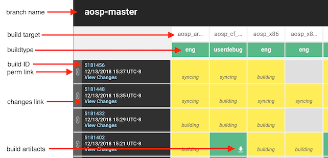

# 开放更多Android开源项目

原标题：More visibility into the Android Open Source Project  
链接：[https://android-developers.googleblog.com/2018/12/more-visibility-into-android-open-source-project.html](https://android-developers.googleblog.com/2018/12/more-visibility-into-android-open-source-project.html)  
作者：Jeff Bailey (AOSP团队)  
翻译：[arjinmc](https://github.com/arjinmc)  

AOSP已经存在了10多年，对项目的了解通常仅限于Android团队和合作伙伴。其中很多都是根植于业务需求：我们希望在发布时能够展示有趣的东西，并且代码没有考虑到让我们在公开场合做更多事情的方式。

在上个月的Android开发者峰会上，我们[演示了](https://android-developers.googleblog.com/2018/11/an-update-on-project-treble.html)通过Project Treble启用的许多合作伙伴设备上运行的GSI。为实现这一目标所做的工作提供了所需的分离，并且还使我们的合作伙伴更容易与Android上游修复到AOSP。因此，我们的git存储库中有超过40％的提交来自今年第3季度的开源树。

## 发布Android的持续集成仪表板

为了支持直接在AOSP和我们的合作伙伴上游进行更改的开发者，我们[预先](https://testing.googleblog.com/2018/09/efficacy-presubmit.html)提交了8000多个测试- 在签入代码之前运行的测试 - 并且正在努力添加其他连续测试，例如兼容性测试套件确保我们的AOSP树处于可持续释放的状态。今天我们很高兴通过[https://ci.android.com/](https://ci.android.com/)打开。

  

在此仪表板上，顶部是我们正在构建的目标，左侧是修订。随着我们添加更多目标（例如GSI），它们将出现在此处。表中的每个方块都提供对构建工件的访问。左侧的锚点为该修订提供了永久URL。欲了解更多信息，请访问[https://source.android.com/setup/build/dashboard](https://source.android.com/setup/build/dashboard)。

我们的DroidCop团队（类似于Chromium的[Tree Sherrifs](https://www.chromium.org/developers/tree-sheriffs)）观看此仪表板并与开发者合作以确保树的健康。这只是我们的开始，我们正在利用这个工具在未来几个月内增加更多。

我要感谢Android工程生产力团队拥抱这一点，我很高兴我们采取这一步骤！我很想听听你如何使用它。联系我[@jeffbaileyaosp](https://twitter.com/jeffbaileyaosp)在Twitter上，[jeffbailey+aosp@google.com](mailto:jeffbailey+aosp@google.com)，在信息或标签/u/jeffbailey到[reddit.com/r/androiddev](http://reddit.com/r/androiddev)。