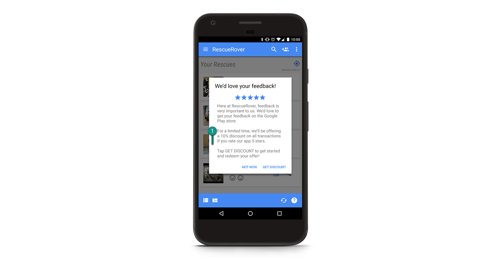
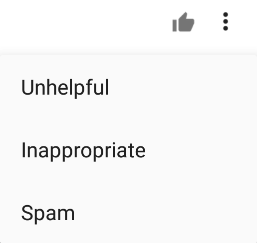

# 在我们相信的评论中 - 让Google Play评分和评论更值得信赖

原标题：In reviews we trust — Making Google Play ratings and reviews more trustworthy  
链接：[https://android-developers.googleblog.com/2018/12/in-reviews-we-trust-making-google-play.html](https://android-developers.googleblog.com/2018/12/in-reviews-we-trust-making-google-play.html)  
作者：Fei Ye (软件工程师) 和 Ninja Spamologist (Kazushi Nagayama)  
翻译：[arjinmc](https://github.com/arjinmc)  

Google Play评分和评论对于帮助用户决定安装哪些应用非常重要。不幸的是，虚假和误导性的评论可能会破坏用户对这些评级的信任。用户信任是我们Google Play的首要任务，我们一直在努力确保我们商店中显示的评分和评价不被操纵。

评级和评论可能有多种方式违反我们的开发者指南：

* <strong>不好的内容</strong>：亵渎，仇恨或偏离主题的评论。
* <strong>假评级</strong>：评级和评论意味着操纵应用程序的平均评分或热门评论。我们已经看到了不同的方法来操纵平均评级; 从5星级攻击中积极提升应用程序的平均评级，到1星级攻击对其产生负面影响。
* <strong>激励评级</strong>：由真人提供的评级和评论，以换取金钱或贵重物品。

当我们看到这些内容时，我们会对应用本身以及相关评论或评级采取措施。

2018年，Google Play Trust＆Safety团队部署了一个系统，该系统将人工智能与机器学习相结合，以检测和执行评级和评论中的政策违规行为。由工程师和分析师组成的团队密切监控和研究Play的评级和评论中的可疑活动，并定期提高模型的精确度和召回率。我们还定期要求熟练的审核人员检查我们的模型所做出的质量保证决策。

这是一项很重要的工作。为了让您了解我们管理的数量，这里有一些最近一周的数字：

* 从Play商店中检测到并删除了<strong>数百万</strong>条评论和评分。
* 由于对他们的可疑评论和评级活动，确定了<strong>数以千计</strong>的不良应用。

我们的团队可以做很多事情，但我们需要您的帮助，以使Google Play成为应用和游戏的安全且值得信赖的地方。

如果您是开发者，可以通过执行以下操作来帮助我们：

* <strong>不要</strong>购买虚假或激励的评级。
* <strong>不要</strong>在应用内或其他方面投放广告系列，例如“给我们5颗星，我们会给你这个应用内商品！” 这就像<strong>激励的评级</strong>一样，并且被[政策](https://play.google.com/about/storelisting-promotional/ratings-reviews-installs/)所禁止。
* 请阅读[Google Play开发者政策](https://play.google.com/about/storelisting-promotional/ratings-reviews-installs/)，以确保您不会无意中发生违规行为。

  
<small>违规示例：不允许激励评级</small>

如果您是用户，也可以遵循以下简单指南：

* <strong>不</strong>接受或收到货币或货物（甚至虚拟货物）以换取评论和评级。
* <strong>不要</strong>用亵渎批评应用或游戏; 保持反馈的建设性。
* <strong>不要</strong>发布乱码，仇恨，性，亵渎或偏离主题的评论; 他们根本不被允许。
* <strong>请</strong>阅读[评论发布政策](https://play.google.com/about/comment-posting-policy.html)。它非常简洁，并讨论了向公众发布评论时应该考虑的所有事项。

最后，如果您在Google Play上发现糟糕的评分和评价，请通过发送反馈来帮助我们改进！用户可以将[评论标记为“垃圾信息”](https://support.google.com/googleplay/android-developer/answer/7318385?hl=en)，开发者可以通过[Play控制台](https://support.google.com/googleplay/android-developer/answer/7318385?hl=en)提交反馈。

  
<small>用于将评论标记为垃圾信息的工具提示。</small>

感谢您帮助我们保持Google Play安全且值得信赖的地方，以发现一些世界上最好的应用和游戏。