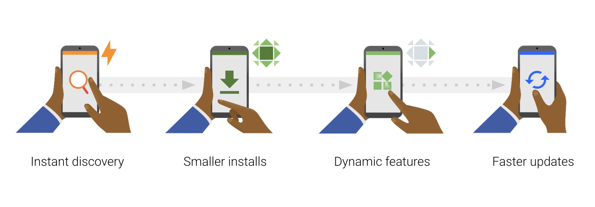
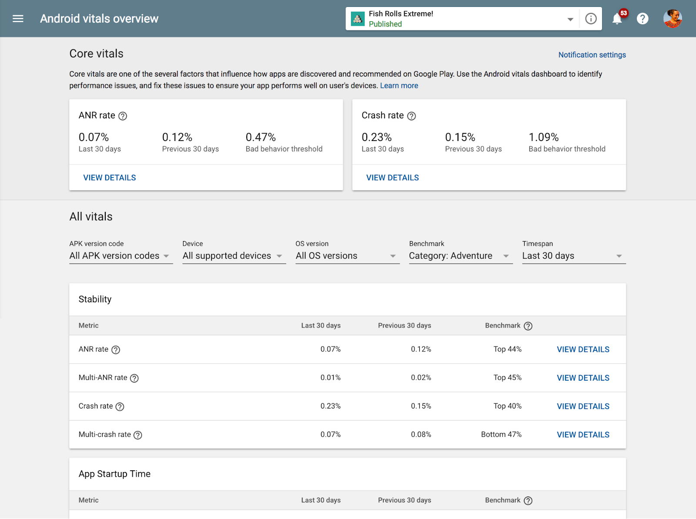

# 总结Google Play和Android的2018年

原标题：Wrapping up for 2018 with Google Play and Android  
链接：[https://android-developers.googleblog.com/2018/12/wrapping-up-for-2018-with-google-play.html](https://android-developers.googleblog.com/2018/12/wrapping-up-for-2018-with-google-play.html)  
作者：Patricia Correa (平台与生态系统)  
翻译：[arjinmc](https://github.com/arjinmc)  

  

今年早些时候，我们重点介绍了一些[Google Play的里程碑](https://android-developers.googleblog.com/2018/08/looking-forward-with-google-play.html)和承诺，以支持Play商店中的一百多万的开发者，以及那些从事Android应用和游戏并希望在我们的平台上推出和发展业务的人。我们受到应用程序和游戏开发者的成就的启发和谦卑，构建了令所有人喜爱和帮助的体验，正如[#IMakeApps](https://android-developers.googleblog.com/2018/06/imakeapps-celebrating-app-makers.html)中强调的一些故事。

[视频介绍](https://youtu.be/PingeD_5yPQ)  

我们将继续专注于帮助您蓬勃发展的业务，构建工具和资源，以帮助您在更多地方吸引和吸引更多用户，同时确保安全可靠的生态系统。展望2019年，我们很高兴看到所有的东西来，看到更多的开发者采用新的功能和更新的[Android P](https://android-developers.googleblog.com/2018/08/introducing-android-9-pie.html)。

与此同时，让我们分享一下2018年Google Play和Android上的一些重点：

## 为未来而构建

与[Android P](https://android-developers.googleblog.com/2018/08/introducing-android-9-pie.html)一起，我们继续帮助Android开发者生态系统，推出[Android Jetpack](https://developer.android.com/jetpack/)，最新的[Android Studio](https://developer.android.com/studio/)和[Kotlin支持](https://developer.android.com/kotlin/)。开发者现在还可以在Google搜索和Google助手中使用动态UI模板的Slices丰富内容，[支持新的屏幕API](https://developer.android.com/reference/android/view/DisplayCutout.html)等等。发现[最新的Android 9](https://developer.android.com/about/versions/pie/android-9.0)，[API级别28](https://developer.android.com/about/versions/pie/android-9.0)。

  

较小的应用程序具有[较高的转换率](https://medium.com/googleplaydev/shrinking-apks-growing-installs-5d3fcba23ce2)，我们的研究表明，大型应用程序大小是卸载的关键驱动因素。在I / O上，我们推出了一个[新的发布形式](https://medium.com/googleplaydev/what-a-new-publishing-format-means-for-the-future-of-android-2e34981793a)，[Android应用程序Bundle](https://goo.gl/aboutappbundles)，帮助开发者以简化的释放过程实现更小，更高效的应用程序，并与点播功能-在下载文件大小平均为35％，节约！在使用Android M及更高版本的设备上，应用程序包可以通过自动支持未压缩的本机库来进一步减少应用程序大小，从而消除设备上的重复。

您可以在[Android Studio 3.2](https://android-developers.googleblog.com/2018/09/android-studio-32.html)稳定版和[Unity 2018.3测试版](https://blogs.unity3d.com/2018/10/03/support-for-android-app-bundle-aab-in-unity-2018-3-beta/)中构建应用程序bundle，并通过早期访问功能上传大型bundle，其中安装的APK大小最多为500MB而不使用扩展文件，所有开发者都可以使用。

## 更丰富的体验和发现

发现您的应用和游戏非常重要，因此我们推出了[Google Play Instant](https://blog.google/products/google-play/introducing-google-play-instant-faster-way-try-apps-and-games/)并将尺寸限制增加到10MB，以便在Play商店中立即尝试，并[删除了免安装应用的网址要求](https://android-developers.googleblog.com/2018/08/streamlining-developer-experience-for.html)。[Android Studio 3.3测试版](https://developer.android.com/studio/preview/features/)允许您发布单个应用程序bundle并将其分类或特定模块即时启用（无需维护单独的代码）。

对于游戏开发者，Unity推出了[Google Play Instant插件](https://assetstore.unity.com/packages/tools/integration/google-play-instant-plug-in-118292)，并在新的[Cocos Creator](https://android-developers.googleblog.com/2018/10/playtime-2018.html)中内置了即时应用程序支持。我们的[应用程序预注册](https://play.google.com/store/apps/collection/promotion_3000000d51_pre_registration_games?hl=en&e=-EnableAppDetailsPageRedesign)计划已经看到近2.5亿个应用程序预注册，通过更丰富的发现帮助推动应用程序下载。

## 优化质量和性能

  

[Android vitals](https://developer.android.com/topic/performance/vitals/)现在更具可操作性，其中一个仪表板突出显示核心生命周期，同行基准，启动时间和权限拒绝情况，异常检测和警报以及链接启动前报告 - 所有这些都可以让您[更好地优化和优先处理问题以进行改进质量](https://medium.com/googleplaydev/how-to-fix-app-quality-issues-with-android-vitals-and-improve-performance-on-the-play-store-part-498dde9f4ef6)和性能。

在发布之前，有更多机会获得反馈和解决问题。Google Play控制台通过针对游戏的[预发布报告](https://medium.com/googleplaydev/google-play-expands-its-pre-launch-testing-capabilities-9b51a23077cf)扩展了自动设备测试的功能，并且内部和关闭测试轨道的启动可让您将应用程序推送到最多100个内部测试人员，然后再将其发布到生产环境中。

## 现在和未来，您的业务长远计划

指标对于优化业务至关重要，我们在Play控制台中添加了新的可自定义工具，并提供可下载的报告以帮助您评估核心指标。包括累积数据，30天滚动平均值和不同时间段的汇总，以更好地匹配您的业务节奏。

您现在可以配置[统计信息报告](https://medium.com/googleplaydev/better-stats-for-better-decisions-3661717b4f2d)，以显示即时应用的执行情况，分析不同的维度并确定最终应用在其设备上的安装数量。购买报告显示用户发现转化的过程 - 平均每用户收入和针对类似应用的保留基准。您还可以通过自然分类找到商品详情中效果最佳的搜索字词 - 有助于优化增长和留住有价值观众的工作量。

越来越多的开发者将[订阅](https://developer.android.com/google-play/guides/subscriptions/)作为其核心金流模式。专用的新订阅中心意味着您可以轻松更改订阅价格，为应用内商品和订阅提供部分退款，还可以在[Play Billing Library(支付订单库)](https://developer.android.com/google/play/billing/billing_library_overview) 1.2版中进行计划更改。[了解如何让订阅者保持参与](https://medium.com/googleplaydev/outsmarting-subscription-challenges-711216b6292c); 用户可以暂停计划，通过订单管理和取消调查为您提供更多控制。

  

了解如何使用我们的交互式免费电子学习平台[Academy for App Success](https://g.co/playacademy)的所有新功能和最佳实践，提供一些大小的课程，帮助您充分利用Play控制台并提高应用质量。

请务必关注[@googleplayv](https://twitter.com/googleplaydev)并[注册我们的简报](https://developer.android.com/newsletter/#subscribe)，以便在2019年的所有更新中保持领先！我们希望这些功能和工具能够让我们在新的一年里继续与您建立成功的合作关系 - [按照我们的倒计时](https://developer.android.com/nye/)进行每日精彩宣传。来自Google Play的所有人 - 节日快乐。