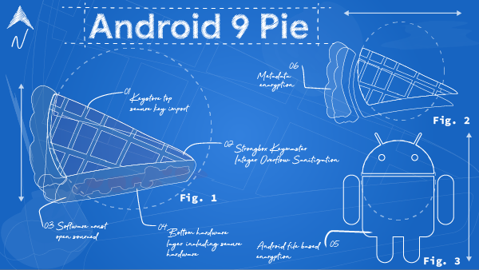

# Android Pie安全和隐私的模式

原标题：Android Pie à la mode: Security & Privacy  
链接：[https://android-developers.googleblog.com/2018/12/android-pie-la-mode-security-privacy.html](https://android-developers.googleblog.com/2018/12/android-pie-la-mode-security-privacy.html)  
作者：Vikrant Nanda 和 René Mayrhofer (Android安全和隐私团队)  
翻译：[arjinmc](https://github.com/arjinmc)  

  

现在是时候谈论Android甜点发布而不是假期，因为谁不喜欢甜点？什么是节日期间我们最喜欢的甜点之一？好吧，馅饼当然。

严肃地说，馅饼是一个很好的类比，因为各种成分如何变成多层：从顶部的软件外壳到底部的硬件层。请继续阅读今年Android Pie中介绍的安全和隐私功能摘要。

## 加强Android

让Android更安全需要结合强化平台和推进反开发技术。

### 平台加固

使用Android Pie，我们更新了[基于文件的加密](https://source.android.com/security/encryption/file-based)，以支持外部存储介质（例如，可扩展存储卡）。我们还引入了对存在硬件支持的[元数据加密](https://source.android.com/security/encryption/metadata)的支持。使用文件系统元数据加密，启动时出现的单个密钥会加密未通过基于文件的加密（例如，目录布局，文件大小，权限和创建/修改时间）加密的任何内容。

Android Pie还引入了[BiometricPrompt API](https://android-developers.googleblog.com/2018/06/better-biometrics-in-android-p.html)，应用程序可以使用它以与模态无关的方式在设备上提供生物识别身份验证对话框（例如，指纹提示）。此功能为对话框创建标准化外观，感觉和位置。这种标准化使用户更有信心，他们正在对可信赖的生物识别凭证检查器进行身份验证。

针对[Application Sandbox(应用沙箱)](https://source.android.com/security/app-sandbox)的新保护和测试用例有助于确保针对Android Pie（以及Android的所有未来版本）的所有非特权应用都在更强大的[SELinux](https://source.android.com/security/selinux)沙箱中运行。通过为沙箱提供每个应用程序的加密身份验证，此保护可以改善应用程序分离，防止覆盖安全默认值，并且（最重要的是）阻止应用程序使其数据可以广泛访问。

### 反开发改进

使用Android Pie，我们扩展了[基于编译器的安全缓解](https://android-developers.googleblog.com/2018/06/compiler-based-security-mitigations-in.html)，当发生未定义的行为时，它会使运行时操作安全地失败。

[控制流完整性（CFI）](https://source.android.com/devices/tech/debug/cfi)是一种安全机制，它不允许更改已编译代码的原始控制流图。在Android Pie中，默认情况下，它已在媒体框架和其他安全关键组件中启用，例如近场通信（NFC）和蓝牙协议。我们还在[Android通用内核中实现了对CFI](https://android-developers.googleblog.com/2018/10/control-flow-integrity-in-android-kernel.html)的支持，继续努力在之前的Android版本中强化内核。

[整型溢出清理](https://source.android.com/devices/tech/debug/intsan)是一种安全技术，用于缓解由整数操作引起的内存损坏和信息泄露漏洞。我们通过在处理复杂不受信任的输入或报告了安全漏洞的库中使用Integer Overflow消毒剂，扩展了它们的使用范围。

## 持续投资硬件支持的安全性

Android Pie的亮点之一是[Android Protected Confirmation](https://android-developers.googleblog.com/2018/10/android-protected-confirmation.html)，这是第一个利用受硬件保护的用户界面（Trusted UI）完全在主要移动操作系统之外执行关键事务的主要移动OS API。开发者可以使用此API向用户显示受信任的UI提示，通过物理受保护的输入（例如设备上的按钮）请求批准。由此产生的加密签名语句允许依赖方重申用户希望通过其应用程序完成敏感交易。

我们还引入了对新Keystore类型的支持，通过利用具有专用CPU，RAM和闪存的防篡改硬件，为私钥提供更强大的保护。[StrongBox Keymaster](https://developer.android.com/training/articles/keystore#HardwareSecurityModule)是Keymaster硬件抽象层（HAL）的一种实现，它位于硬件安全模块中。该模块的设计和要求具有自己的处理器，安全存储，真随机数发生器（TRNG），侧通道电阻和防篡改封装。

其他Keystore功能（作为Keymaster 4的一部分）包括Keyguard绑定密钥，安全密钥导入，3DES支持和版本绑定。键盘锁定键可启用使用限制，以保护敏感信息。安全密钥导入有助于安全密钥使用，同时保护应用程序或操作系统中的密钥材料。您可以在我们最近的[博客](https://android-developers.googleblog.com/2018/12/new-keystore-features-keep-your-slice.html)以及随附的[发布说明](https://source.android.com/setup/start/p-release-notes#keystore)中阅读有关这些功能的更多信息。

## 增强用户隐私

通过一些[行为更改](https://developer.android.com/about/versions/pie/android-9.0-changes-all#privacy-changes-all)提高了用户隐私，例如限制应用程序对相机，麦克风和设备传感器的访问权限。已经为电话呼叫，电话状态和Wi-Fi扫描创建了新的权限规则和权限组，以​​及对从Wi-Fi扫描中检索到的信息的限制。我们还添加了相关的[MAC地址随机化](https://source.android.com/devices/tech/connect/wifi-mac-randomization)，以便设备在连接到Wi-Fi网络时可以使用不同的网络地址。

最重要的是，Android Pie添加了对使用用户的屏幕锁定密钥（即PIN，模式或密码）加密Android备份的支持。根据设计，这意味着[攻击者无法在不明确知道其密码的情况下访问用户备份的应用程序数据](https://developer.android.com/about/versions/pie/security/ckv-whitepaper)。通过为开发者提供一种方法来指定应用程序数据从自动备份中排除的条件，增强了应用程序的自动备份功能。例如，Android Pie引入了一个新标志来确定用户的备份是否是客户端加密的。

作为将所有网络流量从明文（未加密的HTTP）转移到使用TLS（HTTPS）保护的更大努力的一部分，我们更改了网络安全配置的默认值以阻止所有明文流量。我们[默认使用TLS](https://android-developers.googleblog.com/2018/04/protecting-users-with-tls-by-default-in.html)保护用户，除非您明确选择加入特定域的明文。Android Pie还通过[TLS添加了对DNS](https://android-developers.googleblog.com/2018/04/dns-over-tls-support-in-android-p.html)的内置支持，如果网络的DNS服务器支持，则会自动将DNS查询升级到TLS。这可以保护有关访问的IP地址的信息在网络级别被嗅探或截获。

我们相信此帖中描述的功能可以提升Android的安全性和隐私性，但您不必为此而言。年复一年，我们的持续努力显示出更好的保护，这可以通过[提高漏洞利用率](https://www.thezdi.com/blog/2018/9/04/announcing-pwn2own-tokyo-for-2018)和[独立的移动安全评级](https://www.blog.google/products/android-enterprise/gartners-analysis-progress-android-security/)来证明。现在我们回去准备下一个Android甜点发布时，去享受一些真正的馅饼吧！

致谢：本文引用Chad Brubaker，Janis Danisevskis，Giles Hogben，Troy Kensinger，Ivan Lozano，Vishwath Mohan，Frank Salim，Sami Tolvanen，Lilian Young和Shawn Willden的贡献。