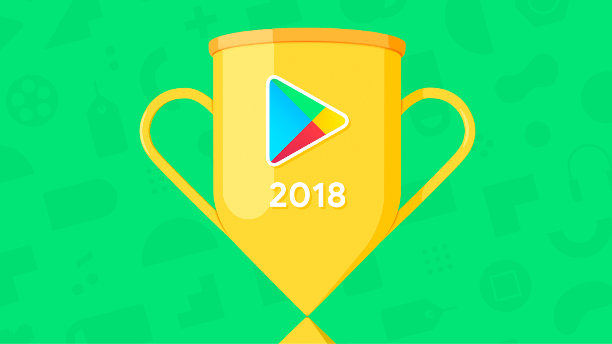

# 祝贺2018年最佳应用和游戏背后的开发者

原标题：Celebrating the developers behind the best apps and games of 2018  
链接：[https://android-developers.googleblog.com/2018/12/celebrating-developers-behind-best-apps.html](https://android-developers.googleblog.com/2018/12/celebrating-developers-behind-best-apps.html)  
作者：Purnima Kochikar (业务开发，游戏和应用总监)  
翻译：[arjinmc](https://github.com/arjinmc)    

  

今天，我们宣布了[年度最佳2018年排行榜](https://play.google.com/store/apps/editorial_collection/promotion_topic_bestof2018_mainpage_tp)，突出了Google Play上的最佳内容。但是有没有想过你最喜欢的应用程序和游戏背后的开发商，如[PUBG MOBILE](https://play.google.com/store/apps/details?id=com.tencent.ig&e=-EnableAppDetailsPageRedesign)或[Tasty](https://play.google.com/store/apps/details?id=com.buzzfeed.tasty)？好吧，我们想花一点时间来祝贺那些让2018年最好的美国应用程序和游戏变为现实的开发者。今年充满了娱乐性 - 这一切都要归功于那些推动我们想象力的开发者。

在Google Play上查看2018年最佳应用和游戏背后的开发者的全部内容：

## [2018年度最佳App](https://play.google.com/store/apps/editorial_collection/promotion_topic_bestof2018_bestofapps_tp)

* [Drops: 学习31种新的语言](https://play.google.com/store/apps/details?id=com.languagedrops.drops.international&e=-EnableAppDetailsPageRedesign) by Language Drops

### [最佳娱乐App](https://play.google.com/store/apps/topic?id=campaign_editorial_bestof2018_most_entertaining)

* [VIMAGE - 影片制作和动态照片动画制作](https://play.google.com/store/apps/details?id=com.vimage.android) by vimage
* [No.Draw - 编号为2018的多种颜](https://play.google.com/store/apps/details?id=com.creative.sandbox.number.drawning.coloring)by Creative APPS
* [Neverthink: 网络电视](https://play.google.com/store/apps/details?id=com.neverthink) by Neverthink
* [Tik Tok - 包含 musical.ly ](https://play.google.com/store/apps/details?id=com.neverthink)by musical.ly
* [Scout FM - 播客收音机](https://play.google.com/store/apps/details?id=com.subcast.radio.android.prod)by Scout FM

### [最佳自我增值App](https://play.google.com/store/apps/topic?id=campaign_editorial_bestof2018_best_self_improvement)

* [Mimo: 学习编程](https://play.google.com/store/apps/details?id=com.getmimo) by MimoHello GmbH
* [Drops: 学习31种新语言](https://play.google.com/store/apps/details?id=com.languagedrops.drops.international&e=-EnableAppDetailsPageRedesign) by Language Drops
* [10% Happier: 烦躁的怀疑论者的冥想](https://play.google.com/store/apps/details?id=com.changecollective.tenpercenthappier) by 10% Happier
* [Keep Trainer - 工作训练者和健身教练](https://play.google.com/store/apps/details?id=com.gotokeep.keep.intl) by Keep Inc
* [MasterClass: 如何煮菜，唱歌，表演等等](https://play.google.com/store/apps/details?id=com.yanka.mc) by MasterClass Inc.

### [最佳日常助手App](https://play.google.com/store/apps/topic?id=campaign_editorial_bestof2018_best_daily_helper)

* [Otter语音笔记](https://play.google.com/store/apps/details?id=com.aisense.otter) by AISense Inc.
* [Tasty](https://play.google.com/store/apps/details?id=com.buzzfeed.tasty) by BuzzFeed
* [Sift - 当价格下降时自动获取退款](https://play.google.com/store/apps/details?id=com.siftwallet.sift.android) by ShopInbox Team
* [Canva: 海报, 广告栏, 名片制作和图形设计](https://play.google.com/store/apps/details?id=com.canva.editor) by Canva
* [Notion - 笔记, 任务, 说明书](https://play.google.com/store/apps/details?id=notion.id) by Notion Labs Inc.

###  [最佳潜质App](https://play.google.com/store/apps/topic?id=campaign_editorial_bestof2018_best_hidden_gem)

* [SLOWLY](https://play.google.com/store/apps/details?id=com.slowlyapp) by Why Interactive
* [Unfold - 创作故事](https://play.google.com/store/apps/details?id=com.moonlab.unfold) by Unfold Creative LLC
* [Just a Line - 使用AR随地作画](https://play.google.com/store/apps/details?id=com.arexperiments.justaline) by Google Creative Lab
* [Luci - 清醒梦之旅](https://play.google.com/store/apps/details?id=com.samruston.luci) by Sam Ruston
* [歌词中学习西班牙语: 音乐语言学习](https://play.google.com/store/apps/details?id=com.taplyrica.lirica) by Lirica

## [2018年度最佳游戏](https://play.google.com/store/apps/editorial_collection/promotion_topic_bestof2018_bestofgames_tp)
* [PUBG MOBILE](https://play.google.com/store/apps/details?id=com.tencent.ig&e=-EnableAppDetailsPageRedesign) by Tencent Games

### [最佳竞技游戏](https://play.google.com/store/apps/topic?id=campaign_editorial_bestof2018_most_competitive)

* [PUBG MOBILE](https://play.google.com/store/apps/details?id=com.tencent.ig&e=-EnableAppDetailsPageRedesign) by Tencent Games
* [Warhammer Age of Sigmar: Realm War](https://play.google.com/store/apps/details?id=com.PixelToys.Sigmar) by Pixel Toys
* [Dragon Ball Legends](https://play.google.com/store/apps/details?id=com.bandainamcoent.dblegends_ww) by Bandai Namco Ent.
* [Asphalt 9](https://play.google.com/store/apps/details?id=com.gameloft.android.ANMP.GloftA9HM) by Gameloft
* [Badland Brawl](https://play.google.com/store/apps/details?id=com.frogmind.badlandbrawl) by Frogmind

### [最佳创新游戏](https://play.google.com/store/apps/topic?id=campaign_editorial_bestof2018_most_innovative)

* [Gorogoa](https://play.google.com/store/apps/details?id=unity.Annapurna.Gorogoa) by Annapurna
* [Umiro](https://play.google.com/store/apps/details?id=com.devolver.umiro) by DevolverDigital
* [Hero Hunters](https://play.google.com/store/apps/details?id=com.hotheadgames.google.free.survivors) by Hothead Games
* [Battlelands Royale](https://play.google.com/store/apps/details?id=com.futureplay.battleground) by FuturePlay
* [Life is Strange](https://play.google.com/store/apps/details?id=com.squareenix.lis) by SQUARE ENIX Ltd

### [最佳独立游戏](https://play.google.com/store/apps/topic?id=campaign_editorial_bestof2018_best_indie)

* [Alto's Odyssey](https://play.google.com/store/apps/details?id=com.noodlecake.altosodyssey) by Noodlecake Studios
* [Reigns: GoT](https://play.google.com/store/apps/details?id=com.devolver.reignsGot) by DevolverDigital
* [Cube Escape Paradox](https://play.google.com/store/apps/details?id=air.com.RustyLake.CubeEscapeParadox) by Rusty Lake
* [Returner 77](https://play.google.com/store/apps/details?id=com.FantasticYes.Returner77) by Fantastic, yes
* [Evoland 2](https://play.google.com/store/apps/details?id=com.playdigious.evoland2) by Playdigious

### [最佳舒服游戏](https://play.google.com/store/apps/topic?id=campaign_editorial_bestof2018_best_casual)

* [The Sims Mobile](https://play.google.com/store/apps/details?id=com.ea.gp.simsmobile) by EA
* [Orbia: Tap and Relax](https://play.google.com/store/apps/details?id=com.joxdev.orbia) by JOX Development LLC
* [Murder in the Alps](https://play.google.com/store/apps/details?id=com.nordcurrent.murderinalps) by Nordcurrent
* [Candy Crush Friends Saga](https://play.google.com/store/apps/details?id=com.king.candycrush4) by King
* [Faraway 3](https://play.google.com/store/apps/details?id=com.mousecity.faraway3) by Snapbreak