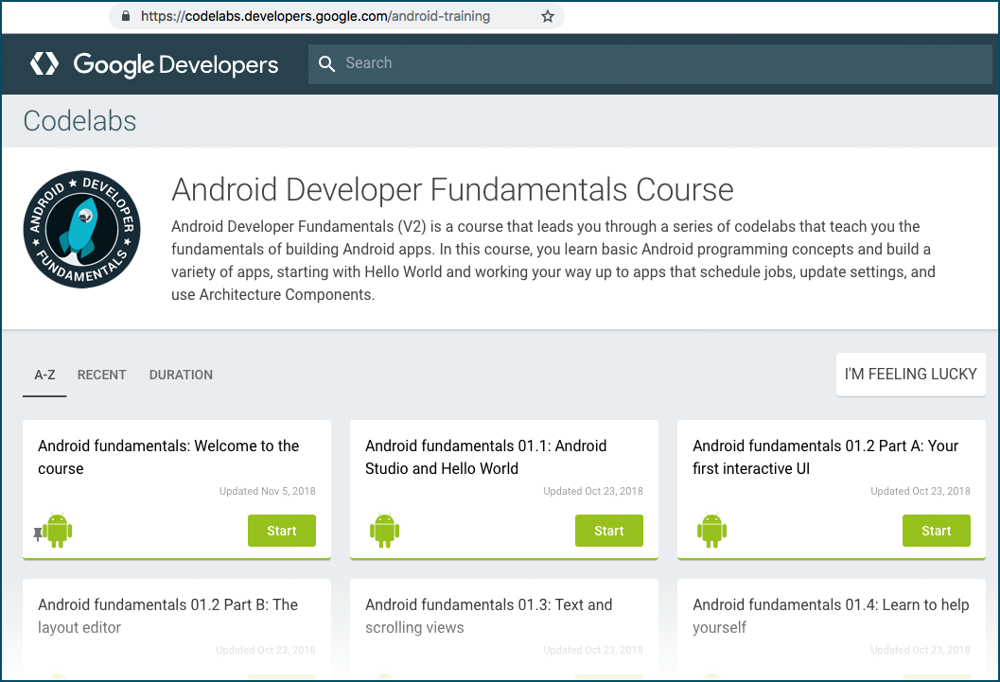
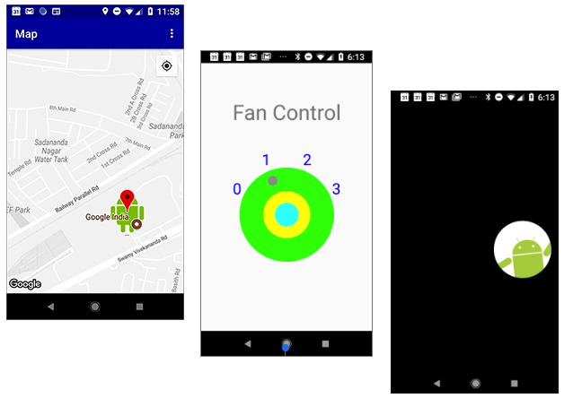

# Android codelab课程在这里！

原标题：Android codelab courses are here!  
链接：[https://android-developers.googleblog.com/2018/12/android-codelab-courses-are-here.html](https://android-developers.googleblog.com/2018/12/android-codelab-courses-are-here.html)  
作者：Jocelyn Becker (Google开发者培训高级项目经理)  
翻译：[arjinmc](https://github.com/arjinmc)  

Google开发者培训团队最近发布了我们的Android开发者基础课程的更新版本，作为一系列Google代码。

  

2015年，[Codelabs](https://codelabs.developers.google.com/)作为Google I / O的现场教程首次亮相，并且作为开发者学习如何使用Google技术，API和SDK的一种方式，人气飙升。一个代码实验室是一个短期的，自包含的教程，指导您如何做一个特定的任务。今年有超过200万用户使用过谷歌代码。

我们的[Android课程](https://developer.android.com/courses/fundamentals-training/overview-v2)最初是作为基于课堂的课程。然而，我们发现许多人在正式教学计划之外自己完成课程。因此，当我们更新Android开发者基础课程时，除了支持基于课堂的学习外，我们还将这些材料作为一系列连续的代码填充。

## [Android开发者基础课程](https://codelabs.developers.google.com/android-training/)

更新的[Android Developer Fundamentals(Android开发者基础)](https://codelabs.developers.google.com/android-training/)（V2）课程包括使用Room数据库和其他架构组件的课程。所有应用都已更新，以反映Android Studio中的空Activity模板使用ConstraintLayout，并且我们已将所有应用更新到更高版本的Android Studio。有关差异的更多详细信息，请参阅[发布说明](https://docs.google.com/document/d/1pYtBo7w9aqihmnAm8h3XdS5qwFSK85qrzNFJdRo8mdU/view)。

## [Android高级课程](https://codelabs.developers.google.com/advanced-android-training/)

我们还重新发布了[Android开发者高级课程](https://codelabs.developers.google.com/advanced-android-training/)作为一系列代码。本课程提供了逐步说明，可帮助您了解更多高级主题，并为您的应用添加功能，以提高用户参与度和喜悦程度。了解如何向应用添加地图，创建自定义视图，使用SurfaceView直接绘制到屏幕等等。

  

## 两门课程的教材

如果您想在课堂上教授课程，或者将其作为学习课程的基础，那么整个软件包仍然可用，包括幻灯片，GitHub中的源代码和概念指南，以及逐步完成步骤codelabs。

* [更新的Android基础课程的材料](https://developer.android.com/courses/fundamentals-training/overview-v2)
* [适用于Android高级课程的资料](https://developer.android.com/courses/advanced-training/overview)