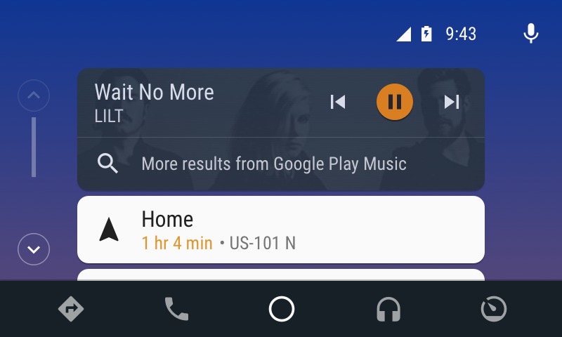
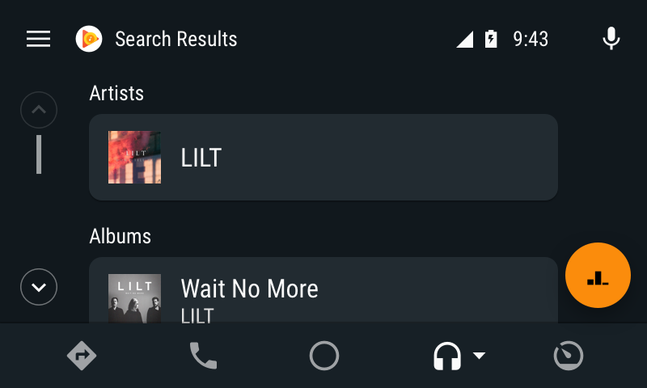
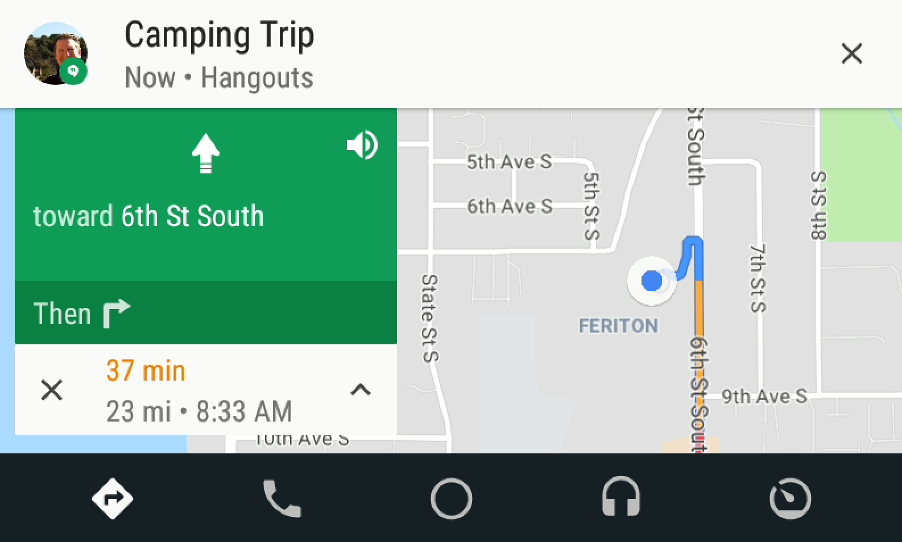

# 改进Android Auto的媒体和消息应用程序集成

原标题：Improve media and messaging app integrations with Android Auto  
链接：[https://android-developers.googleblog.com/2018/12/improve-media-and-messaging-app.html](https://android-developers.googleblog.com/2018/12/improve-media-and-messaging-app.html)  
作者：John Posavatz （Android Auto产品经理)  
翻译：[arjinmc](http://github.com/arjinmc)  

在今年五月的谷歌I / O上，我们提供了Android Auto的几种新媒体和消息功能的预览。我们很高兴地宣布，这些功能现已在我们最新版本的Android Auto中准备就绪，我们建议您更新Android Auto实施以使用它们优势！

## 新媒体功能

一些新功能使用户可以更轻松地找到他们正在寻找的媒体内容。在我们的Android开发者网站上查看[完整的文档](https://developer.android.com/training/auto/audio/)。

#### 搜索结果

执行基于助理的搜索后（例如“确定Google，播放[艺术家/专辑/播放列表/书籍/歌曲/流派]”），音乐会像以前一样自动播放，此外，您现在可以提供自己的分类结果列表。首先，您需要在<i>MediaBrowserServiceCompat</i>实现中声明对[onSearch()](https://developer.android.com/reference/androidx/media/MediaBrowserServiceCompat#onsearch)的支持，然后[覆盖它](https://developer.android.com/training/auto/audio/#display_search)。只要用户调用“显示更多结果”功能，Android Auto就会将用户的搜索词转发给此方法。

  

Android Auto使用的<i>playFromSearch()</i>调用定义的附加的Bundle调用<i>onSearch()</i>所调用bundle是相同的。与<i>playFromSearch()</i>不同，onSearch()包含一个<i>Result(结果)</i>——可用于将多个MediaItem返回到Android Auto进行显示。

然后，您可以使用[标题项](https://developer.android.com/training/auto/audio/#title_items)对搜索结果进行分类。例如，音乐应用可以包括诸如“艺术家”，“专辑”和“歌曲”之类的类别。

  

#### 改进浏览

内容已经从抽屉中“提出”，现在位于媒体屏幕的主视图中。在这个新布局中，您现在可以选择将浏览树显示为简单列表，也可以选择显示大型专辑封面/图标。我们建议在文本描述最有用的地方使用列表来描述内容（例如，曲目名称或播客剧集列表），而较大的网格视图最适合专辑/图标帮助快速识别和选择。

要开始[应用内容样式](https://developer.android.com/training/auto/audio/#apply_content_style)，您应该通过在<i>onGetRoot()</i>函数返回的<i>BrowserRoot</i>额外的bundle中应用特定常量来设置媒体项显示方式的全局默认值。Android Auto会读取与浏览树中每个项目关联的附加内容，并查找特定常量（在我们的[文档](https://developer.android.com/training/auto/audio/#apply_content_style)中详细说明），然后使用每个键的presence / value添加相应的指示符。

为了更改特定节点的默认行为，Content Style API支持覆盖任何可浏览节点的子节点的默认全局提示。上述相同的附加内容可作为<i>MediaDescription</i>中的附加内容提供。如果存在这些额外内容，则该可浏览节点的子节点将具有新的内容样式提示。

最后，您可以使用标题项组织内容以将列表中的媒体分组。要执行此操作，组中的每个媒体项都需要在其媒体描述中声明具有相同字符串值的额外字符串，您可以对其进行本地化。该值用作组标题。您还需要将媒体项目按照您希望它们显示的顺序传递。

#### 其他元数据图标

在浏览和回放视图中，您现在可以在具有明确语言，已下载到用户设备，以及未播放/部分播放/完成（例如，有声读物和播客）的媒体项目旁边显示图标。

Android Auto会检查浏览树中每个项目的额外内容，并查找指标的[特定键](https://developer.android.com/training/auto/audio/#apply_content_style)，然后使用每个键的状态/值添加相应的指示符。

您应该将这些额外内容添加到<i>MediaBrowse</i>服务返回的内容中。“Explicit”和“Downloaded”是额外的布尔值（设置为true以显示指示符），而“Completion State”是一个额外设置为适当值的整数。应用程序应创建一个包含一个或多个这些密钥的附加软件包，并将其传递给<i>MediaDescription.Builder.setExtras()</i>。

  

## 消息更新

我们正在弃用CarExtender，转而采用更强大，更广泛的MessagingStyle API。[迁移到MessagingStyle](https://developer.android.com/training/auto/messaging/)非常简单，不仅可以扩展Android Auto之外的消息支持（例如，扩展到Google智能助理），还可以为Android Auto带来以下直接好处：

#### 群发消息

以前，Android Auto对群组消息的支持缺乏 - 在大多数情况下，通知从未显示过。MessagingStyle解决了这个问题，因此您的用户永远不会错过任何消息。

  

#### MMS / RCS支持

Android Auto仅通过系统SMS广播本地支持SMS。MessagingStyle允许支持自己支持RCS和MMS的SMS应用程序。

要使您的应用为自动设备提供消息服务，您的应用必须执行以下操作：

1. 构建并发送包含reply和mark-as-read Action对象的[NotificationCompat.MessagingStyle](https://developer.android.com/reference/androidx/core/app/NotificationCompat.MessagingStyle)对象。
2. 使用服务处理回复并将对话标记为已读。
3. 配置清单以指示该应用支持Android Auto。

通过迁移到MessagingStyle，您的应用程序不仅可以获得汽车支持，还可以获得更丰富的移动通知体验，包括内联回复，图像预览和对话历史记录; 都在通知阴影内。

一个[深入的指南](https://developer.android.com/training/auto/messaging/)，以实现（或更新到）MessagingStyle可在我们的[在线开发者文档](https://developer.android.com/training/auto/messaging/)中找到。

感谢您继续支持Android Auto！