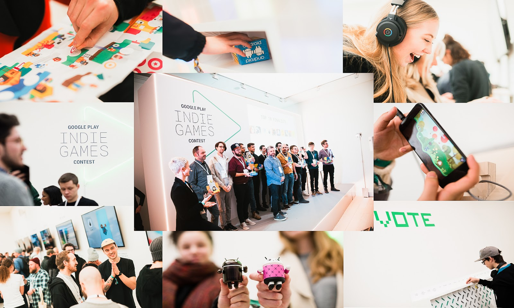

# 恭喜2017年Google Play欧洲独立游戏大赛获奖者

原标题：Congratulations to the winners of the Google Play Indie Games Contest 2017 in Europe  
链接：[https://android-developers.googleblog.com/2018/02/congratulations-to-winners-of-google.html](https://android-developers.googleblog.com/2018/02/congratulations-to-winners-of-google.html)  
作者：Adriana Puchianu (Google Play开发者营销)  
翻译：[arjinmc](https://github.com/arjinmc)  

我们刚刚结束了第二版[Google Play欧洲独立游戏大赛](https://events.withgoogle.com/indie-games-contest-2017/)！伦敦标志性的萨奇画廊欢迎来自12个国家的[20位开发商](https://android-developers.googleblog.com/2018/01/meet-finalists-of-google-play-indie.html)向游戏玩家，行业专家和记者展示他们的游戏。

决赛选手的比赛已向公众展示，他们花了三个小时尝试他们的游戏并投票选出他们的最爱，并与Google Play团队一起投票。然后选出前十名决赛选手，然后继续展开他们的比赛，并在[陪审团](https://events.withgoogle.com/indie-games-contest-2017/jury/#content)面前争夺大奖。

  

请加入我们一起祝贺获奖者！他们将带给他们一个当之无愧的证书，以及一个可以帮助他们接触全球更多玩家的奖品。包括在Google Play商店上的优越展示位置，高达100,000欧元的市场营销活动和高达50,000欧元的影响力活动，最新的Google硬件，Google I / O的门票[等等](https://events.withgoogle.com/indie-games-contest-2017/prizes/#content)。

看到这个第二版的兴奋之情，真是鼓舞人心，而且很高兴看到来自欧洲的新一轮独立游戏。我们已经期待着玩2018年将要开发的游戏！

查看[Google Play商店](https://play.google.com/store/apps/editorial_collection/promotion_topic_3002f6a_indie_games_contest_europe_2017_tp?e=-EnableAppDetailsPageRedesign)中的主要获胜者和其他入围者！

## 冠军

[Bury me, my love](https://play.google.com/store/apps/details?id=com.plug_in_digital.emma)

Playdius

France

一款为手机设计的现实灵感互动小说。它讲述了一个叙利亚妇女努尔到达欧洲希望美好生活的故事。

## 亚军

[Old Man's Journey](https://play.google.com/store/apps/details?id=es.brokenrul.oldmansjourney)

Broken Rules Interactive Media GmbH

Austria

一个关于人生珍贵时刻，破碎梦想和改变计划的故事游戏。

[Yellow](https://play.google.com/store/apps/details?id=air.com.bartbonte.yellow)

Bart Bonte

Belgium

一个益智游戏给你！一封给奇妙的颜色的情书和称为触摸屏的小奇迹。警告：非常黄！

## 其他进入前10名的游戏包括：

[Captain Tom Galactic Traveler](https://play.google.com/store/apps/details?id=com.picodongames.CaptainTomGT)

Picodongames

France

一款开放的世界平台游戏和太空探索游戏。开始探索性任务，发现行星，收集氧气，玩重力。

[I Love Hue](https://play.google.com/store/apps/details?id=com.zutgames.ilovehue)

Zut!

United Kingdom

受正念应用程序和抽象艺术影响的极简环境益智游戏。玩家将彩色瓷砖的马赛克摆放成完美有序的调色板。

[Jodeo](https://play.google.com/store/apps/details?id=air.com.gamebrain.jodeo)

Gamebra.in

Turkey

Jodeo是2D果冻小动物。有一件事很好奇：如果3D对象和2D物理在同一个游戏中会发生什么？2D对象如何与3D对象交互？

[Kami 2](https://play.google.com/store/apps/details?id=com.stateofplaygames.kami2)

State of Play

State of Play

平静而令人上瘾的益智游戏又回来了！拥有100多个手工拼图，它将你带入一个结合了逻辑和解决问题的思维扭曲之旅。

[Kenshō](https://play.google.com/store/apps/details?id=com.fiftytwo.kensho_android)

FIFTYTWO

Russia

带有美妙配乐的瓷砖滑动拼图。神秘的事情发生在一个破败的房间里。该房间内的门导致不同的世界和美丽的风景。

[No More Buttons](https://play.google.com/store/apps/details?id=com.tommysoereide.NoMoreButtons&e=-EnableAppDetailsPageRedesign)

[Tommy Søreide Kjær](https://play.google.com/store/apps/developer?id=Tommy+S%C3%B8reide+Kj%C3%A6r)

Norway

一个用按钮来手绘的平台游戏。

[The Big Journey](https://play.google.com/store/apps/details?id=com.armorgames.thebigjourney.android)

Catfishbox

Ukraine

专为儿童和成人设计，这是一次美丽的休闲冒险。倾斜身体，与威威先生一起探索美丽的世界。