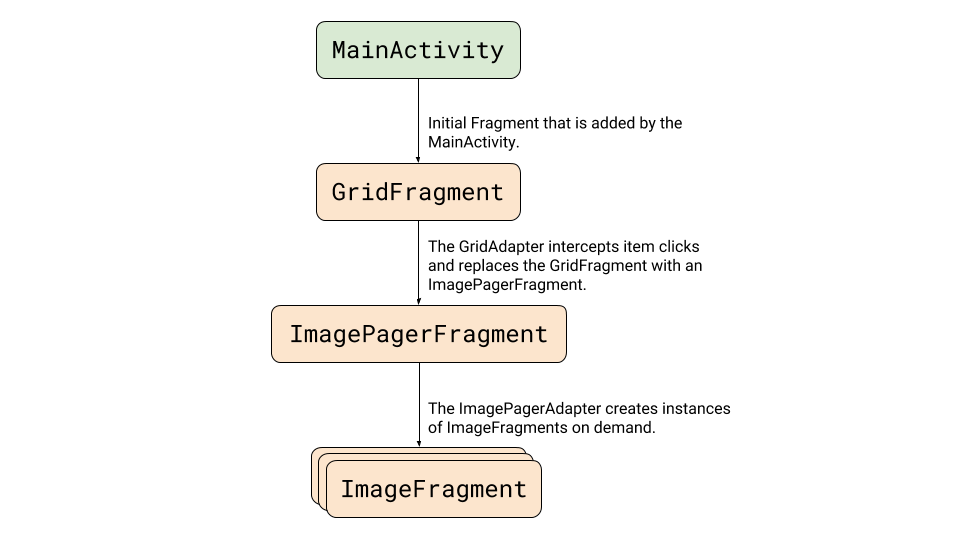
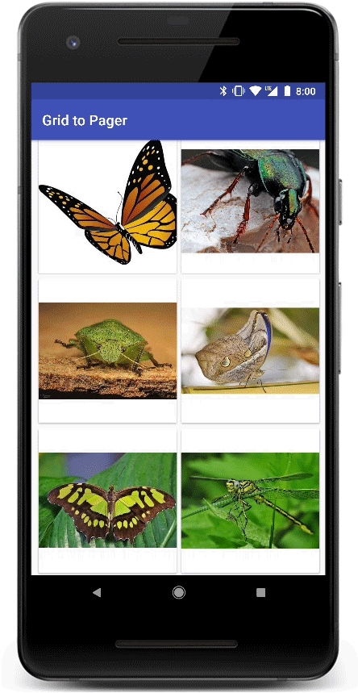
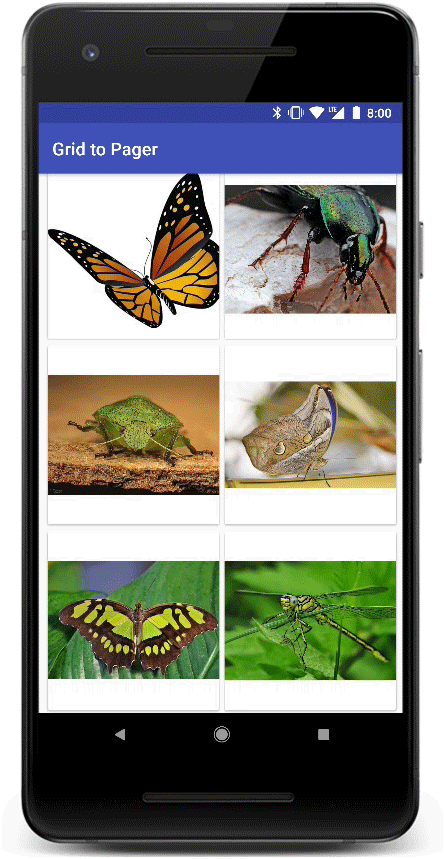
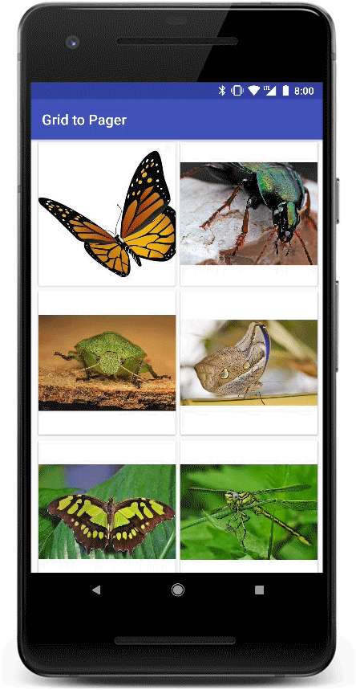

# 连续共享元素转换：RecyclerView变ViewPager

原标题：Continuous Shared Element Transitions: RecyclerView to ViewPager  
链接：[https://android-developers.googleblog.com/2018/02/continuous-shared-element-transitions.html](https://android-developers.googleblog.com/2018/02/continuous-shared-element-transitions.html)  
作者：Shalom Gibly (Google材料图库团队的软件工程师)
翻译：[arjinmc](https://github.com/arjinmc)  

Material Design应用程序中的转换提供了视觉连续性。像用户导航应用，应用中的视图改变状态。运动和转变强化了接口是有形的概念，从一个视图到另一个视图连接共同的元素。

这篇文章旨在为Android Fragments之间的特定连续转换提供指导和实施。我们将演示如何实现从RecyclerView中的图像到ViewPager中的图像并返回，使用“共享元素”来确定哪些视图参与转换以及如何转换。我们还将处理棘手的情况，即在分页到之前不在屏幕上的项目之后转换回网格。

这是我们的目标：

  

如果你想跳过解释并直接进入代码，你可以在[这里](https://github.com/google/android-transition-examples/tree/master/GridToPager)找到它。

## 什么是共享元素？
A共享元素的过渡确定存在于它们之间的两个Fragment过渡如何视图。例如，被显示在图像ImageView上两个Fragment A和 Fragment B转变从A到B时B变得可见。

有许多以前发布的例子解释共享元素是如何工作的以及如何实现基本的Fragment过渡。这篇文章将跳过大部分的基础知识，并将详细介绍如何创建一个ViewPager的工作过渡并返回。不过，如果你想了解更多关于转换的信息，我建议你先阅读[Android开发者网站](https://developer.android.com/training/material/animations.html#Transitions)上的转换，并花时间观看2016年的Google I / O [演示](https://www.youtube.com/watch?v=4L4fLrWDvAU)。

## 挑战

### 共享元素映射

我们希望支持无缝来回过渡。这包括从grid到pager的转换，然后转换回相关图像，即使用户分页到不同的图像。

为此，我们需要找到一种<i>动态重新映射</i>共享元素的方式，以便为Android的过渡系统提供它需要的魔法！

### 延迟加载

共享元素转换非常强大，但在处理需要加载的元素之前，我们可以转换到它们，这可能会非常棘手。当目标Fragment的视图没有布局和准备就绪时，转换可能无法按预期工作。

在这个项目中，加载时间影响共享元素转换有两个方面：

1. <i>ViewPager</i>加载其内部Fragment需要几毫秒的时间。此外，将图像加载到显示的Fragment中可能需要时间（甚至可能包括资源的下载时间）。
2. 将<i>RecyclerView</i>图像加载到其视图时也会面临类似的延迟。

## 示例应用设计

### 基本结构

在我们深入了解这个丰富的过渡之前，这里有一点关于这个示例程序的结构。

  

MainActivity加载一个<i>GridFragment</i>以呈现<i>RecyclerView</i>图像。所述RecyclerView适配器加载图像的item（即在所限定的恒定阵列<i>ImageData</i>类），并管理<i>onClick</i>通过更换显示的事件<i>GridFragment</i>与<i>ImagePagerFragment</i>。

该<i>ImagePagerFragment</i>适配器加载嵌套<i>ImageFragments</i>恰好显示单独的图像。

<strong>注意</strong>：演示应用程序实现使用[Glide](https://github.com/bumptech/glide)，它将图像异步加载到视图中。演示应用程序中的图像与它捆绑在一起。但是，你可以轻松地将该<i>ImageData</i>类转换为包含指向在线图像的URL字符串。

## 协调选定/显示的位置

为了传达Fragment之间的选定图像位置，我们将使用该<i>MainActivity</i>位置来存储位置。

当单击item或更改页面时，<i>MainActivity</i>会更新相关项目的位置。

存储的位置稍后在几个地方使用：

* 确定在哪个页面显示<i>ViewPager</i>。
* 导航回到网格并自动滚动到位置以确保其可见。
* 当然，当连接转换回调时，我们将在下一节中看到。

## 设置转换

如上所述，我们需要找到一种动态重新映射共享元素的方法，以便为过渡系统提供实现其魔力所需的内容。

在XML中使用静态map配置transitionName属性是不会起作用的，像我们正在处理共享相同布局的任意数量的view（例如<i>RecyclerView</i>适配器的view或<i>ImageFragment</i>中的其他view)。

为了实现这一点，我们将使用转换系统为我们提供的一些内容：

1. 我们通过在图像视图上设置过渡名称调用[setTransitionName](https://developer.android.com/reference/android/view/View.html#setTransitionName(java.lang.String))。这将为转换标识具有唯一名称的view。<i>setTransitionName</i>在网格的<i>RecyclerView</i>适配器上绑定视图时调用，并<i>onCreateView</i>在<i>ImageFragment</i>。在这两个位置，我们都使用唯一的图像资源作为名称来识别视图。
2. 我们设置了[SharedElementCallbacks](https://developer.android.com/reference/android/app/SharedElementCallback.html)拦截[onMapSharedElements](https://developer.android.com/reference/android/app/SharedElementCallback.html#onMapSharedElements(java.util.List<java.lang.String>, java.util.Map<java.lang.String, android.view.View>))并调整共享元素名称到view的映射。这将在退出<i>GridFragment</i>和进入时完成<i>ImagePagerFragment</i>。

## 设置FragmentManager事务
我们设置的用于启动Fragment替换过渡的第一件事是在<i>FragmentManager</i>事务准备阶段。我们需要通知系统我们有一个共享元素转换。

```code
fragment.getFragmentManager()
   .beginTransaction()
   .setReorderingAllowed(true) // setAllowOptimization before 26.1.0
   .addSharedElement(imageView, imageView.getTransitionName())
   .replace(R.id.fragment_container, 
        new ImagePagerFragment(),
        ImagePagerFragment.class.getSimpleName())
   .addToBackStack(null)
   .commit();
```
   
该<i>setReorderingAllowed</i>设置为true。它将重新排序Fragment的状态更改以允许更好的共享元素转换。添加的片段<i>onCreate(Bundle)</i>在被替换的Fragment调用之前会<i>onDestroy()</i>调用，允许在转换开始之前创建并布局共享view。

## 图像转换

为了定义图像在动画到新位置时的转换方式，我们<i>TransitionSet</i>在XML文件中设置一个并在其中加载<i>ImagePagerFragment</i>。

<i>ImagePagerFragment.java</i>
```code
Transition transition =
   TransitionInflater.from(getContext())
       .inflateTransition(R.transition.image_shared_element_transition);
setSharedElementEnterTransition(transition);
```

<i>image_shared_element_transition.xml</i>
```code
<?xml version="1.0" encoding="utf-8"?>
<transitionSet
   xmlns:android="http://schemas.android.com/apk/res/android"
   android:duration="375"
   android:interpolator="@android:interpolator/fast_out_slow_in"
   android:transitionOrdering="together">
 <changeClipBounds/>
 <changeTransform/>
 <changeBounds/>
</transitionSet>
```

## 调整共享元素映射

我们将在开始时调整共享元素映射<i>GridFragment</i>。为此，我们将调用<i>setExitSharedElementCallback()</i>并提供一个将映射元素名称<i>SharedElementCallback</i>的回调到我们希望包含在转换中的view。

需要注意的是当Fragment转换触发<strong>退出</strong>的Fragment将换起这个回调，同时<strong>重新</strong>进入的<i>Fragment</i>时候它的弹出返回堆栈的（在后退导航）。我们将使用此行为来重新映射共享view并调整转换以处理分页图像后更改view的情况。

在这种特定情况下，我们只关注<i>ImageView</i>从网格到viewpager所保存的Fragment的单个转换，因此只需要调整回调中接收的<u>第一个</u>命名元素的映射<i>onMapSharedElements
</i>。

<i>GridFragment.java</i>
```code
setExitSharedElementCallback(
   new SharedElementCallback() {
     @Override
     public void onMapSharedElements(
         List<String> names, Map<String, View> sharedElements) {
       // Locate the ViewHolder for the clicked position.
       RecyclerView.ViewHolder selectedViewHolder = recyclerView
           .findViewHolderForAdapterPosition(MainActivity.currentPosition);
       if (selectedViewHolder == null || selectedViewHolder.itemView == null) {
         return;
       }

       // Map the first shared element name to the child ImageView.
       sharedElements
           .put(names.get(0),
                selectedViewHolder.itemView.findViewById(R.id.card_image));
     }
   });
``` 

我们还需要在输入时调整共享元素映射<i>ImagePagerFragment</i>。为此，我们会调用<i>setEnterSharedElementCallback()</i>.

<i>ImagePagerFragment.java</i>
```code
setEnterSharedElementCallback(
   new SharedElementCallback() {
     @Override
     public void onMapSharedElements(
         List<String> names, Map<String, View> sharedElements) {
          // Locate the image view at the primary fragment (the ImageFragment
          // that is currently visible). To locate the fragment, call
          // instantiateItem with the selection position.
          // At this stage, the method will simply return the fragment at the
          // position and will not create a new one.
       Fragment currentFragment = (Fragment) viewPager.getAdapter()
           .instantiateItem(viewPager, MainActivity.currentPosition);
       View view = currentFragment.getView();
       if (view == null) {
         return;
       }

       // Map the first shared element name to the child ImageView.
       sharedElements.put(names.get(0), view.findViewById(R.id.image));
     }
   });
```
   
## 推迟过渡

我们想要转换的图像被加载到网格和pager并花费时间加载。为了使它正常工作，我们需要<strong>推迟</strong>过渡，直到参与view准备就绪（例如，布置和加载图像数据）。

为此，我们调用我们的Fragment的[postponeEnterTransition()](https://developer.android.com/reference/android/support/v4/app/Fragment.html#postponeEnterTransition()) onCreateView()，一旦图片被加载，我们就开始通过调用进行转换[startPostponedEnterTransition()](https://developer.android.com/reference/android/support/v4/app/Fragment.html#startPostponedEnterTransition())。

注意：在浏览应用程序时，为网格和pager Fragment调用延迟以支持向前和向后转换。

由于我们使用Glide加载图像，因此我们设置了监听器，用于在加载图像时触发输入转换。

这在两个地方完成：

1. 当一个<i>ImageFragment</i>图像被加载时，一个其父作出<i>ImagePagerFragment</i>启动的过渡时。
2. 当转换回网格时，在加载“选定”图像后调用开始转换。

以下是<i>ImageFragment</i>加载图像并在准备好时通知其父类的方法。

请注意，<i>postponeEnterTransition</i>是在<i>ImagePagerFragment</i>中，而<i>startPostponeEnterTransition</i>从子<i>ImageFragment</i>由pager创建。

<i>ImageFragment.java</i>
```code
Glide.with(this)
   .load(arguments.getInt(KEY_IMAGE_RES)) // Load the image resource
   .listener(new RequestListener<Drawable>() {
     @Override
     public boolean onLoadFailed(@Nullable GlideException e, Object model,
         Target<Drawable> target, boolean isFirstResource) {
       getParentFragment().startPostponedEnterTransition();
       return false;
     }

     @Override
     public boolean onResourceReady(Drawable resource, Object model,
         Target<Drawable> target, DataSource dataSource, boolean isFirstResource) {
       getParentFragment().startPostponedEnterTransition();
       return false;
     }
   })
   .into((ImageView) view.findViewById(R.id.image));
```

正如您可能已经注意到的那样，当加载失败时，我们也会启动延期转换。这对于防止UI在失败期间挂起是很重要。

## 最后的触发

为了让我们的转换更平滑，我们希望在图像转换到pager视图时淡出网格项目。

为此，我们创建一个<i>TransitionSet</i>作为退出过渡的应用程序<i>GridFragment</i>。

<i>GridFragment.java</i>
```code
setExitTransition(TransitionInflater.from(getContext())
   .inflateTransition(R.transition.grid_exit_transition));
```

<i>grid_exit_transition.xml</i>
```code
<?xml version="1.0" encoding="utf-8"?>
<transitionSet xmlns:android="http://schemas.android.com/apk/res/android"
   android:duration="375"
   android:interpolator="@android:interpolator/fast_out_slow_in"
   android:startDelay="25">
 <fade>
   <targets android:targetId="@id/card_view"/>
 </fade>
</transitionSet>
```
 
这是在退出转换建立之后转换的样子：

  

正如你可能已经注意到的那样，这种设置仍然没有彻底改变过渡。淡入淡出的动画正在运行所有网格的Fragment视图，包括保存转换到pager的图像的卡片。

为了解决这个问题，我们在提交Fragment段事务之前从退出过渡中Fragment排除点击<i>GridAdapter</i>。

```code
// The 'view' is the card view that was clicked to initiate the transition.
((TransitionSet) fragment.getExitTransition()).excludeTarget(view, true);
```
 
在这个变化之后，动画看起来好多了（点击的卡不会退出，作为退出过渡的一部分，而其余的卡片会淡出）：

   

作为<i>GridFragment</i>最后一步，我们设置滚动并显示从pager返回时转换到的卡（完成时<i>onViewCreated</i>）：

<i>GridFragment.java</i>
```code
recyclerView.addOnLayoutChangeListener(
   new OnLayoutChangeListener() {
      @Override
      public void onLayoutChange(View view,
                int left, 
                int top, 
                int right, 
                int bottom, 
                int oldLeft, 
                int oldTop, 
                int oldRight, 
                int oldBottom) {
         recyclerView.removeOnLayoutChangeListener(this);
         final RecyclerView.LayoutManager layoutManager =
            recyclerView.getLayoutManager();
         View viewAtPosition = 
            layoutManager.findViewByPosition(MainActivity.currentPosition);
         // Scroll to position if the view for the current position is null (not   
         // currently part of layout manager children), or it's not completely
         // visible.
         if (viewAtPosition == null 
             || layoutManager.isViewPartiallyVisible(viewAtPosition, false, true)){
            recyclerView.post(() 
               -> layoutManager.scrollToPosition(MainActivity.currentPosition));
         }
     }
});
```

## 封装起来

在本文中，我们实现了从一个<i>RecyclerView</i>到一个ViewPager的平滑过渡。

我们展示了如何推迟转换并在视图准备就绪后开始转换。我们还实现了共享元素重新映射，以便在共享视图在导航应用程序时动态更改时进行转换。

这些变化改变了我们应用程序的Fragment转换，以便在用户与它进行交互时提供更好的视觉连续性。

   

演示应用程序的代码可以在[这里](https://github.com/google/android-transition-examples/tree/master/GridToPager)找到。