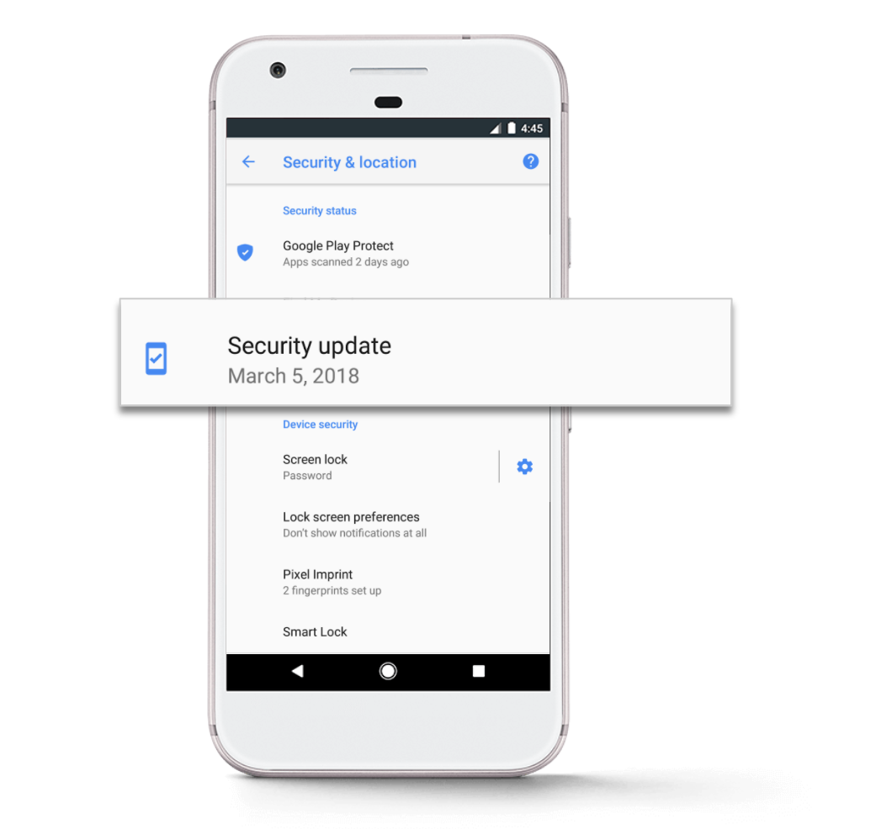
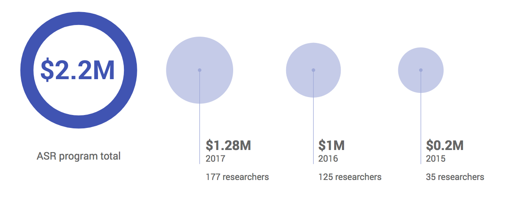

# 回顾Android安全2017年

原标题：Android Security 2017 Year in Review  
链接：[https://android-developers.googleblog.com/2018/03/android-security-2017-year-in-review.html](https://android-developers.googleblog.com/2018/03/android-security-2017-year-in-review.html)  
作者：最初由[谷歌安全日志](https://security.googleblog.com/2018/03/android-security-2017-year-in-review.html) Android，Play，ChromeOS安全副总裁Dave Kleidermacher 发表
翻译：[arjinmc](https://github.com/arjinmc)  

我们团队的目标很简单：安全保护超过20亿的Android设备。这是我们的全部重点，我们一直致力于改善我们的保护措施，确保用户安全。

今天，我们正在审查我们的第四个Android安全年。我们编译这些报告以帮助公众了解Android安全性的多个不同层次，并让我们自己负责，以便任何人都可以随时跟踪我们的安全工作。

去年我们看到了一些非常积极的势头，这篇文章包括了2017年的一些主要时刻，但不是全部。关于所有细节，你可以阅读完整报告：[g.co/AndroidSecurityReport2017](https://source.android.com/security/reports/Google_Android_Security_2017_Report_Final.pdf)

## Google Play保护

今年五月，我们[宣布](https://blog.google/products/android/google-play-protect/)推出 Google Play Protect，这是全球近二十亿台设备上的Android安全服务套件的新家。尽管Play Protect的许多功能多年来一直在保护Android设备，但我们希望能够让这些设备更加醒目，以帮助确保人们能够始终保持安全。

Play Protect的核心目标是为用户屏蔽[潜在有害应用程序](https://source.android.com/security/reports/Google_Android_Security_PHA_classifications.pdf)或PHA。它每天都会自动审查超过500亿个应用程序，PHA的其他潜在来源和设备，并在发现任何设备时采取相应措施。

Play Protect使用各种不同的策略来保护用户及其数据的安全，但机器学习的影响已经非常显着：60.3％的潜在有害应用程序是通过机器学习检测到的，我们预计未来会增加。

  

### 保护用户的设备

Play Protect每天至少自动检查PHA的Android设备一次，用户可以随时进行额外的检查，以获得额外的安心。这些自动评估使我们去年能够消除近3900万个PHA。

我们还更新Play Playct以回应我们在整个生态系统中发现的趋势。例如，我们意识到，近35％的新PHA安装是在设备脱机或丢失网络连接时发生的。因此，2017年10月，我们在Play Protect中启用了离线扫描功能，并且此后已经阻止了1000万次以上的PHA安装。

### 防止PHA下载

仅从Google Play下载应用的设备比从其他来源下载应用的设备获得PHA的可能性低9倍。这些安全保护措施继续得到改善，部分原因是Play Protect增加了对新提交的Play应用的可见性。与2016年相比，它审查了65％以上的游戏应用。

Play Protect也不仅可以保护Google Play，而且还有助于保护更广泛的Android生态系统。非常感谢Play Protect，Google Play以外的PHA安装率下降了60％以上。

## 安全更新

虽然Google Play Protect对抗有害的PHA非常有效，但我们也与设备制造商合作，确保在用户设备上运行的Android版本保持最新和安全。

  

在这一年中，我们致力于改进发布安全更新的过程，并且比2016年多30％的设备获得了安全补丁。此外，没有针对Android设备的更新或缓解措施，公开披露了影响Android平台的关键安全漏洞。这可能是由于[Android安全奖励计划](https://www.google.com/about/appsecurity/android-rewards/)，与[安全研究人员社区](https://source.android.com/security/overview/acknowledgements)的加强协作，与行业合作伙伴的协调以及Android平台的内置安全功能。

## Android Oreo中的新安全功能

我们在Android Oreo中引入了一系列新的安全功能：[使获取应用程序更安全](https://android-developers.googleblog.com/2017/08/making-it-safer-to-get-apps-on-android-o.html)，丢弃[不安全的网络协议](https://android-developers.googleblog.com/2017/04/android-o-to-drop-insecure-tls-version.html)，提供更多[用户对标识符的控制权](https://android-developers.googleblog.com/2017/04/changes-to-device-identifiers-in.html)，[加强内核](https://android-developers.googleblog.com/2017/08/hardening-kernel-in-android-oreo.html)等等。

我们在一年中强调了其中的许多内容，但也有一些可能已经被忽视了。例如，我们更新了覆盖API，以便应用程序无法再阻止整个屏幕并阻止你解除它们，这是勒索软件采用的一种常用策略。

## 开放性使Android安全性更强

我们早就说过了，但它仍然比以往更真实：Android的开放性有助于加强我们的安全保护。多年来，Android生态系统已从研究人员的调查结果中受益，2017年也不例外。

### 安全奖励计划

我们继续看到我们的Android安全奖励计划取得了巨大的发展势头：自该计划启动以来，我们为研究人员支付了128万美元，总计超过200万美元。我们还将[超出顶线支出](https://android-developers.googleblog.com/2017/06/2017-android-security-rewards.html)，例如将TrustZone的漏洞利用的奖金从5万美元增加到20万美元，Verified Boot远程内核漏洞利用的奖金从3万美元增加到15万美元。

  

与此同时，我们还推出了[Google Play安全奖励计划](https://www.google.com/about/appsecurity/play-rewards/index.html)，并向开发者提供了额外的奖励，以便发现和披露Play上托管的应用中的关键漏洞。

### 外部安全竞赛

我们的团队还参与了外部漏洞发现和披露竞赛，例如[Mobile Pwn2Own](https://www.thezdi.com/blog/2017/11/2/the-results-mobile-pwn2own-2017-day-two)。在2017年Mobile Pwn2Own大赛中，没有任何漏洞利用成功入侵Google Pixel。针对运行Android的设备演示的漏洞利用情况，没有人可以在[Android开源项目](https://source.android.com/)（AOSP）运行未经修改的Android源代码的设备上进行再现。

我们很高兴看到Android安全背后的积极势头，今年以及今后我们将继续努力改进我们的保护。我们永远不会停止我们的工作来确保Android用户的安全。