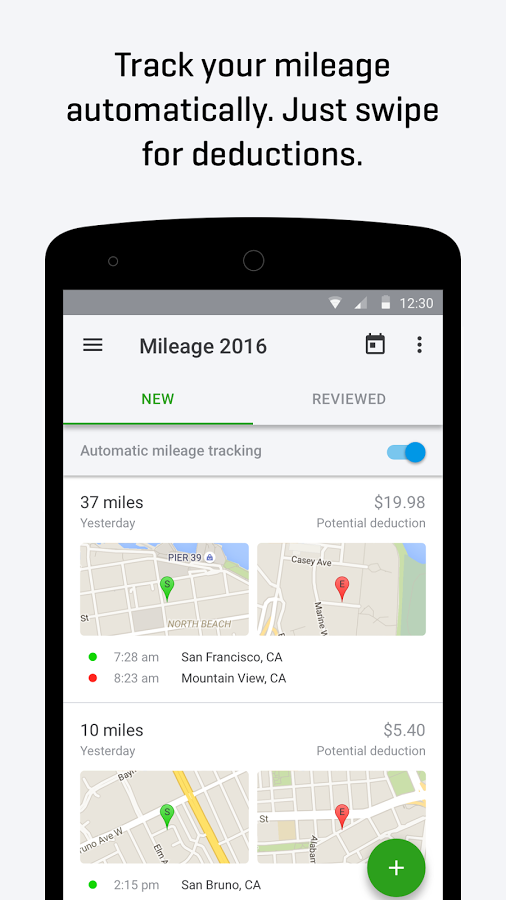
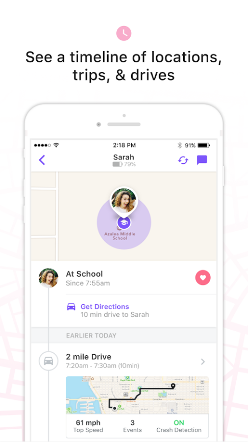

# 所有开发者都可以访问识别Activity的新API Transition

原标题：Activity Recognition’s new Transition API makes context-aware features accessible to all developers
链接：[https://android-developers.googleblog.com/2018/03/activity-recognitions-new-transition.html](https://android-developers.googleblog.com/2018/03/activity-recognitions-new-transition.html)  
作者：Marc Stogaitis，Tajinder Gadh和Michael Cai （Android Activity识别团队） 
翻译：[arjinmc](http://github.com/arjinmc)  

手机是我们随处可见的最个人的设备，但直到现在，应用程序很难根据用户不断变化的环境和活动调整体验。我们从开发者那里听说开发者已经花费了宝贵的工程时间来结合位置和传感器数据等各种信号，以确定用户何时开始或结束了像步行或驾驶这样的活动。更糟的是，当应用程序独立并不断检查用户活动的变化时，电池寿命会受到影响。这就是为什么今天，我们很高兴能够向所有Android开发者提供Activity识别Transition API - 这是一个简单的API，可为你完成所有处理，并只告诉你实际关心的内容：用户的活动发生变化时。

自去年11月以来，Transition API一直在后台工作，为Pixel 2上启动的[驾驶请勿打扰](https://android-developers.googleblog.com/2017/11/making-pixel-better-for-drivers.html)功能提供支持。虽然在检测到轿厢运动时打开请勿打扰似乎很简单手机的传感器在实践中出现了许多棘手的难题。你怎么知道静止是否意味着用户停放了他们的汽车并结束了一个驱动器，或者只是在一个红绿灯处停下来并继续行驶？你是否应该相信非驾驶活动中的高峰，还是暂时的分类错误？借助Transition API，所有Android开发者现在都可以利用Google使用的相同训练数据和算法过滤器来确信地检测用户活动中的这些更改。

Intuit与我们合作测试Transition API，并发现了他们自己应用[QuickBooks Self-Employed](https://play.google.com/store/apps/details?id=com.intuit.qbse)的理想解决方案：

“QuickBooks Self-Employed通过导入交易并自动跟踪汽车行驶里程，帮助自雇员工在税务时间最大限度地减免税款。在Transition API之前，我们创建了自己的解决方案来跟踪GPS，手机传感器和其他元数据结合的里程数，但由于Android设备的广泛变化，我们的算法不是100％准确的，有些用户报告缺少或不完整的旅行。我们能够在几天内使用Transition API构建一个概念验证，现在它已经有了取代我们现有的解决方案，提供更可靠的解决方案，同时减少我们的电池消耗。Transition API使我们能够集中精力，努力成为最好的税务解决方案，“Intuit的Pranay Airan和Mithun Mahadevan说。

  
<i>QuickBooks Self-Employed中的自动里程追踪</i>

[Life360](https://play.google.com/store/apps/details?id=com.life360.android.safetymapd)在其应用程序中同样实施了Transition API，并在活动检测延迟和电池消耗方面取得重大进展：

“Life360拥有超过1000万活跃的家庭，是全球最大的家庭移动应用程序，我们的使命是成为家庭成员必备的家庭成员，让家人随时随地都能安心，今天我们通过定位分享和全天候安全功能（例如监控家庭成员的驾驶行为），因此，准确测量活动并尽可能减少电池消耗非常关键。要确定用户何时启动或完成驱动器，我们的应用程序以前依靠地理围栏，融合位置提供程序API和活动识别API，但这种方法面临许多挑战，包括如何快速检测驱动器的启动而不会过度耗尽电池，并从原始活动识别API中解读粒度和快速变化的读数。但是在测试Transition API时，我们发现比我们以前的解决方案具有更高的精度和更少的电池耗电量，而不仅仅是满足我们的需求，“Life360的Dylan Keil说。

  
<i>在Life360中实时分享位置信息</i>

在接下来的几个月中，我们将继续在Transition API中增加新的活动，以支持Android上更多类型的场景感知功能，如区分公路和铁路车辆。如果你准备在你的应用中使用Transition API，请查看我们的[API指南](https://developer.android.com/guide/topics/location/transitions.html)。